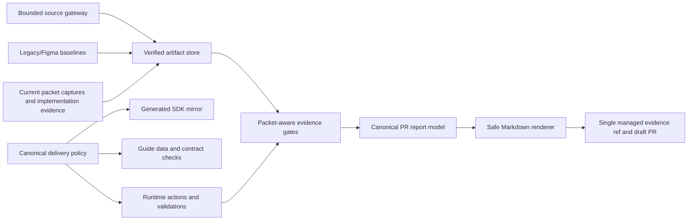

# ADR 038: Harden Evidence Trust and Unify Delivery Policy

- Status: Proposed
- Date: 2026-07-20
- Supersedes: the trust, legacy coverage, visual-attempt, and policy-parity portions of ADR 036

## Context

The four delivery cases are implemented behind one workflow, but the current branch has three classes of defects:

1. Evidence can be replayed, mutated, raced, or rendered unsafely after it has been accepted.
2. The runtime, SDK, skills, reviewers, and guide site independently derive the same delivery rules and have drifted.
3. PDF and image support were added directly to the MCP entry bundle, increasing its raw size from about 2.01 MB to 5.85 MB.

The repair must preserve the product decisions already made:

- four user-facing modes: `brief`, `legacy`, `feature`, and `figma`;
- seven public workflow tools and eight durable stages;
- one API/UI implementation writer;
- independent functional review and UI-only design review;
- feature-only targeted E2E and one video;
- Figma and running legacy screens as the respective visual baselines;
- blocked diagnostic drafts that never pretend unrun work is complete;
- no permanent manager, API, UI, browser, or publisher agent;
- no `docs/superpowers` directory.

This ADR addresses the verified review findings without rebuilding the Run engine or adding public microtools.

## Decision drivers

1. A ready PR must be derived only from current, immutable, packet-bound evidence.
2. Required work must never become `not-applicable` merely because execution stopped early.
3. The four modes must have one executable policy source.
4. Legacy migration must require only the target project and separate legacy project; OpenAPI is optional enrichment, not an extra required input.
5. Runtime startup and ordinary non-PDF/non-visual work must not load heavy PDF or image code.
6. The fixes must be testable in small slices and must not increase normal agent count or token use.

## Canonical four-mode contract

| Mode      | Required inputs                               | API rule                                                                                                              | Visual baseline                                       | Additional evidence                                                      |
| --------- | --------------------------------------------- | --------------------------------------------------------------------------------------------------------------------- | ----------------------------------------------------- | ------------------------------------------------------------------------ |
| `brief`   | brief/spec + Figma + OpenAPI                  | supplied OpenAPI operations must have usage, mock, test, or explicit gap evidence; API-ready is required              | Figma                                                 | affected-route performance                                               |
| `legacy`  | target project + separate legacy project      | API inventory is derived from scoped legacy source/runtime evidence; optional OpenAPI enriches it but is not required | running legacy project captured before implementation | migration coverage and affected-route performance                        |
| `feature` | same inputs as `brief`, scoped to one feature | same as `brief`                                                                                                       | Figma                                                 | affected-feature performance, one targeted E2E result, exactly one video |
| `figma`   | Figma URL + target project                    | real API integration is not required; deterministic JSON mock fixtures are required                                   | Figma                                                 | visual, responsive, interaction, and accessibility evidence only         |

Legacy API reporting is always applicable. If the bounded legacy inventory finds no API operations, the PR section is `complete` with “no API operations detected” and the inventory digest; it is not `not-applicable`. If operations are found, every scoped operation must map to a target callsite/test or remain an explicit blocking gap.

This deliberately corrects ADR 036 and the earlier implementation assumption that made legacy API coverage conditional on separately supplied OpenAPI. That older rule conflicts with the accepted case-2 contract: migration receives a legacy project path and returns the same API usage/gap class of PR evidence as full delivery. Static and runtime legacy evidence replace mandatory OpenAPI as the authoritative input.

The visual gate uses `reviewMatchRatio >= 0.98`. `exactMatchRatio` is reported but is not a pass gate. A review packet permits three comparison attempts total: the initial comparison plus at most two repairs.

Functional and design reviews may run concurrently only for `L` and `XL` workloads. Smaller runs use the same reviewers sequentially. API and UI implementation remain in one writer context for every mode.

The compatibility input `mode: auto` remains accepted at the facade. Intake resolves it to one explicit mode before calling the canonical policy; an unresolved `auto` value can never be stored in a started Run’s effective delivery profile.

## Architecture



The implementation is divided into five internal boundaries. These are modules, not new agents or public MCP tools.

### 1. Canonical delivery policy

Create `src/workflow/delivery-mode-policy.ts` as the only executable source for mode requirements, validation IDs, API-ready applicability, visual constants, report-section applicability, and reviewer concurrency.

The module exposes:

```ts
export type PrReportSectionId =
  | "api"
  | "legacy"
  | "visual"
  | "functional-review"
  | "design-review"
  | "performance"
  | "feature-evidence";

export type ModeRequirementSet = {
  brief: boolean;
  legacyBaseline: boolean;
  legacyInventory: boolean;
  targetedFeatureE2E: boolean;
  featureVideo: boolean;
  figmaBundle: boolean;
  visualComparison: boolean;
  apiCoverage: boolean;
  performanceEvidence: boolean;
  mockData: boolean;
};

export type ModeValidationId =
  | "legacy-baseline"
  | "legacy-inventory"
  | "targeted-feature-e2e"
  | "feature-video"
  | "figma-bundle"
  | "visual-comparison"
  | "api-coverage"
  | "performance-evidence"
  | "mock-data"
  | "api-ready";

export type DeliveryPolicyInput = {
  mode: "brief" | "legacy" | "feature" | "figma";
  hasOpenApi: boolean;
  legacyApiOperationCount: number;
  ui: boolean;
  workload: "XS" | "S" | "M" | "L" | "XL";
};

export type ResolvedDeliveryPolicy = {
  requirements: ModeRequirementSet;
  requireApiReady: boolean;
  modeValidations: readonly ModeValidationId[];
  sectionApplicability: Readonly<Record<PrReportSectionId, boolean>>;
  parallelReviewers: boolean;
};

export const VISUAL_POLICY = {
  reviewThreshold: 0.98,
  maxMaskedAreaRatio: 0.2,
  maxComparisonAttempts: 3,
} as const;

export function resolveDeliveryPolicy(input: DeliveryPolicyInput): ResolvedDeliveryPolicy;
```

`buildDeliveryProfile`, workflow actions, submission gates, `requiredValidations`, report materialization, and delegation policy consume this result. Mode-name checks outside this module are limited to input normalization.

The policy module owns dependency-free types and does not import `DeliveryProfile`, report schemas, SDK code, or application services. Runtime `requiredValidations` is the ordered union of `modeValidations`, required scope gates from `buildGatePlan(scope)`, and publication preflight from publication policy. Security, observability, and repository-specific gates therefore remain scope-derived instead of being incorrectly encoded as mode constants.

The SDK receives a generated mirror at `packages/codex-sdk/src/generated/delivery-mode-policy.ts`, produced by `scripts/sync-delivery-mode-policy.mjs`. `policy:sync` updates it and `policy:check` fails on byte-level drift. Skills stop restating the matrix and instead instruct the agent to obey the current `workflow_status` policy. The guide consumes generated policy data for tables; README and agent prose are protected by documentation contract tests.

### 2. Verified artifact and source boundary

`ArtifactBlobStore` keeps its public API, but every read becomes verified:

- content and metadata must be regular files and must not be symlinks;
- metadata is parsed through a strict schema;
- requested digest, metadata digest, byte length, and recalculated SHA-256 must match;
- writes use a same-directory temporary file, file sync, create-without-replacement publication, and cleanup;
- an existing destination is verified instead of being trusted after `EEXIST`.

Create `src/source-ingestion/safe-https-client.ts` and route remote OpenAPI/Swagger loading through it. It uses `node:https` with an injected resolver so the address validated by policy is the address used for the connection. The client:

- accepts HTTPS only and rejects credentials;
- rejects IP literals and any DNS result in loopback, private, link-local, CGNAT, unspecified, multicast, metadata, or reserved ranges;
- fails closed when a hostname resolves to a mixture of public and blocked addresses;
- repeats validation for every redirect and Swagger-discovered spec URL;
- applies one 15-second deadline, three redirects, and a 1 MB streaming limit across the complete resolution chain.

Raw URL query values are used only during intake and are not persisted into public report data. Create `src/pr-report/public-provenance.ts` to project internal provenance into a public form:

- local project sources become project-relative paths;
- the legacy root becomes `external-legacy-project` plus its root digest;
- URL query values, fragments, credentials, and home-directory components are removed;
- ready JSON, blocked JSON, and Markdown all consume the same public projection.

Create `src/source-ingestion/openapi-inventory.ts`. It inventories inline Path Items and local JSON Pointer `$ref` values, including `~0` and `~1` decoding, with depth 32, cycle detection, broken-reference errors, external-reference rejection, and the existing operation-count ceiling.

### 3. Visual, mock, and legacy evidence gates

Create `src/visual/png-decoder.ts` and use it for Figma validation and comparison. It validates the PNG signature and IHDR before decompression, rejects unsafe multiplication, enforces a fixed pixel ceiling, and only then calls `pngjs`. The first implementation uses an 8,388,608-pixel ceiling and a 50 MB compressed-file ceiling. A worker thread is not added unless a benchmark shows the bounded synchronous path can still block the MCP event loop for more than two seconds.

Visual submissions must use separate baseline and actual namespaces. A submitted actual path may not equal any baseline path from any target, and each actual path must be under the current packet’s actual-capture directory. The capture manifest binds:

- target ID and current review packet ID;
- route, state, viewport, device scale factor, and fixture ID;
- capture provider and timestamp;
- actual artifact path and digest.

This prevents stale/path-role replay while allowing a genuinely pixel-identical fresh capture. It does not claim to defend against the local machine owner deliberately copying identical pixels; that actor already controls the repository, browser, and credentials.

Visual attempt allocation uses existing `RunStore.save` revision CAS plus a packet-scoped attempt reservation. A stable submission identity is calculated from the packet ID, target IDs, and submitted actual artifact digests. The reservation stores that identity and the next attempt number before comparison work is accepted. A duplicate identity returns the existing in-progress/completed result; it never consumes another attempt. A CAS loser returns a refresh-required conflict instead of promoting the same capture to the next attempt. A new numbered attempt therefore requires a new capture identity. At most reservations 1, 2, and 3 can exist, and a packet with a passing report rejects later submissions.

Figma mock fixtures remain project-local JSON. Paths must be unique `.json` files, distinct from the manifest. Each fixture must parse to a non-null object or array. The strict manifest binds the exact fixture paths and their artifact digests; every visual target’s fixture ID must resolve to one manifest entry.

Legacy roots are canonicalized before use. Equal, ancestor, descendant, and symlink-alias relationships between target and legacy roots are rejected. The SDK stops adding the legacy root to writable `additionalDirectories`, and rejects explicitly supplied writable directories that overlap it. This preserves one implementation writer while allowing read access to the reference project.

The running legacy baseline and bounded inventory are captured before implementation. The inventory digest is recomputed before passed contracts, passed implementation, visual comparison, report materialization, and publication. A mismatch blocks with the changed boundary and exact restart action.

`src/legacy/legacy-inventory.ts` gains independent limits for visited directories, all directory entries, recursion depth, elapsed time, source files, source bytes, and feature entries. Exhaustion produces `truncated: true`. A truncated default migration cannot publish ready; the user must narrow the migration scope and restart intake.

Legacy API inventory is derived from the same bounded source pass plus captured legacy runtime network evidence when the application is runnable. Recognized source candidates include `fetch`, axios verbs/config, generated clients, and configured project client wrappers. Each entry has a stable operation key, source file or runtime request ID, discovered method/path when available, and evidence confidence. Optional OpenAPI operations merge by method/path without replacing legacy-only entries. Unknown-method calls remain visible operations that require a target mapping or blocking gap; they are never silently dropped. “No API operations detected” means none were found by the explicitly listed bounded source/runtime adapters; the report includes those adapter names and inventory digest rather than claiming the entire application has no network behavior.

Once an inventory feature key enters `legacyScopeKeys`, contracts may only mark it `planned`, and a passed implementation may only mark it `migrated`. Inventory entries omitted before scope selection are exclusions. Blocked attempts may report `gap` or `blocked`, but those statuses cannot pass.

### 4. Packet-aware canonical report

`PrReportV2` records a status for every conditional section:

```ts
type ReportSectionStatus = "complete" | "not-run" | "blocked" | "not-applicable";
```

New reports use `schemaVersion: "pr-report-v2.1"` and a required top-level `sectionStatuses` record for API, legacy, visual, functional review, design review, performance, and feature evidence. Existing `pr-report-v2.1` artifacts remain readable as historical evidence but are not accepted for a new publication; the workflow rematerializes them from current Run evidence into v2.1. No stored artifact is rewritten in place.

Applicability comes from the canonical delivery policy. Evidence presence never decides applicability. Therefore required-but-unrun feature E2E, performance, API, visual, or review work renders as `not-run`, while only policy-exempt work renders as `not-applicable`.

A blocked report binds a review packet only while the implementation stage and current Git snapshot still match that packet. Functional/design reviews and visual reports are included only when their `reviewPacketId` equals the bound current packet. Otherwise packet-derived claims are omitted and shown as `not-run` or `blocked`.

Create `src/pr-report/markdown-safe.ts`. Every dynamic value passes through a context-specific inline, table-cell, or bullet renderer. Newlines, headings, HTML, comments, images, links, code fences, and control characters cannot create report structure. Structured data is rendered as escaped fields or tables, not raw JSON interpolation. The renderer also applies final secret-shape redaction before an artifact can be published.

The title of section 15 is conditional: ready reports use `Rollback`; blocked reports use `Rollback and exact unblock action`. Source rows include public locator, digest, and capture timestamp.

### 5. Publication and distribution

GitHub uses one managed branch, `spec-to-pr/evidence`, rather than one branch per Run/head. Assets retain immutable run, packet, target, and artifact IDs in their paths, and returned URLs remain pinned to the upload commit. The adapter:

- validates that the existing ref is the expected branch and points to a commit;
- re-fetches and validates after a create-ref `422` instead of treating every `422` as success;
- retries bounded shared-ref update conflicts;
- never falls back to the source branch;
- blocks ready publication when required current-packet media cannot be uploaded;
- leaves packetless blocked diagnostics as local reports without packet media.

One durable evidence ref is retained because temporary branches can make commit URLs garbage-collectable, release assets add visible release/tag state, and source-branch assets pollute the product diff. Branch count remains constant. Asset count is bounded by existing per-run target/video limits.

The runtime remains self-contained, but heavy paths become lazy. `tsup` enables ESM splitting and minification. PDF and PNG codecs are dynamically imported, and release packaging includes and verifies every `dist/mcp/*.js` chunk. The initial deterministic build freezes two regression gates: MCP entry size no larger than 2 MiB and total MCP JavaScript no larger than 4.5 MiB, with at most 5 percent release-to-release growth unless explicitly approved. These are distribution-size gates, not token budgets.

## Agent, browser, and MCP policy

- The API and UI implementation remain in one writer context.
- Functional review is always independent; design review is independent only for UI scope.
- Reviewers run in parallel only for `L` and `XL` workloads. For `XS`, `S`, and `M`, `actionsForRun` emits functional review first and emits design review only after functional approval. For `L` and `XL`, both actions may be emitted together after implementation and required visual evidence are ready.
- Read-only scouts are optional only for bounded repository/source discovery and follow the existing workload limits.
- Figma MCP is used only when a Figma source is supplied.
- A real browser is used only for required visual capture, accessibility checks, affected-route performance, or feature-targeted E2E/video.
- Direct CDP and RUM are not default requirements. They are used only when the supplied application or acceptance criteria require evidence unavailable through the normal browser path.
- No new public MCP tool or permanent agent role is introduced by this hardening.

## Failure behavior

The workflow uses stable blocker codes and always supplies one exact unblock action:

| Code                            | Meaning                                                 | Exact unblock action                                                           |
| ------------------------------- | ------------------------------------------------------- | ------------------------------------------------------------------------------ |
| `ARTIFACT_INTEGRITY_FAILED`     | blob, metadata, size, or digest mismatch                | remove the corrupted Run artifact store entry and resubmit the producing stage |
| `REMOTE_SOURCE_ADDRESS_BLOCKED` | URL or resolved address violates source policy          | provide a public HTTPS source or a project-local OpenAPI file                  |
| `VISUAL_CAPTURE_REPLAY`         | an actual capture reused a baseline role/path           | capture the current target route into the packet-specific actual directory     |
| `VISUAL_PIXEL_LIMIT`            | PNG dimensions exceed the bounded decoder               | recapture at an allowed viewport/device scale factor                           |
| `VISUAL_ATTEMPT_LIMIT_REACHED`  | three total comparisons have failed                     | fix the listed targets and start a new implementation review packet            |
| `LEGACY_SOURCE_CHANGED`         | the legacy digest changed after intake                  | restore the legacy source or restart intake from its new state                 |
| `LEGACY_INVENTORY_TRUNCATED`    | bounded discovery cannot claim complete coverage        | narrow the migration scope and restart intake                                  |
| `REPORT_UNSAFE_CONTENT`         | report input cannot be safely represented               | remove or redact the unsafe field and rematerialize the report                 |
| `EVIDENCE_REF_CONFLICT`         | the managed evidence ref cannot be validated or updated | repair branch permissions/ref state and retry publication                      |

Blocked diagnostic publication uses the same report model. Completed current evidence remains `complete`; required work after the blocker is `not-run`; failed work is `blocked`; and only truly exempt sections are `not-applicable`.

## Verification strategy

Implementation follows red-green-refactor in this dependency order:

1. artifact integrity and safe source transport;
2. bounded PNG decoding, capture-role checks, visual CAS, and mock fixtures;
3. legacy isolation, inventory bounds, freshness, and derived API operations;
4. canonical delivery policy and SDK mirror;
5. packet-aware report states, Markdown safety, and public provenance;
6. single evidence ref and split runtime bundle;
7. skills, agents, README, ADR, Korean/English guide, and browser accessibility synchronization;
8. complete source, generated-output, release-package, and installed-runtime verification.

Each slice has focused unit/integration tests and an independent functional review. Documentation/guide changes additionally receive design/accessibility review. Full verification runs only after focused tests pass.

The final gate includes:

- policy generation/check and SDK source/dist parity;
- TypeScript and SDK type checks;
- artifact/source/visual/legacy/report/publisher regression tests;
- the complete Vitest suite;
- Korean and English guide builds and browser checks;
- English navigation catalogs at `website/i18n/en/docusaurus-plugin-content-docs/current.json` and `website/i18n/en/docusaurus-theme-classic/footer.json`, plus complete navbar-label assertions;
- English navigation, landmarks, skip link, keyboard, unique-ID, accessible-name, mobile-menu, and overflow assertions;
- plugin validation;
- deterministic MCP/release builds, chunk resolution, size gates, and installed-bundle smoke;
- `git diff --check` and a final functional plus UI-applicable design review.

## Rejected alternatives

### Patch every consumer independently

This is fastest initially but preserves five copies of the policy and caused the current SDK/runtime/guide drift. It is rejected.

### Rebuild the Run engine or add mode-specific pipelines

The existing stages, revisioned Run store, and profile architecture are sufficient. Rebuilding them would add migration risk and token cost without fixing the trust boundaries more effectively. It is rejected.

### Split API and UI implementation agents

API readiness and mock/UI state validation are tightly coupled and small enough for one implementation writer. Separate writers would add handoff and merge overhead. It is rejected.

### Reject equal baseline and actual digests

A correct pixel-perfect implementation can legitimately produce identical bytes. Role/path separation, packet-bound capture metadata, and independent design review prevent accidental/stale replay without rejecting a real 100 percent match. Digest inequality is rejected as a gate.

### Recursively change legacy filesystem permissions

Changing user project permissions is invasive and remains race-prone. Removing writable sandbox grants, rejecting overlapping roots, capturing the baseline before implementation, and rechecking the digest are safer. Recursive permission mutation is rejected.

### Per-run branches, temporary branches, or release assets

Per-run branches recreate branch accumulation. Temporary branches weaken evidence retention. Release assets create visible release/tag state outside the current product contract. One managed evidence ref is selected.

### Externalize runtime dependencies

Release archives intentionally exclude `node_modules`. ESM splitting and lazy loading reduce startup cost while keeping the plugin self-contained, so externalization is rejected.

## Consequences

- Normal runs keep the same public tool and stage count.
- API/UI implementation does not gain an extra handoff.
- Required visual modes become stricter about capture layout and provenance.
- Private/VPN OpenAPI URLs are rejected; project-local OpenAPI files are the supported fallback.
- A changed or truncated legacy source blocks rather than producing an authoritative-looking migration report.
- GitHub repositories retain one evidence branch instead of one branch per Run.
- The release contains multiple MCP JavaScript chunks but loads PDF/image code only when needed.
- Docs and SDK policy drift becomes a deterministic build failure.

## Acceptance criteria

- Every verified P1 review reproduction has a failing regression test before its fix.
- Neither a baseline path nor another target’s baseline path can be submitted as an actual capture.
- Artifact tampering, symlink substitution, visual attempt races, stale review packets, malformed mocks, private-network source URLs, and unsafe Markdown all fail closed.
- Legacy scoped keys cannot pass as excluded, and legacy source mutation/nesting cannot pass unnoticed.
- Legacy mode produces an API usage/gap section without requiring separate OpenAPI input.
- Required-but-unrun PR sections never say `not-applicable`.
- Figma-only never advertises real `api-ready`; all layers return the same validation set for the same mode input.
- There are at most three total comparison attempts per packet with unique attempt numbers.
- GitHub evidence publication creates or reuses only `spec-to-pr/evidence`.
- Korean/English guides state the runtime’s exact visual threshold, attempt semantics, reviewer concurrency, Web Vitals budgets, and four input contracts.
- The English guide passes the expanded accessibility/browser checks.
- The MCP entry and total distribution stay within the frozen size gates, and the installed plugin passes its runtime smoke test.
