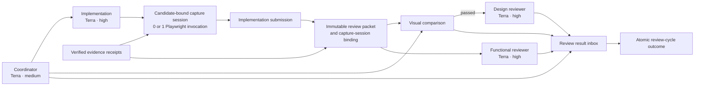

# Runtime Execution Optimization

- Status: Implemented
- Date: 2026-07-30
- Implementation model for this change: `gpt-5.6-terra`

## Scope

This design changes only four execution concerns:

1. collect browser evidence through one Playwright capture session per implementation candidate;
2. reuse evidence when its actual dependency fingerprint is unchanged;
3. overlap visual, functional, and design review work safely;
4. use medium reasoning for coordination and high reasoning for implementation and review.

The following are explicitly out of scope:

- durable or wall-clock deadlines;
- workload-estimation changes;
- deterministic preflight gates;
- publication or GitLab asset changes;
- new public MCP tools or new durable workflow stages.

Existing quality gates, the fixed visual threshold, immutable review packets, one implementation
writer, and read-only independent reviewers remain unchanged.

## Context

The runtime validates browser evidence but does not execute a consumer project's Playwright suite
itself. Today a feature implementation must produce targeted E2E, one video, and performance
evidence before the implementation submission. The implementation submission then creates the
review packet, after which a separate `compare-visuals` action requests packet-bound visual
captures and focused UI assertions.

That ordering structurally causes at least two Playwright invocations:

1. feature E2E, video, and performance collection during implementation;
2. visual capture and UI assertion collection after the review packet exists.

Review scheduling is also only partly concurrent. Visual comparison and functional review can be
exposed together, but design review waits for functional approval on XS, S, and M workloads.

Finally, evidence reuse is currently an idempotent replay check rather than impact-based reuse.
`PacketEvidenceEntry` binds evidence to the complete `headSha` and `diffDigest`, so any repair
invalidates every browser and API artifact even when its actual inputs did not change.

## Target architecture



No implementation evidence is submitted early. The implementation agent finishes and commits the
candidate, runs the capture session locally, and includes its manifest in the ordinary
implementation submission.

## 1. Candidate-bound capture session

### Decision

Add an internal `capture-session-v1` contract. A capture session represents one focused
`playwright test` CLI invocation and all evidence derived from it:

- the targeted feature E2E result;
- exactly one final feature video when the delivery profile requires it;
- affected-route performance evidence;
- all current visual-target PNGs;
- focused UI assertion observations;
- baseline-isolation observations;
- renderer, fixture, font, asset, and toolchain provenance.

One CLI invocation may create more than one browser context when target DPR or performance
isolation requires it. “One Playwright run” means one spawned Playwright command, not one shared
page for incompatible environments.

### Contract

```ts
type CaptureSessionReceiptV1 = {
  schemaVersion: "capture-session-v1";
  captureSessionId: `capture_${string}`;
  runId: string;
  implementationContextId: string;
  candidate: {
    baseSha: string;
    headSha: string;
    diffDigest: `sha256:${string}`;
  };
  invocation: {
    runner: "playwright-test-cli";
    command: string;
    selector: string;
    invocationCount: 1;
    reporterResultPath: string;
    reporterResultDigest: `sha256:${string}`;
  };
  environment: {
    adapterVersion: string;
    playwrightVersion: string;
    browserName: string;
    browserVersion: string;
    platform: string;
    locale: string;
    timezoneId: string;
  };
  inputs: {
    capturePlanDigest: `sha256:${string}`;
    scenarioDigest: `sha256:${string}`;
    fixtureDigest: `sha256:${string}`;
    uiBundleDigest: `sha256:${string}`;
    rendererLineageId: `sha256:${string}`;
  };
  outputs: {
    featureResult?: {
      path: string;
      digest: `sha256:${string}`;
      testId: string;
    };
    video?: {
      path: string;
      digest: `sha256:${string}`;
      durationMs: number;
    };
    performance?: {
      path: string;
      digest: `sha256:${string}`;
    };
    targets: Array<{
      targetId: string;
      testId: string;
      actualPath: string;
      actualDigest: `sha256:${string}`;
      observationPath: string;
      observationDigest: `sha256:${string}`;
    }>;
  };
};
```

All arrays and target records are canonicalized before `captureSessionId` is calculated. Volatile
timestamps and artifact IDs do not participate in the identity.

`candidate.diffDigest` is the Git diff of implementation source after excluding only the session
manifest and the session's declared generated outputs. This prevents a manifest from recursively
changing the digest it must attest; all other source, fixture, configuration, and committed files
remain in the candidate fence.

### Avoiding an intermediate submission

The current review packet ID cannot be known before implementation submission because it includes
the implementation snapshot and accepted evidence digests. The capture session therefore binds to
the candidate's `baseSha`, `headSha`, and `diffDigest`, not to a future packet ID.

During the normal implementation submission, the runtime:

1. captures its own Git snapshot;
2. verifies that the session candidate matches that snapshot;
3. ingests and digest-verifies every session output;
4. creates the normal immutable review packet;
5. writes a `capture-session-binding-v1` artifact linking the verified session to that packet.

The later `compare-visuals` action consumes the bound raw outputs without starting a browser: it
materializes only packet-bound receipt, assertion, baseline-isolation, and comparison artifacts.
This preserves the current packet-specific reviewer contract without requiring an early workflow
submission or a circular packet ID.

For compatibility, implementation submissions without a capture session continue to use the
existing visual capture path during a migration window.

### Shared reporter result

All target assertions may reference one Playwright JSON reporter output. The runtime selects the
correct observation using `captureSessionId + reporterResultDigest + target testId`. It no longer
requires a physically separate reporter JSON file for every visual target.

The runner keeps only one nominated video in the committed evidence bundle. Any extra browser
context videos, raw traces, and transient logs remain outside the bundle.

### Isolation within one invocation

- Performance collection uses a fresh context and runs before stateful interaction captures.
- Each incompatible DPR or device profile receives a fresh context within the same CLI process.
- Fixtures and application state are reset between scenarios.
- Fonts and declared assets must be ready before target capture.
- Video actions use human-readable pacing, but arbitrary waits are not part of correctness.

## 2. Dependency-fingerprint evidence reuse

### Decision

Keep the complete `headSha` and `diffDigest` as reviewer freshness fences. Add a separate
dependency fingerprint for deciding whether an evidence artifact can be carried forward.

Evidence is reused only within the same durable Run and its visual-repair lineage in the first
version. Cross-Run caches are out of scope.

```ts
type EvidenceFingerprintV1 = {
  schemaVersion: "evidence-fingerprint-v1";
  family: "api-ready" | "feature-e2e" | "feature-video" | "performance" | "visual-capture";
  algorithmVersion: string;
  repositoryKey: `sha256:${string}`;
  dependencyGraphDigest: `sha256:${string}`;
  contractDigest: `sha256:${string}`;
  toolchainDigest: `sha256:${string}`;
  subjectDigest: `sha256:${string}`;
  inputs: Array<{
    role: string;
    path: string;
    digest: `sha256:${string}`;
  }>;
};

type EvidenceReuseReceiptV1 = {
  schemaVersion: "evidence-reuse-receipt-v1";
  family: EvidenceFingerprintV1["family"];
  sourceArtifactIds: string[];
  sourceArtifactDigests: Array<`sha256:${string}`>;
  sourceFingerprint: `sha256:${string}`;
  targetPacketId: string;
  targetFingerprint: `sha256:${string}`;
  algorithmVersion: string;
  decision: "reused";
};
```

The runtime rereads and verifies every source blob before writing a content-addressed reuse
receipt. It then creates a new current-packet binding; it never mutates the original evidence or
weakens the current packet fence.

### Fingerprint families

| Evidence family | Required fingerprint inputs                                                                                                                                                                          |
| --------------- | ---------------------------------------------------------------------------------------------------------------------------------------------------------------------------------------------------- |
| API-ready       | canonical accepted OpenAPI operation inventory; generated types/schema/wrapper/mock/contract-test import closure; generator and validator versions; relevant TS config, aliases, and lockfile inputs |
| Feature E2E     | affected functional import closure; exact selector and scenario; fixtures and mock responses; Playwright config and version                                                                          |
| Feature video   | interaction import closure; action plan; fixtures/render data; viewport/browser/video configuration                                                                                                  |
| Performance     | UI bundle/metafile closure; route and scenario; fixtures/render data; browser environment; performance policy                                                                                        |
| Visual capture  | target-specific UI bundle closure; route/state/viewport plan; fixture and render-data digests; Figma/state-contract/baseline digests; fonts/assets; renderer lineage and capture/normalizer versions |

Every input list is sorted by role and project-relative path. Timestamps, Run revisions, packet
IDs, and artifact IDs are excluded from the fingerprint.

### Reuse rules

#### UI-only change

Carry API-ready evidence forward only when the complete API-ready fingerprint is identical. A
filename classification or agent-supplied `uiChanged` boolean is not sufficient.

#### API-only change

Reuse video and visual captures only when all of the following remain identical:

- emitted UI bundle closure;
- capture/action plan;
- fixtures, mock responses, and render data;
- target state contracts and baselines;
- fonts and assets;
- renderer and toolchain lineage.

An unchanged UI bundle alone is insufficient because a changed API response can render different
content through the same bundle.

#### Conservative invalidation

Invalidate both API and browser families when the change touches an unresolved dynamic import,
shared runtime environment, relevant bundler/TS configuration, package lock, common fixture, or
dependency whose closure cannot be proven.

### What is not reused

Final functional and design reviewer verdicts are not carried forward. They remain bound to the
complete current packet and are rerun for each new packet.

A visual capture may be reused, but the deterministic visual comparison is recomputed for the
current packet. This is inexpensive and prevents a historical visual verdict from being mistaken
for a current-packet result.

### Partial capture sessions

A repaired candidate may reuse some target captures and collect others. The new capture-session
manifest records per-output provenance:

```ts
type CaptureOutputProvenance =
  { mode: "captured"; captureSessionId: string } | { mode: "reused"; reuseReceiptId: string };
```

If every required browser output is reusable, no Playwright process is spawned. Otherwise all
non-reusable outputs are collected through one Playwright invocation.

## 3. Review concurrency

### Decision

Remove workload-size gating from reviewer concurrency. The action graph becomes:

1. after implementation, expose visual comparison and functional review together;
2. submit visual comparison as soon as it finishes;
3. when visual comparison passes, expose design review immediately even if functional review is
   still running;
4. collect applicable reviewer results against the same immutable packet;
5. apply one review-cycle outcome.

For UI scope:

```text
functional review ──────────────────────┐
visual comparison ── passed ── design ──┼─ review-cycle outcome
                                       ┘
```

For non-UI scope, functional review remains the only reviewer.

### Review result inbox

Parallel submissions must not lose the second review when the first `changes-requested` result
reopens implementation. Add an internal packet-scoped result inbox keyed by
`reviewPacketId + reviewerKind`.

- The first result is persisted idempotently but does not mutate implementation.
- A duplicate identical result returns the stored receipt.
- A conflicting result for the same slot is rejected.
- When all applicable slots are present, the runtime applies one atomic outcome.
- Any `changes-requested` verdict reopens implementation once with the combined findings.
- All applicable approvals complete both review stages.
- A blocker produces one blocked outcome with all completed reviewer evidence retained.

If the visual comparison fails, design review is not started. The already-running functional
review may be canceled, or its completed findings may be attached to the same repair packet; it
never approves a later packet.

### Runtime changes

- `parallelReviewersForWorkload` becomes unconditional for applicable UI review.
- `actionsForRun` exposes design review solely when current visual evidence passes, without
  requiring functional review to pass first.
- Design-review submission prerequisites require a current packet and passing visual result, not a
  passed functional-review stage.
- Boundary instructions submit visual results immediately and start design review from the next
  status instead of waiting for functional review.
- Review result persistence uses Run revision CAS and current packet/head/diff fencing.

This decision supersedes the workload-gated review-concurrency portion of ADR 038.

## 4. Stage-aware reasoning

### Decision

Use one caller-selected execution model and vary reasoning effort by action group:

```ts
type StageReasoningProfile = {
  model: "gpt-5.6-terra";
  coordinator: "medium";
  implementation: "high";
  review: "high";
};
```

The model remains configurable rather than permanently hardcoded, but this change is implemented
and validated with `gpt-5.6-terra`.

| Action group                                                                             | Reasoning effort |
| ---------------------------------------------------------------------------------------- | ---------------- |
| intake, contracts, API-ready coordination, status, visual orchestration, report, publish | medium           |
| implement, implementation-repair                                                         | high             |
| functional review, design review                                                         | high             |

Reviewer agent profiles already request high reasoning and remain read-only. They inherit the
selected model. When review agents are disabled and the coordinator must execute a review action
itself, that boundary is routed to high reasoning.

### SDK routing

`ThreadOptions` are fixed on a `Thread` object, but the SDK can resume the same thread ID with new
options. Add a stage-aware thread factory to the boundary runner:

1. classify the next action group;
2. select medium or high effort;
3. recreate the SDK `Thread` with `resumeThread(existingThreadId, routedOptions)`;
4. run the next boundary using the same durable conversation;
5. record the selected model, effort, and action group in the turn result.

This preserves one implementation context while avoiding high reasoning for mechanical
coordination turns.

The existing single `modelReasoningEffort` input remains a compatibility-wide override. A new
stage profile is used only when that global override is absent.

## Main implementation boundaries

### Capture and binding

- `src/workflow/capture-session.ts`: session and binding schemas, canonical identities.
- `src/workflow/workflow-contracts.ts`: optional implementation capture-session reference and
  capture-session-backed visual submission form.
- `src/application/workflow-service.ts`: session ingestion, Git-snapshot match, packet binding,
  visual-receipt projection, and shared reporter validation.
- `src/visual/*`: reuse existing capture environment, UI assertion, baseline isolation, and
  renderer-lineage validators.
- `skills/implement/SKILL.md`: require one capture-session invocation rather than separate feature
  and visual Playwright commands.

### Evidence reuse

- `src/workflow/evidence-fingerprint.ts`: canonical fingerprint and reuse-receipt schemas.
- `src/workflow/implementation-snapshot.ts`: per-file digests needed by the impact planner.
- `src/workflow/packet-evidence-index.ts`: family fingerprint matching in addition to exact replay.
- `src/application/workflow-service.ts`: API-ready receipt creation and current-packet carry-forward.

### Review scheduling

- `src/workflow/delivery-mode-policy.ts` and generated SDK mirror: unconditional applicable review
  concurrency.
- `src/application/workflow-service.ts`: action predicates, result inbox, and atomic cycle outcome.
- `packages/codex-sdk/src/boundary-runner.ts`: immediate visual submission and design dispatch.
- `packages/codex-sdk/src/workflow-policy.ts`: updated orchestration instructions.

### Reasoning routing

- `packages/codex-sdk/src/spec-to-pr-runner.ts`: stage profile and medium coordinator default.
- `packages/codex-sdk/src/boundary-runner.ts`: action-to-effort classification and thread
  rehydration.
- reviewer TOML profiles: retain high reasoning and verify Terra inheritance.

## Implementation order for the Terra development run

1. Add capture-session and evidence-fingerprint schemas with unit tests.
2. Bind a candidate session to the implementation packet and project packet-bound visual receipts.
3. Convert the browser fixture to one Playwright invocation and shared reporter JSON.
4. Add same-Run evidence reuse and partial capture-session composition.
5. Enable review concurrency for every workload and add the packet-scoped result inbox.
6. Add stage-aware SDK reasoning routing.
7. Run focused unit/integration/browser tests, then the repository check.

Capture-session binding and evidence reuse should be implemented together because their identities
share candidate, closure, and toolchain digests. Review scheduling and reasoning routing can be
implemented independently after those schemas stabilize.

## Acceptance criteria

1. A fresh feature candidate spawns exactly one Playwright CLI process for E2E, video,
   performance, visual captures, and UI assertions.
2. All browser artifacts share one `captureSessionId`, candidate binding, renderer lineage, and
   reporter digest.
3. No workflow submission is required before the normal implementation submission.
4. A UI-only repair reuses API-ready evidence when its API fingerprint is unchanged.
5. An API-only repair reuses visual/video evidence only when UI, render data, capture plan,
   baseline, asset, and renderer fingerprints all match.
6. Reused visual captures are rebound to the current packet and visually recomputed.
7. XS, S, M, L, and XL UI runs expose visual comparison and functional review together.
8. A passing visual result exposes design review while functional review is still pending.
9. Concurrent reviewer results are idempotent and produce one combined review-cycle transition.
10. Coordinator boundaries run with medium reasoning; implementation and review boundaries run
    with high reasoning on the same selected model and conversation.
11. Existing packet freshness, required gates, visual threshold, attempt limits, and read-only
    reviewer rules remain enforced.

## Risks and mitigations

| Risk                                                         | Mitigation                                                                                                              |
| ------------------------------------------------------------ | ----------------------------------------------------------------------------------------------------------------------- |
| Capture receipt needs a packet ID that does not exist yet    | Bind the session to the Git candidate and let the runtime project packet-bound receipts after implementation submission |
| One browser session leaks state between scenarios            | Use isolated contexts or explicit fixture reset inside one CLI invocation                                               |
| Performance is polluted by preceding interactions            | Run it in a fresh context before stateful capture                                                                       |
| Fingerprint misses an indirect dependency                    | Use real build/import closures and conservatively invalidate unresolved or shared configuration changes                 |
| Parallel reviewer results race with implementation reopening | Persist results in a packet-scoped inbox and apply one atomic cycle outcome                                             |
| A high-reasoning turn is used for mechanical coordination    | Rehydrate the same SDK thread per boundary with the routed reasoning effort                                             |
