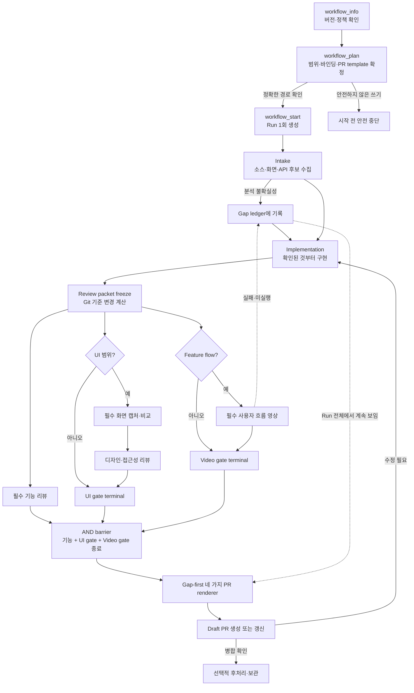
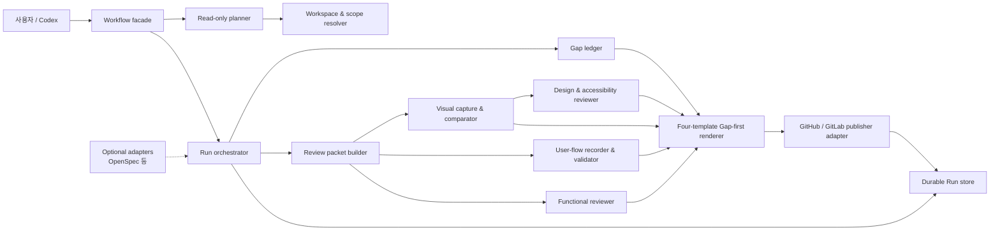

# SpecToPR 1.0.0 목표 아키텍처

- 상태: 확정 설계. 아래 정책 baseline은 구현됐고, contract/schema 정리는 cleanup 계획으로 추적한다.
- 목표 릴리스: `1.0.0`
- 현재 구현 facade 계약: `2.0.0` (`3.0.0`은 cleanup 계획의 호환성 단절 목표)
- 작성일: 2026-08-07
- 범위: 1.0 정책, 런타임·SDK 라우팅, PR renderer, 문서 정합성의 기준

## 1. 한 줄 결정

SpecToPR 1.0.0은 **안전하지 않은 쓰기만 중단하고, 나머지 불확실성은 개발을 계속하면서 Gap으로 축적하며, UI 작업은 화면 비교를 반드시 실행하고 그 결과를 간결한 Draft PR 본문에 공개하는 워크플로**로 다시 설계한다.

여기서 “반드시 실행”과 “반드시 통과”는 다르다.

- UI 비교 실행은 필수다.
- 비교 실패나 기준 화면 획득 실패는 숨기거나 `passed`로 바꾸지 않는다.
- 실패해도 Draft PR은 리뷰와 피드백을 위해 발행할 수 있다.
- 다만 해당 Gap이 해결되기 전에는 “검증 완료” 또는 “병합 권장”으로 표시할 수 없다.

## 2. 해결할 문제

0.3.x는 좋은 증빙 장치를 많이 갖췄지만 다음 책임이 뒤섞였다.

1. `legacy`, `feature`, `figma` 같은 입력 유형이 검증 강도까지 결정했다.
2. API 자동 판별 실패, 증빙 JSON 형식, 브랜치 바인딩, GitLab 인증 같은 지원 기능의 실패가 제품 개발 전체를 멈췄다.
3. 반대로 `fast legacy` 경로는 필수 UI 비교와 독립 리뷰까지 `skipped`로 만들었다.
4. `skipped`, `waived`, `passed`가 사용자 보고에서 명확히 구분되지 않았다.
5. Run 생성 전에 정확한 소스·대상 경로와 브랜치 결합을 검토할 읽기 전용 단계가 없었다.
6. 런타임이 계산할 Git 변경 파일과 호출자가 제출한 변경 파일이 서로 충돌했다.
7. PR 본문이 리뷰 판단보다 내부 스키마, 단계, 도구 로그를 더 많이 보여줬다.
8. OpenSpec 등 선택 기능이 핵심 워크플로의 필수 전제처럼 노출됐다.
9. 문서, Skill, SDK, 런타임 정책이 서로 달라 같은 모드가 다르게 설명됐다.

## 3. 목표와 비목표

### 목표

- 명령 한 번으로 안전하게 개발을 시작할 수 있다.
- 사용자가 준 `legacyProjectRoot`와 `targetPaths`를 문자 그대로 존중한다.
- API·환경·인증·증빙 분석 실패는 기본적으로 비차단 Gap이다.
- UI 범위에는 기준 화면과 구현 화면 비교가 항상 적용된다.
- 기능 리뷰와 UI 리뷰는 독립적이고, 실행하지 못한 검증도 사실대로 보인다.
- Draft PR은 완료 증명서가 아니라 조기 피드백 채널로 사용할 수 있다.
- PR 본문만 보고 리뷰어가 변경, 화면 차이, Gap, 테스트, 확인 방법을 판단할 수 있다.
- Run을 재시작하지 않고 같은 Run에서 Gap 해소, 재검증, PR 갱신을 반복한다.
- 정책의 단일 원천에서 런타임, SDK, Skill, 문서, PR 렌더러를 생성·검증한다.

### 비목표

- 모든 불확실성을 자동 추론으로 없애는 것
- API를 모를 때 요청 본문이나 파괴적 동작을 임의로 발명하는 것
- 실패한 검증을 통과로 보이게 만드는 것
- 모든 내부 증빙을 PR 본문에 그대로 출력하는 것
- OpenSpec을 모든 프로젝트에 강제하는 것
- 0.3.x Run을 1.0 런타임에서 영구적으로 수정 가능하게 유지하는 것

## 4. 핵심 원칙

### 4.1 Gap-first, fail-safe

불명확한 점은 먼저 구조화된 Gap으로 기록한다. 중단은 안전한 쓰기가 불가능할 때만 사용한다.

| 상황                                                          | 기본 처리                     | 개발                             | Draft PR                     | 병합 권장                        |
| ------------------------------------------------------------- | ----------------------------- | -------------------------------- | ---------------------------- | -------------------------------- |
| API method/path/body 일부 불명확                              | Gap                           | 계속                             | 가능                         | 영향도에 따라 보류               |
| 동일 origin의 동적 API가 자동 매칭되지 않음                   | Gap                           | 레거시 코드를 직접 추적하며 계속 | 가능                         | 미해결 호출이 핵심 기능이면 보류 |
| 원격·인증·사내 인증서 문제                                    | Gap                           | 로컬 작업 계속                   | 게시 재시도 또는 로컬 보고서 | PR 생성 전까지 불가              |
| 브랜치 최신성·원격 바인딩 문제                                | Gap 후 격리 worktree에서 계속 | 가능                             | 정확한 바인딩을 고친 뒤 게시 | 바인딩 해결 전 보류              |
| UI 비교 점수 기준 미달                                        | 중대한 Gap                    | 수정 또는 리뷰 요청              | 가능                         | 보류                             |
| UI 기준 화면 획득 실패                                        | 중대한 Gap, 상태 `not-run`    | 소스 기반 구현 계속 가능         | 가능                         | 보류                             |
| 정확한 쓰기 대상이 없거나 쓰기·증빙 경로가 저장소 밖으로 탈출 | 안전 중단                     | 불가                             | 불가                         | 불가                             |
| 소스와 대상이 같은 경로여서 레거시를 덮어쓸 위험              | 안전 중단                     | 불가                             | 불가                         | 불가                             |

“비차단”은 무시한다는 뜻이 아니다. Gap은 Run 상태, 보고서, PR 본문, 후속 갱신에 끝까지 남는다.

### 4.2 입력 유형과 검증 수준 분리

`mode`는 요구사항이 어디서 왔는지만 설명한다.

- `brief`: 문서 중심 입력
- `legacy`: 기존 코드·실행 화면 중심 입력
- `feature`: 대화와 저장소 맥락 중심 입력
- `figma`: Figma 중심 입력

mode는 PR 표현 형식을 하나로 고정한다.

| mode      | PR template        |
| --------- | ------------------ |
| `legacy`  | `legacy-migration` |
| `brief`   | `brief-delivery`   |
| `feature` | `feature-flow`     |
| `figma`   | `figma-ui`         |

템플릿은 reviewer에게 보여줄 정보 구조만 결정한다. 필수 검증은 공통 scope policy가
결정하며 template renderer가 줄일 수 없다.

검증은 `scope`와 정책이 결정한다.

- 코드 변경이면 기능 리뷰를 실행한다.
- UI 변경이면 화면 비교와 디자인·접근성 리뷰를 실행한다.
- `feature-flow`이면 현재 review packet에 묶인 사용자 흐름 영상을 반드시 생성·검증한다.
- 성능 민감 범위면 성능 검증을 실행한다.
- API 입력이 있거나 API 변경이 감지되면 API 매핑을 보고하되, 불확실성은 Gap으로 남긴다.

`auto`는 호환 입력으로 남긴다. 다만 UI scope로 분류되거나 사용자가 UI scope를 지정하면
명시 mode와 동일하게 화면 비교와 디자인·접근성 검증을 요구한다.

### 4.3 실행, 판정, Gap 상태를 분리

검증은 두 축으로 기록한다.

- `execution`: `executed | not-run | skipped`
- `verdict`: 실행된 검증에 한해 `passed | failed | changes-requested`

Gap의 판단 이력은 별도 축이다.

- `status`: `open | resolved | assumed | waived`

`waived`는 검증 결과가 아니라 권한 있는 사람이 이유와 함께 위험을 수용한 Gap 상태다.
`unsafe-stop` Gap은 `assumed` 또는 `waived`로 바꿀 수 없다.

다음 불변식을 적용한다.

1. 필수 검증은 `skipped`가 될 수 없다.
2. `not-run`, `skipped`, Gap의 `assumed/waived`는 `passed`가 아니다.
3. UI가 발견되면 화면 비교를 뒤늦게라도 필수로 승격한다.
4. 수동 스크린샷은 런타임 비교 결과를 대신할 수 없다.
5. 코드가 바뀌면 이전 리뷰 패킷과 그 리뷰 결과는 낡은 것으로 표시한다.
6. `feature-flow` 영상은 `skipped`가 될 수 없다. 획득하지 못하면 `not-run + Gap`이며 Draft는 가능하지만 verified 또는 merge recommended는 불가하다.

### 4.4 Host-neutral 모델 라우팅

core는 공급자 모델명을 모르며 `fast`, `build`, `expert` 역할과 정책만 저장한다. 각 host
adapter가 역할을 한 공급자 안에서 해석한다.

| Host adapter | fast  | build  | expert |
| ------------ | ----- | ------ | ------ |
| Codex        | Luna  | Terra  | Sol    |
| Claude       | Haiku | Sonnet | Opus   |

- 기본은 `adaptive-verified`다. 구현·화면 비교에는 `build`, 독립 기능/디자인 리뷰에는
  `expert`, 상태·정리에는 `fast`를 사용한다.
- `pinned`는 사용자가 지정한 하나의 모델을 모든 단계와 두 독립 리뷰에 그대로 사용한다.
  자동 승격·host 전환은 없다.
- `custom`은 `fast/build/expert` 모델을 모두 직접 지정한다.
- Run은 Codex와 Claude를 자동으로 섞지 않는다. `provider`는 immutable delivery profile에
  저장한다.
- 상위 역할 모델을 host가 제공하지 못하면 개발을 멈추지 않고 다음 사용 가능한 구성 역할로
  진행한다. 요청 모델·실제 모델·영향·재검증 결정은 open quality Gap으로 남는다.
- 어느 전략도 화면 비교, 테스트, 독립 리뷰, Gap 공개의 적용 여부를 바꾸지 않는다.

## 5. 목표 사용자 흐름



세부 시퀀스는 [`spec-to-pr-1.0-flow.mmd`](./spec-to-pr-1.0-flow.mmd)에 기록한다.

## 6. 단계별 설계

### 6.1 `workflow_info`

다음을 짧게 반환한다.

- plugin version: `1.0.0`
- workflow contract version: 현재 구현은 `2.0.0`; 계획된 호환성 단절 뒤에는 `3.0.0`
- build commit과 bundled byte digest
- 지원 mode와 scope
- 지원 `templateKind` enum과 mode→template mapping
- 현재 정책 버전·digest와 mode/scope별 실제 requirement matrix
- 호스트 adapter 상태
- 0.x Run은 읽기·내보내기만 가능하다는 호환성 안내

### 6.2 `workflow_plan` — 새 읽기 전용 사전 단계

Run을 만들거나 저장소를 수정하지 않는다. 다음을 canonicalize하고 그대로 되돌려준다.

- 정확한 `projectRoot`
- 정확한 `legacyProjectRoot`
- 정확한 `targetPaths`와 보조 경로
- source/target branch, base SHA, remote, publication host
- 해석된 mode와 scope
- 확정된 `templateKind`
- 필수 검증 목록
- UI 기준 화면 획득 계획
- Feature 사용자 흐름 영상 시나리오와 획득 계획
- 알려진 사전 Gap
- 안전 중단 사유
- 만료되는 `planToken`과 입력 digest

경로 규칙:

1. `shop`을 `shopping`으로 바꾸는 이름 유사도 추론을 금지한다.
2. `../sandbox_new/...`처럼 사용자가 명시한 저장소 밖 `legacyProjectRoot`는 canonicalize한 뒤 read-only source로 허용한다.
3. 사용자가 지정한 legacy root 밖은 명시적 import, alias, 환경 설정 같은 의존성 edge만 읽는다.
4. 보조 파일을 읽었다고 대상 feature 범위를 넓히지 않는다.
5. 저장소 안의 명시적 새 target path는 생성할 수 있다. target이 명시되지 않았거나 쓰기 parent가 저장소 밖이면 안전 중단한다.

쓰기·읽기 범위도 이름만 다른 하나의 배열로 합치지 않는다.

- `productWriteRoots`: 제품 코드를 수정할 수 있는 정확한 대상
- `generatedEvidenceRoot`: SpecToPR이 자동 관리하는 증빙 위치
- `readOnlyDependencyRoots`: import/configuration edge를 확인할 수 있지만 수정할 수 없는 위치

OpenSpec이나 `.spec-to-pr` 경로는 사용자가 `productWriteRoots`에 미리 추가할 항목이 아니다.

### 6.3 `workflow_start`

- 검토된 `planToken`을 한 번 소비해 durable Run을 만든다.
- 동일 token 재호출은 새 Run을 만들지 않고 기존 Run ID를 반환한다.
- 정책과 workspace binding을 immutable snapshot으로 저장한다.
- publication 인증 성공을 시작 조건으로 요구하지 않는다.
- 안전한 경우 전용 `codex/*` 브랜치와 격리 worktree를 준비한다.

### 6.4 Intake

Intake는 “모든 것을 완전히 아는 단계”가 아니라 “구현 가능한 경계와 미확인 사항을 분리하는 단계”다.

레거시 입력에서는 다음 순서로 조사한다.

1. 사용자가 지정한 feature root의 route, 화면, component, state, type을 읽는다.
2. import·wrapper·HTTP client·environment 이름을 호출 지점에서 terminal request까지 추적한다.
3. method, path, request body, auth, response 소비 위치를 가능한 만큼 연결한다.
4. 실행 가능한 레거시 앱에서는 네트워크와 기준 화면을 수집한다.
5. 자동 판별이 모호하면 API별 Gap을 만들고 구현을 계속한다.

`feature-flow`에서는 사용자의 진입 상태, 핵심 interaction, 성공·오류 종료 상태, fixture,
auth 조건을 `userFlowTargets` manifest로 고정한다. renderer가 나중에 임의의 짧은 흐름으로
대체할 수 없다.

`legacy-network-evidence.json` 같은 별도 형식은 보조 입력일 뿐 개발 시작 허가서가 아니다. 같은 origin의 요청을 도구가 구분하지 못했다는 이유만으로 Run을 막지 않는다.

### 6.5 Implementation

- writer는 하나만 둔다.
- 확인된 route, layout, component, 상태, type, GET 연결부터 구현할 수 있다.
- 불명확한 mutation은 임의 연결하지 않고 해당 interaction을 명시적 pending 상태 또는 safe stub으로 두며 Gap에 기록한다.
- 레거시 코드에 근거가 있으면 자동 inventory의 한계와 관계없이 직접 추적해 구현한다.
- 구현 중 해소한 Gap은 근거와 함께 `resolved`로 바꾸되 기록을 삭제하지 않는다.
- caller가 `changedFiles`를 진실의 원천으로 제출하지 않는다.

### 6.6 Review packet freeze

런타임이 `baseSha → headSha` Git diff에서 다음을 계산한다.

- 변경 파일
- binary diff digest
- UI/API 영향 범위
- 현재 Gap snapshot
- 검증 artifact와 digest
- Feature 사용자 흐름 영상 receipt와 scenario/fixture/head binding

패킷 생성에는 commit된 snapshot과 깨끗한 intended diff가 필요하다. 이것은 개발 시작 조건이 아니라 리뷰 freshness 조건이다. 코드가 바뀌면 새 패킷을 만들고 이전 패킷을 `stale`로 표시한다.

### 6.7 UI 화면 비교 — UI 범위에서 항상 필수

화면 비교는 artifact metadata 속의 암묵적 상태가 아니라 명시적
`visual-verification` 단계로 승격한다.

#### 실행 규칙

UI가 하나라도 포함되면 다음을 모두 시도한다.

1. 기준 화면 획득
2. 동일 route, state, viewport, DPR, locale, fixture, auth 조건에서 현재 화면 획득
3. 런타임 소유 정규화와 비교
4. baseline/current/diff/overlay 생성
5. 상태별 점수와 전체 판정 기록

Intake가 route, state, viewport별 `visualTargets` manifest를 고정한다. 구현 후 모든 target은
반드시 `passed`, `failed`, `not-run` 중 하나를 가져야 한다. target 누락은 자동으로
`not-run`과 merge-blocking Gap이 되며, agent가 비교 대상을 조용히 줄일 수 없다.

기준 화면 우선순위:

1. 실행 중인 지정 legacy feature의 실제 화면
2. 지정 Figma node의 native capture
3. 사용자가 승인한 고정 screenshot

소스 코드만으로 만든 추정 이미지는 통과 기준 화면이 아니다.

#### 판정 규칙

- 1.0.0 기본 `reviewMatchRatio`는 현재 승인 정책과 맞춰 `92%`를 제안한다.
- 허용 mask는 정당화된 영역에 한해 최대 `20%`다.
- 최초 비교와 최대 두 번의 자동 수정 비교를 허용한다.
- 점수와 verdict는 런타임이 계산한다.
- 임계값은 PR 본문에 실제 적용값과 함께 표시한다.

92%라는 숫자는 릴리스 전 대표 fixture로 재교정한다. 숫자를 바꾸더라도 한 정책 원천에서만 바꾸며 과거 Run 결과를 다시 쓰지 않는다.

#### 실패 처리

- 기준 미달: `failed` + merge-blocking Gap + Draft PR 가능
- 기준 획득 실패: `not-run` + merge-blocking Gap + Draft PR 가능
- capture 형식 오류: 원인을 Gap으로 기록하고 재수집 가능
- 세 번째 유효 비교 실패: 자동 수정을 멈추되 Run 전체를 숨기지 않고 Draft 피드백 단계로 이동

“Draft 생성 가능”은 “통과”를 뜻하지 않는다. PR 제목·상단 상태·화면 비교 표에서 실패가 즉시 보여야 한다.

### 6.8 Feature 사용자 흐름 영상 — Feature flow에서 항상 필수

`templateKind: feature-flow`는 현재 review packet에 묶인 사용자 흐름 영상 한 개 이상을
필수 evidence로 가진다.

- Intake의 `userFlowTargets`와 같은 진입 상태, 핵심 interaction, 종료 상태를 담는다.
- 동일 packet의 head, fixture, auth 조건과 video digest를 receipt에 묶는다.
- `.webm` 또는 `.mp4`가 실제로 재생되고 필수 단계가 순서대로 포함됐는지 검증한다.
- 사용자 token, cookie, 개인정보, 운영 secret을 capture 전에 가리거나 안전한 fixture로 대체한다.
- 임의 편집, 잘라내기, 대기로 실패 구간을 숨기지 않는다.
- 코드, fixture, 흐름 단계가 바뀌면 이전 영상은 `stale`이다.

영상 누락, 촬영 실패, 재생 불가, stale receipt는 `not-run + merge-blocking Gap`이다. 이
상태에서도 Draft는 만들 수 있지만 verified 또는 merge recommended가 될 수 없다. 사용자
흐름 영상은 UI pixel comparison을 대신하지 않으므로 Feature가 UI scope이면 두 evidence를
모두 요구한다.

### 6.9 기능, 디자인, 접근성 리뷰

- 코드 변경은 독립 기능 리뷰 대상이다.
- UI 변경은 독립 디자인·접근성 리뷰 대상이다.
- 기능 리뷰와 화면 비교는 같은 immutable packet에서 병렬 실행한다.
- 이미지가 준비되면 점수 통과 여부와 관계없이 디자인 리뷰가 차이를 분석할 수 있다.
- capture 자체가 불가능하면 디자인 리뷰는 `not-run` 또는 제한적 코드 리뷰로 기록하고 Gap을 만든다.
- reviewer는 read-only이며 구현을 수정하지 않는다.
- `changes-requested`는 구현으로 돌아가게 하지만 기존 Gap과 리뷰 흔적은 보존한다.
- 각 검증 action은 bounded timeout을 가진다. 도구 미응답·획득 실패·reviewer 불가를 무한 재시도하지 않고 `execution: not-run`과 typed Gap으로 확정한 뒤 report와 Draft를 계속한다.

### 6.10 Report와 Draft PR

Report의 목적은 내부 실행 기록을 전시하는 것이 아니라 리뷰 결정을 빠르게 만드는 것이다. 기본 본문은 [`PR 본문 계약`](#10-pr-본문-계약)을 따른다.

Draft PR은 다음 상태에서도 만들거나 갱신할 수 있다.

- 화면 비교 실패
- Feature 사용자 흐름 영상 실패 또는 미실행
- 일부 API 미확인
- 일부 테스트 실패 또는 실행 불가
- 기능·디자인 reviewer의 changes requested

다만 게시 호스트에 실제 요청을 만들 수 없는 인증·TLS·원격 문제는 PR 생성을 물리적으로 막는다. 이 경우 로컬 보고서를 완성하고 `requestSynced: false`와 게시 Gap을 표시한다. 생성되지 않은 PR을 생성됐다고 보고하지 않는다.

### 6.11 Post-merge

병합을 실제로 확인한 뒤 Run을 immutable completion으로 보관한다. OpenSpec archive는 핵심 단계가 아니라 설치 가능한 optional adapter다.

## 7. Gap 모델

```ts
type GapBase = {
  id: string;
  area:
    | "scope"
    | "binding"
    | "api"
    | "visual"
    | "user-flow"
    | "functional"
    | "accessibility"
    | "performance"
    | "publication"
    | "tooling";
  severity: "critical" | "major" | "minor" | "info";
  effect: "informational" | "draft-warning" | "merge-blocking" | "unsafe-stop";
  summary: string;
  impact: string;
  nextAction?: string;
  evidenceRefs: string[];
  discoveredAt: string;
  owner?: "agent" | "reviewer" | "user" | "platform";
};

type GapV1 = GapBase &
  (
    | {
        status: "open" | "assumed" | "waived";
        reviewerDecision:
          "fix-required" | "accept-risk" | "provide-information" | "allow-follow-up";
      }
    | {
        status: "resolved";
        resolvedAt: string;
        resolution: string;
        reviewerDecision?: string;
      }
  );
```

규칙:

- 자동 파서가 모른다는 사실과 실제 제품 코드에 근거가 없다는 사실을 구분한다.
- 동일 원인의 중복 Gap은 하나로 묶고 영향받는 operation·화면 목록을 연결한다.
- `open/assumed/waived` Gap은 PR에 표시할 `impact`와 `reviewerDecision`을 반드시 가진다.
- `waived`는 사용자 또는 정책상 권한 있는 reviewer만 설정하며 이유를 필수로 남긴다.
- `effect: unsafe-stop`은 assume/waive할 수 없고 안전한 binding을 새로 확정해야만 해결된다.
- resolved Gap도 접힌 상세 내역에 남겨 판단 이력을 제공한다.
- `unsafe-stop` 외의 Gap은 구현 진행을 막지 않는다.
- `merge-blocking`은 Draft PR을 막지 않고 병합 권장 상태만 막는다.

## 8. 시스템 구성



### 컴포넌트 책임

| 컴포넌트              | 책임                                          | 하지 않는 일                  |
| --------------------- | --------------------------------------------- | ----------------------------- |
| Read-only planner     | 경로·정책·binding 미리보기, 안전성 검사       | Run 생성, 파일 쓰기           |
| Run orchestrator      | 상태 전이, action 발행, packet freshness      | 제품 코드 직접 수정           |
| Gap ledger            | 불확실성·실패·해결 이력의 단일 원천           | Gap을 자동 통과 처리          |
| Workspace resolver    | 정확한 root/path/branch/remote 확인           | fuzzy sibling 추론            |
| Review packet builder | Git 기반 diff와 증빙 snapshot                 | caller 변경 목록 신뢰         |
| Visual comparator     | capture 검증, 점수·diff 계산                  | caller score 신뢰             |
| Reviewers             | 독립 read-only 판정                           | 구현 수정, workflow 상태 조작 |
| User-flow recorder    | packet-bound Feature 영상·redaction·재생 검증 | 영상으로 화면 비교 대체       |
| Template router       | mode에 맞는 네 renderer 중 하나 선택          | 검증 gate 선택·약화           |
| Report renderer       | Gap-first reviewer 본문 생성                  | raw log·Run ID 기본 노출      |
| Publisher adapter     | idempotent preview/create/update              | merge, ready 전환, TLS 우회   |
| Optional adapter      | OpenSpec 등 후처리                            | 핵심 Run 의존성 생성          |

## 9. 공개 인터페이스 제안

기존 일곱 도구에 `workflow_plan`을 추가해 여덟 개로 만든다.

1. `workflow_info`
2. `workflow_plan`
3. `workflow_start`
4. `workflow_advance`
5. `workflow_submit`
6. `workflow_status`
7. `workflow_publish`
8. `workflow_archive`

주요 변경:

- `workflow_start`는 raw workspace 추론 대신 `planToken`을 소비한다.
- `workflow_submit`은 Gap 발견·해결, 구현 snapshot, packet-bound 사용자 흐름 영상 receipt, 검증·리뷰 결과를 typed submission으로 받는다.
- `workflow_status`는 `nextActions`, 검증 상태, Gap 요약, publication sync를 짧게 반환하고 내부 설명을 반복하지 않는다.
- `workflow_publish`은 `preview`와 `execute`를 유지하되 같은 source/target draft를 idempotent하게 찾고 갱신한다.
- `workflow_archive`은 Run 자체 보관만 담당한다. OpenSpec 처리는 optional adapter 명령으로 분리한다.

정리 단계에서 계약 호환성을 실제로 단절할 때에는 plugin `1.0.0`과 별개로 facade contract를
`3.0.0`으로 올린다. 그 전까지 구현 facade는 `2.0.0`을 유지하되, 이 문서의 정책 불변식은
이미 적용한다.

## 10. PR 본문 계약

목표 `pr-report-v3` canonical data는 하나지만 기본 본문 renderer는 네 개의 discriminated
template으로 분리한다. 현재 1.0.0 baseline은 호환 가능한 `pr-report-v2.1` 데이터 위에서
동일한 네 reviewer-first 본문을 렌더링하며, v3 전환 전까지 기존 Run을 재해석하거나 삭제하지 않는다.

| mode      | `templateKind`     | 기본 reviewer 관점                              |
| --------- | ------------------ | ----------------------------------------------- |
| `legacy`  | `legacy-migration` | 정확한 source→target과 이관·제외 범위           |
| `brief`   | `brief-delivery`   | 수용 기준과 구현·검증 대응                      |
| `feature` | `feature-flow`     | 사용자 흐름과 필수 재생 영상                    |
| `figma`   | `figma-ui`         | Figma node/state와 구현의 시각·interaction 일치 |

모든 template의 공통 순서는 다음과 같다.

1. 제목과 한 줄 상태
2. unresolved Gap과 영향·리뷰어 결정 — 존재할 때만, 가장 위에 표시
3. template별 핵심 요약
4. UI 화면 비교 — UI scope면 반드시
5. 사용자 흐름 영상 — `feature-flow`면 반드시
6. 구현 내용
7. 검증 결과
8. 리뷰 방법
9. reviewer에게 필요한 상세 증빙 — 값이 있을 때만

네 template의 전체 skeleton, 조건부 렌더링, Gap/화면/영상 block과 snapshot matrix는
[`spec-to-pr-1.0-pr-templates.md`](./spec-to-pr-1.0-pr-templates.md)를 canonical 설계로
사용한다.

Report는 같은 review packet에 적용되는 모든 검증의 `execution`이 `executed`, `not-run`
또는 `skipped`로 확정되고, 실행된 검증의 `verdict`가 기록된 뒤 생성한다. `skipped`는
애초에 적용 대상이 아닌 검증에만 허용한다. bounded timeout에 도달한 검증은
`not-run + Gap`으로 확정하므로 report와 Draft를 무한 대기시키지 않는다.

### 기본 본문에 포함할 것

- 무엇을 개발했는지
- template별 핵심 판단 정보: legacy mapping, Brief 수용 기준, Feature 흐름, Figma mapping
- unresolved Gap(`open`, `assumed`, `waived`)과 영향, 리뷰어 결정, 다음 행동·담당자
- 화면별 일치율, 임계값, 기준 출처, 미실행 이유, baseline/current/diff
- Feature 사용자 흐름 영상의 시나리오, 실행 결과, 시작→종료, 재생 링크
- 기능·디자인·접근성·테스트 상태
- 주요 변경 모듈
- 재현·리뷰 방법

### 기본 본문에서 뺄 것

- Skill 이름과 실행 지시
- token budget, workload 추정, 내부 reasoning 정보
- 내부 stage 이름과 revision 나열
- Run ID와 resume 정보
- schema version, artifact ID, digest 전체 목록
- internal/raw tool log, terminal log, stack trace
- 빈 section, 빈 표, 빈 checklist, placeholder
- 의미 없는 전체 파일 나열
- Gap이 없는 전체 API inventory
- OpenSpec 내부 경로와 archive 절차
- 사용자가 판단할 수 없는 정책 설명 반복

원본 증빙은 삭제하지 않는다. 기본 본문에서 숨기고 로컬 canonical report 또는 evidence
store에서 접근하게 한다. reviewer에게 필요한 전체 파일·API mapping·증빙 링크는 값이 있을
때만 `<details>`로 표시할 수 있지만 raw log와 Run ID는 그 안에도 넣지 않는다.
해결된 Gap만 접힌 상세로 이동한다.
Gap section은 `open/assumed/waived`가 있을 때만, 화면 비교 section은 UI 범위일 때만 렌더링한다.
Feature 영상 section은 `feature-flow`에서 항상 렌더링하며 영상이 없으면 `not-run + Gap`을 표시한다.
`requestSynced`는 PR 본문이 아니라 `workflow_status`와 로컬 report에만 표시한다.

## 11. 게시 설계

게시 사전 점검은 구현과 분리한다.

1. 정확한 Git host와 remote URL을 canonicalize한다.
2. 명시적 PAT 또는 해당 host의 CLI 인증을 사용한다.
3. 앱 로그인 cookie를 Git host token으로 재사용하지 않는다.
4. 사내 CA는 설정된 trust store 또는 `NODE_EXTRA_CA_CERTS`로 신뢰한다.
5. 인증서 검증을 끄는 우회는 금지한다.
6. 사용자 API가 JSON과 예상 identity를 반환하는지 확인한다.
7. 같은 source/target의 기존 Draft를 먼저 찾아 update한다.
8. 네트워크 결과가 불확실하면 재조회해 생성 여부를 확인한 뒤에만 재시도한다.
9. secret은 로그, artifact, PR 본문, 저장소에 저장하지 않는다.

결과 상태:

- `requestSynced: true`: host에서 Draft 생성/갱신을 확인함
- `requestSynced: false`: PR 없음 또는 확인 불가; 로컬 report와 publication Gap만 존재

## 12. 저장과 복구

현재 OS 임시 디렉터리 기본값은 durable Run에 적합하지 않다. 1.0.0은 플랫폼별 사용자 데이터 디렉터리에 저장소별 namespace를 둔다.

- SQLite: Run, stage, Gap, binding, publication 상태
- content-addressed artifact store: 캡처, diff, report, review evidence
- secret-free source snapshot metadata
- 명시적 export, backup, retention, cleanup 명령

0.3.x 데이터는 릴리스 전에 export 도구로 백업한다. 1.0 런타임이 구형 Run을 조용히 변환하거나 수정하지 않는다.

## 13. 정책 단일 원천

하나의 versioned policy manifest에서 다음을 생성하거나 검증한다.

- mode와 scope 규칙
- mode→`templateKind` mapping과 네 renderer의 필수 block
- 필수 검증과 상태 의미
- visual threshold와 mask, retry
- Feature 사용자 흐름 영상 requirement와 receipt 검증
- Gap effect 기본값
- public contract constants
- SDK mirror
- Skill 표와 README 표
- plugin manifest 설명
- PR renderer status labels

릴리스 검증은 모든 표면의 policy digest가 다르면 실패해야 한다. 문서와 runtime이 다르지만 빌드가 성공하는 상태를 허용하지 않는다.

## 14. 보안과 운영 불변식

- 사용자 token·cookie·secret은 출력하거나 artifact 또는 저장소에 기록하지 않는다.
- 레거시 root는 read-only다.
- target path 밖 쓰기는 허용하지 않는다.
- 게시 mutation은 preview와 최신 remote fence를 다시 확인한다.
- 불확실한 mutation 결과는 중복 생성 전에 재조회한다.
- artifact는 digest와 packet/head에 묶는다.
- reviewer 결과는 해당 packet에만 유효하다.
- 화면 점수와 pass verdict는 runtime만 계산한다.
- 사용자 흐름 영상은 secret redaction과 packet freshness를 통과해야 한다.
- agent가 Gap을 임의 삭제하거나 실패를 `passed`로 바꾸지 못한다.

## 15. 성공 지표

1. UI Run의 100%가 `passed`, `failed`, `not-run` 중 하나의 화면 비교 결과를 가진다.
2. 적용 가능한 필수 검증이 `skipped`로 종료되는 Run은 0건이다.
3. API 자동 판별 실패 때문에 구현 전 중단되는 안전한 Run은 0건이다.
4. 사용자 지정 legacy root와 다른 유사 경로를 선택하는 Run은 0건이다.
5. Feature Run의 100%가 `executed` 또는 `not-run + Gap` 사용자 흐름 영상 결과를 가진다.
6. 모든 Run이 mode에 맞는 네 template 중 정확히 하나를 사용한다.
7. PR 본문 첫 화면에서 Gap의 영향·리뷰어 결정과 template별 핵심 증빙을 확인할 수 있다.
8. 어떤 기본 PR 본문에도 internal log, Run ID, 빈 checklist가 나타나지 않는다.
9. 생성되지 않은 PR을 생성됐다고 보고하는 사례는 0건이다.
10. 동일 publish 재시도가 중복 PR을 만드는 사례는 0건이다.
11. runtime, SDK, Skill, docs의 policy digest 불일치 릴리스는 0건이다.
12. 평균 Run 시간은 병렬 리뷰와 capture reuse로 줄이고, 필수 검증 실행률은 낮아지지 않는다.

## 16. 남은 결정

1. 대표 프로젝트 fixture로 `92%` 임계값을 최종 교정한다.
2. merge-blocking Gap을 실제 host의 merge check로 연동할지, PR 본문 표시에만 둘지 결정한다.
3. Draft PR 제목에 실패 상태 접두사(`[GAPS]`, `[VISUAL FAIL]`)를 자동 추가할지 결정한다.
4. optional OpenSpec adapter를 같은 저장소 package로 둘지 별도 plugin으로 분리할지 결정한다.

이 결정들은 1.0 구현 전에 닫아야 하지만, API·binding Gap 때문에 개발을 멈추지 않는 원칙과 UI 비교 필수 실행 원칙은 변경하지 않는다.
