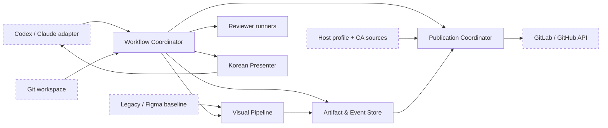
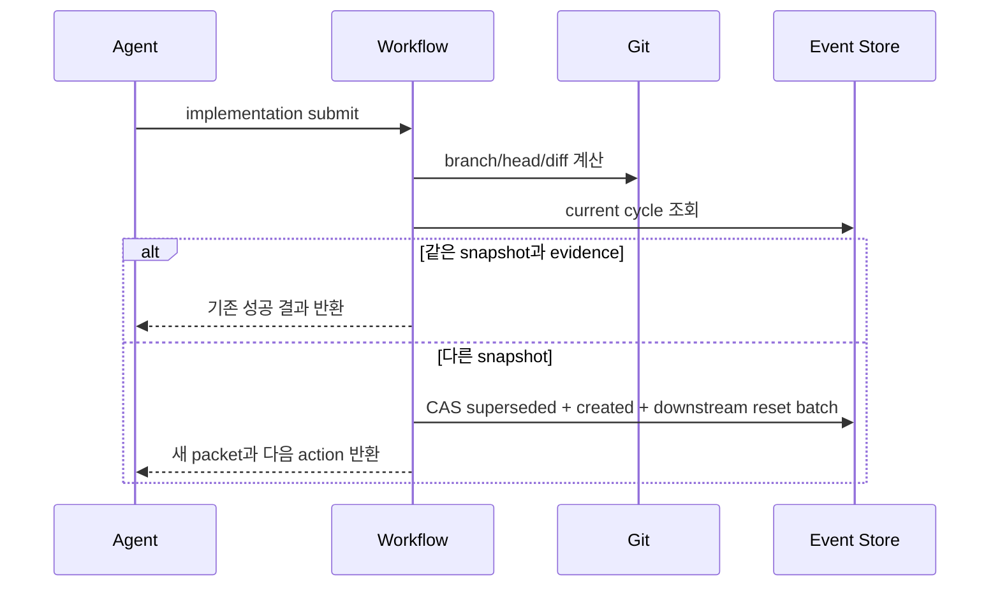

# SpecToPR 복구 파이프라인 설계

- 상태: 구현 기준안
- 작성일: 2026-08-10
- 기준 버전: `1.0.0`
- 목표 버전: `1.1.0`
- 관련 결정: [ADR 043](../adr/043-use-revision-cycles-and-recoverable-publication.md)
- 전체 흐름: [Mermaid source](./spec-to-pr-recovery-pipeline-flow.mmd)

## 1. 결론

Mapfinder 문제는 UI 구현 실패나 GitLab 인증 하나의 문제가 아니다. 다음 세 복구 경로가 서로
이어지지 않은 복합 결함이다.

1. 저장된 Run은 UI 작업을 `visual.not-applicable`로 잘못 마감했다. 별도로 레거시 시각 비교는
   receipt 없이 실행되지만 실패 repair는 strict receipt를 요구해 정상적인 재개 전이를 건너뛴다.
2. 통과한 구현 뒤 새 commit을 기존 packet과 분리하는 revision 경로가 없다. 레거시 visual은 공통
   packet freshness 검사도 생략한다.
3. Git push가 사용하는 CA 설정을 Node publisher가 공유하지 않으며, publisher의 preflight가 실제
   TLS/API 요청과 API base URL을 검증하지 않는다. 중간 실패를 복구할 publication transaction도
   없다.

따라서 해결책은 상태 전이 하나를 풀거나 GitLab 주소를 하드코딩하는 것이 아니다. 구현 revision,
시각 획득·비교, artifact 보존, 원격 publication을 하나의 복구 가능한 파이프라인으로 연결해야 한다.

증거 수준도 구분한다. Mapfinder 저장 Run으로 직접 확정되는 것은 visual applicability 오류, CA/API
URL 게시 오류, MR branch 불일치다. receipt repair 교착과 stale packet은 현재 코드와 회귀 commit으로
확정되는 구조적 결함이지만, 해당 Run에 durable visual attempt가 없어 그 시도 자체를 사후 입증할
수는 없다.

## 2. 조사로 확인한 사실

### 2.1 직접 원인과 정정

| 관찰                                              | 확인된 원인                                                                              | 잘못된 설명                  |
| ------------------------------------------------- | ---------------------------------------------------------------------------------------- | ---------------------------- |
| 시각 실패 후 implementation이 `passed`에 남음     | receipt 없는 레거시 비교 실패 뒤 repair artifact가 `captureSummary`를 요구하며 예외 발생 | 재개 기능 자체가 없음        |
| 보정 commit 재제출이 `passed -> running`으로 실패 | 일반 implementation revision/supersede 계약 부재                                         | immutable packet이 잘못됨    |
| `workflow_advance`가 해결하지 않음                | advance는 Git HEAD reconcile 또는 implementation revision 명령이 아님                    | advance가 상태 갱신에 실패함 |
| push는 되지만 publisher `fetch`는 실패            | Git 전용 `http.sslCAInfo`와 Node CA trust가 분리됨                                       | 쿠키 또는 Git 인증 문제      |
| CA 적용 후 HTML JSON parse 실패                   | Run의 GitLab API URL에 `/api/v4` 누락                                                    | CA만 고치면 게시 완료        |
| `glab`으로 MR 생성 성공                           | host 설정의 `skip_tls_verify=true`로 인증서 검증 생략                                    | glab이 사내 CA를 정상 신뢰   |
| 긴 legacy baseline이 통과 불가능                  | capture geometry 부재 + exact dimension 요구 + 고정 pixel limit                          | 비교 점수 조정 문제          |
| MR 본문이 길고 영어 진단이 많음                   | blocker 원인 덮어쓰기 + legacy coverage 이중 렌더링                                      | 모델의 말투만의 문제         |

### 2.2 코드 근거

- `src/state/stage-machine.ts`
  - `passed -> running`은 의도적으로 금지한다.
  - 리뷰 및 시각 repair 전용 reopen helper는 이미 존재한다.
- `src/application/workflow-service.ts`
  - 레거시 대상은 strict capture receipt 없이 획득을 통과한다.
  - 실패 repair artifact는 모든 target에 `captureSummary`를 요구한다.
  - 레거시 visual submit은 review packet freshness를 공통 검사하지 않는다.
  - 캡처 검증이 visual attempt 예약보다 먼저 실행돼 획득 오류가 durable attempt로 남지 않는다.
  - 3차 시각 실패 뒤에는 일반 implementation guard가 먼저 실행돼
    `VISUAL_ATTEMPT_LIMIT_REACHED` 전용 진단에 도달하지 못한다.
  - blocker 재구성이 실제 code, summary, recovery를 일반 문구로 바꾼다.
- `src/visual/png-decoder.ts`
  - `8,388,608` pixel 한도가 전역 상수로 고정돼 있다.
- `src/visual/visual-comparator.ts`
  - baseline과 actual bitmap 크기가 정확히 같아야 한다.
  - 현재 metric은 pixel 독립적이므로 타일 집계 결과를 whole-frame 결과와 동일하게 만들 수 있다.
- `src/publisher/gitlab-publisher.ts`
  - 전역 `fetch`를 사용하며 host별 CA 주입 지점이 없다.
- `src/publisher/remote-detector.ts`
  - 현재 preflight는 URL과 credential availability를 검사할 뿐 동일 transport로 TLS/API를 호출하지 않는다.
- `src/application/publisher-service.ts`
  - 실제 API identity·권한 preflight보다 Git push를 먼저 실행한다.
  - 외부에서 만든 MR을 검증해 transaction에 등록하는 입력이 없다.
- PR report renderer
  - legacy coverage를 범위와 source-to-target 섹션에서 반복 렌더링한다.

레거시 repair의 직접 회귀는 `b9294d2` (`fix: validate visual repair evidence lineage`)에서
도입됐다. 이 변경은 receipt가 없는 결과에 만들던 기본 `captureSummary`를 제거하면서, 같은 경로의
failed target에는 여전히 summary를 필수로 뒀다. 관련 시각 unit 69개는 통과하지만 “3회 시각 실패”
workflow integration test는 현재 guard 순서 문제로 실패한다. 즉 기존 테스트가 이 레거시 조합을
보호하지 못했고, 별개의 terminal diagnostic 경로도 현재 red다.

### 2.3 Mapfinder 증빙 재검산

대상 branch의 마지막 두 commit은 구현 commit과 시각 정렬 commit으로 확인된다.

```text
5dea2cf25  feat(gz-app): Mapfinder UI 이관
15f9cd155  fix(gz-app): Mapfinder 기본 화면 정렬
```

현재 MR branch에 commit된 baseline과 actual은 모두 `390 x 844`다. `1.0.0` comparator로 다시 계산한
최종 `reviewMatchRatio`는 약 `91.30%`로 현재 기준 `92%`에 미달한다. 첫 commit의 actual은 약
`84.56%`였다. 따라서 “최종 비교 통과”에 사용했다는 임시 캡처 또는 mask가 따로 있었다면 현재
commit된 증빙만으로는 이를 재현할 수 없다. 이 파일들도 canonical Run visual report에 묶여 있지
않다. 이것은 publication뿐 아니라 evidence classification·retention 결함이다.

대화에 나온 `390 x 31,266` full-page baseline은 현재 commit된 Mapfinder 이미지와는 다른 사례다.
다만 아래 계약에서는 실제로 구조적 교착이 재현되므로 일반 결함으로 함께 해결해야 한다.

현재 decoder는 baseline을 dimension 비교보다 먼저 읽으므로, 실제 오류 순서는 다음과 같다.

```text
390 x 844 actual    + 390 x 31,266 baseline -> baseline VISUAL_PIXEL_LIMIT
390 x 31,266 actual + 390 x 31,266 baseline -> baseline 또는 actual VISUAL_PIXEL_LIMIT
```

pixel limit을 우회해도 viewport와 full-page를 구분할 계약이 없어 작은 actual은 결국 geometry가
맞지 않는다. 따라서 오류 문구 하나가 아니라 capture contract와 decoder를 함께 고쳐야 한다.

### 2.4 Mapfinder Run과 MR !496의 게시 상태

저장된 Run을 직접 조회한 결과, “비교는 통과했고 MR 첨부만 빠졌다”는 설명도 사실과 다르다.

| 항목             | 저장된 Run                                | MR !496                                 |
| ---------------- | ----------------------------------------- | --------------------------------------- |
| source branch    | `codex/gz-app-mapfinder-legacy-migration` | `codex/feat-gz-app-mapfinder-migration` |
| GitLab API base  | `https://gitlab.golfzon.local`            | 정상 API 경로는 `/api/v4` 필요          |
| canonical visual | `not-applicable`, 결과 0건                | 본문에 visual evidence 없음             |

- canonical report는 `visual.applicable=false`, `status=not-applicable`, `results=[]`다.
- CAS에는 baseline 2장과 actual 2장이 남아 있지만 visual role이 아닌 일반 artifact다. diff와
  overlay, final visual report는 없다.
- publisher에는 baseline/actual/diff preview 수집 기능이 이미 있다. 이번 문제는 기능 부재가 아니라
  UI scope 분류, canonical evidence 생성, 게시 복구가 차례로 끊긴 것이다.
- Run의 source branch와 !496의 source branch가 다르다. 따라서 !496을 기존 Run에 URL만 등록하면
  branch/SHA fence를 위반한다.
- Codex runtime의 artifact data directory가 명시되지 않아 OS 임시 경로가 기본이다. 현재 CAS blob이
  남아 있는 것과 process/cleanup 이후 장기 복구가 보장되는 것은 다르다.

실제 게시 실패는 두 단계였다.

1. 기본 Node `fetch`가 사내 CA를 신뢰하지 않아 `UNABLE_TO_VERIFY_LEAF_SIGNATURE`.
2. CA를 제공한 뒤에는 Run의 `apiBaseUrl`에 `/api/v4`가 없어 HTML을 JSON으로 읽으며 실패.

Git push는 Git의 `http.sslCAInfo`를 사용해 성공했다. `glab`은 keyring 인증과 별개로 해당 host의
TLS 검증 생략 설정 때문에 성공했으므로 안전한 fallback 근거가 아니다.

### 2.5 현재 테스트 상태

- 상태 전이 관련 19개, 시각 관련 69개, publisher 관련 100개 테스트는 통과했다.
- “3회 시각 실패 뒤 attempt limit 진단” integration test는 현재 실패한다. 일반 implementation
  prerequisite가 전용 `VISUAL_ATTEMPT_LIMIT_REACHED` guard보다 먼저 실행되는 기존 결함이다.
- private CA HTTPS, 잘못된 API base의 HTML 응답, 동시 publisher, uncertain POST, 외부 MR 등록,
  process restart artifact 복구, legacy coverage aggregation 회귀 테스트는 현재 없다.

즉 기존 단위 테스트 188개가 통과한다는 사실은 이번 end-to-end 복구 경로를 보장하지 않는다.

## 3. 설계 목표와 비목표

### 목표

- 코드가 바뀌면 이전 packet을 보존한 채 같은 Run에서 새 packet으로 전진한다.
- 레거시와 Figma가 동일한 freshness, artifact ownership, attempt 규칙을 사용한다.
- 구조적으로 비교할 수 없는 baseline은 구현 전에 진단한다.
- 획득 실패와 비교 실패를 구분하고 재시도 가능 여부와 정확한 다음 행동을 제공한다.
- publication 어느 단계에서 실패해도 중복 MR이나 artifact 유실 없이 재시도로 수렴한다.
- 사내 GitLab을 안전하게 기본 설정할 수 있지만 공개 core는 host-neutral을 유지한다.
- 사용자 및 MR의 기본 출력은 짧은 한국어이며, 기계 진단은 손실 없이 별도 보존한다.

### 비목표

- 이전 packet 또는 리뷰 결과의 SHA를 수정하는 것
- visual attempt 한도를 새 commit으로 초기화하는 것
- TLS 검증을 끄는 것
- 화면 차이를 자동으로 정답 UI라고 판단하는 것
- 모든 내부 artifact와 파일 목록을 MR 본문에 펼쳐 쓰는 것

## 4. 시스템 경계



외부 시스템은 Git workspace, baseline provider, reviewer runtime, Git host뿐이다. Git host에 대한
push transport와 HTTP API transport는 인증·CA source가 다를 수 있으므로 publication coordinator가
명시적으로 결합한다.

## 5. 목표 컴포넌트

| 컴포넌트                        | 책임                                                                           | 금지 사항                                  |
| ------------------------------- | ------------------------------------------------------------------------------ | ------------------------------------------ |
| `ImplementationRevisionService` | HEAD drift 감지, cycle supersede, 새 packet 생성, downstream projection 무효화 | 기존 packet 수정, attempt reset            |
| `UiScopeGate`                   | UI scope·visual target·필수 stage·report applicability의 일관성 보장           | 결과가 없다는 이유로 `not-applicable` 처리 |
| `VisualCapturePlanner`          | mode·viewport·content·bitmap·tile 계획을 contract 단계에서 확정                | 캡처 뒤 geometry 추측                      |
| `VisualCaptureSessionService`   | 획득 event 기록, packet-bound adapter 실행, receipt 생성                       | 사람이 JSON receipt 수동 작성하도록 요구   |
| `BrowserCaptureAdapter`         | shell 없는 고정 Playwright invocation으로 target 캡처                          | 호출자 임의 command 또는 receipt 신뢰      |
| `VisualComparisonService`       | whole-frame/tiled 비교, aggregate metric, 원인 영역 계산                       | pixel limit 무제한 상향                    |
| `ArtifactLedger`                | baseline/actual/diff/overlay와 upload receipt의 ownership·retention            | publish 전 임시 산출물 삭제                |
| `HostProfileResolver`           | exact host 설정, Git/Node CA source, 인증 adapter 해석                         | 공개 core에 회사 URL 고정                  |
| `PublicationCoordinator`        | true preflight, idempotent asset/MR sync, reconcile, remote verification       | 모호한 POST 뒤 즉시 다른 create 경로 사용  |
| `WorkflowPresenter`             | 구조화 진단을 짧은 한국어로 렌더링                                             | 원인 code와 recovery 정보 파괴             |

## 6. 상태와 데이터 계약

### 6.1 Implementation cycle

```ts
type ImplementationCycleV1 = {
  schemaVersion: "implementation-cycle-v1";
  cycleId: string;
  runId: string;
  ordinal: number;
  packetId: string;
  supersedesCycleId?: string;
  supersedesPacketId?: string;
  reason:
    "initial" | "visual-failure" | "review-changes" | "workspace-head-changed" | "user-requested";
  source: {
    branch: string;
    baseSha: string;
    headSha: string;
    diffDigest: string;
  };
  visualLineageId?: string;
  createdAt: string;
};

type ImplementationCycleEventV1 =
  | {
      kind: "cycle-created";
      cycle: ImplementationCycleV1;
      expectedPreviousCycleId?: string;
    }
  | {
      kind: "cycle-superseded";
      cycleId: string;
      supersededByCycleId: string;
      reason: Exclude<ImplementationCycleV1["reason"], "initial">;
      occurredAt: string;
    };
```

외부 submission은 다음 revision envelope를 선택적으로 받는다.

```ts
type ImplementationRevisionInput = {
  supersedesPacketId: string;
  reason: Exclude<ImplementationCycleV1["reason"], "initial">;
  triggerArtifactIds?: string[];
};
```

불변식은 다음과 같다.

1. 생성된 cycle record와 event, packet은 수정하지 않는다.
2. `current/superseded`는 append-only event를 replay한 projection이며 active Run에는 current cycle이
   정확히 하나다.
3. 같은 source snapshot과 evidence의 중복 제출은 같은 결과를 반환한다.
4. 다른 snapshot은 explicit 또는 auto-reconciled revision 없이는 review/visual/publish에 들어갈 수 없다.
5. 기존 리뷰와 publication은 historical record로 남지만 current projection에서는 제거한다.
6. 같은 baseline contract의 revision은 `visualLineageId`와 사용한 비교 횟수를 계승한다.
7. baseline 또는 승인된 contract가 바뀌면 새 Run을 요구한다.
8. supersede와 create event는 expected current cycle에 대한 하나의 CAS batch로 append한다.

초기 구현은 stage enum을 대규모 변경하지 않고 `failed/retryable` projection을 사용할 수 있다. 다만
사용자에게는 `IMPLEMENTATION_REVISION_REQUIRED`를 실패나 blocker가 아니라 다음 정상 action으로
표시한다.

### 6.2 Visual capture plan

```ts
type VisualCapturePlanV2 = {
  schemaVersion: "visual-capture-plan-v2";
  targetId: string;
  mode: "viewport";
  route: string;
  state: string;
  fixture: { id: string; digest: string };
  environment: {
    serverOrigin: string;
    locale: string;
    timezone: string;
    colorScheme: "light" | "dark" | "no-preference";
    reducedMotion: "reduce" | "no-preference";
    authState?: { id: string; digest: string };
    readiness: "document-fonts-images-assets";
  };
  viewportCss: { width: number; height: number };
  deviceScaleFactor: number;
  screenshotScale: "css" | "device";
  captureBitmap: { width: number; height: number };
  comparisonBitmap: { width: number; height: number };
  normalization: "none" | "device-to-css";
  comparison: { strategy: "whole-frame" };
  colorSpace: "srgb";
};

type VisualCapturePlanV3 = Omit<VisualCapturePlanV2, "schemaVersion" | "mode" | "comparison"> & {
  schemaVersion: "visual-capture-plan-v3";
  mode: "viewport" | "full-page" | "element";
  contentCss?: { width: number; height: number };
  elementSelector?: string;
  comparison:
    { strategy: "whole-frame" } | { strategy: "tiled"; tileHeight: number; tileCount: number };
};
```

검증 시점은 implementation 이후가 아니라 contract 승인 전이다.

- baseline PNG header와 `comparisonBitmap`이 다르면 `VISUAL_BASELINE_GEOMETRY_INVALID`다.
- actual은 `captureBitmap`과 먼저 검증하고, 선언된 normalization만 적용해 `comparisonBitmap`으로 만든다.
- adapter는 server origin, fixture digest, locale/timezone/theme, auth-state digest와 readiness를 적용하고
  receipt facts와 대조한다. auth-state 내용과 경로는 artifact에 저장하지 않는다.
- T1의 V2는 `viewport + whole-frame`만 지원한다.
- T5의 V3에서 `full-page`는 content height가 확정돼야 하며 tiled strategy를 기본으로 한다.
- T5의 V3에서 `element`는 stable selector와 element bounds receipt를 요구한다.
- `whole-frame` memory budget을 넘으면 자동으로 tiled plan을 만들거나 계약을 차단한다.
- mask는 CSS 좌표인지 bitmap 좌표인지 명시하고 contract 단계에서 타일별로 정규화한다.

### 6.3 Capture receipt

receipt는 Figma 전용 strict 구조 하나를 레거시에 강제하지 않고 provenance별 discriminated union으로
만든다.

```ts
type VisualCaptureReceiptV3 =
  | {
      schemaVersion: "visual-capture-receipt-v3";
      provenance: "figma-native";
      targetId: string;
      packetId: string;
      headSha: string;
      planDigest: string;
      route: string;
      state: string;
      viewportCss: { width: number; height: number };
      outputBitmap: { width: number; height: number };
      deviceScaleFactor: number;
      environmentDigest: string;
      fixtureDigest: string;
      fontSetDigest: string;
      assetSetDigest: string;
      figmaNodeId: string;
      stateContractDigest: string;
      artifactDigest: string;
    }
  | {
      schemaVersion: "visual-capture-receipt-v3";
      provenance: "legacy-runtime";
      targetId: string;
      packetId: string;
      headSha: string;
      planDigest: string;
      route: string;
      state: string;
      viewportCss: { width: number; height: number };
      outputBitmap: { width: number; height: number };
      deviceScaleFactor: number;
      environmentDigest: string;
      fixtureDigest: string;
      fontSetDigest: string;
      assetSetDigest: string;
      browser: string;
      captureMode: "viewport" | "full-page" | "element";
      artifactDigest: string;
    };
```

두 종류 모두 packet/head/plan/artifact를 fence한다. Figma만 node와 state contract를 추가로 요구한다.
repair evidence는 provenance 공통 필드만 사용해야 한다.

compatibility import의 실패 repair는 receipt 공통 필드를 가장하지 않고 별도 분기로 기록한다.

```ts
type VisualRepairAcquisitionV2 =
  | {
      kind: "runtime-receipt";
      receipt: VisualCaptureReceiptV3;
    }
  | {
      kind: "legacy-import-without-receipt";
      packetId: string;
      headSha: string;
      targetId: string;
      baselineDigest: string;
      actualDigest: string;
      evidenceGapId: string;
    };
```

두 분기 모두 current packet freshness를 먼저 확인한다. receipt 없는 import의 numeric failure는 구현
repair를 열 수 있지만 verified pass가 될 수 없고 comparison attempt도 소모하지 않는다.

새 visual action은 caller가 `actualPath`와 receipt JSON을 만들어 제출하지 않는다. core가 먼저 session을
기록한 뒤 host별 adapter를 호출하고, 결과 파일을 직접 hash·검증해 receipt를 만든다.

```ts
interface BrowserCaptureAdapter {
  readonly adapterId: string;
  capture(input: {
    workspaceRoot: string;
    packetId: string;
    headSha: string;
    plan: VisualCapturePlanV2 | VisualCapturePlanV3;
    timeoutMs: number;
  }): Promise<{
    actualPath: string;
    browserName: string;
    browserVersion: string;
    environmentFacts: Record<string, string>;
  }>;
}
```

adapter는 argument array와 고정 cwd로 Playwright를 실행하며 shell string을 받지 않는다. 브라우저
호출 전에 acquisition event를 append한다. process가 중간 종료되면 다음 시작에서 미완료 session을
`retryable-gap`으로 닫고 새 session으로 재시도하되 comparison attempt는 소모하지 않는다.
T1 구현 시 adapter 입력은 V2만 선언하고, T5가 V3 union을 additive하게 확장한다.

기존 caller-supplied `artifactPaths/captures`는 한 릴리스 동안 compatibility import로 읽을 수 있다.
이 경로도 numeric failure를 repair로 전환할 수 있어야 하지만 `legacy-runtime` receipt를 허위로 만들지
않는다. verified pass에는 adapter가 생성한 packet-bound capture가 필요하다.

### 6.4 Visual attempt event

```ts
type VisualAttemptEventV2 = {
  attemptEventId: string;
  visualLineageId: string;
  targetId: string;
  phase: "acquisition" | "comparison" | "artifacts-attached" | "committed";
  outcome: "started" | "succeeded" | "retryable-gap" | "terminal-gap" | "failed" | "passed";
  consumesComparisonAttempt: boolean;
  packetId: string;
  headSha: string;
  artifactIds: string[];
  diagnostic?: StructuredDiagnosticV2;
};
```

획득 event는 브라우저를 호출하기 전에 기록한다. 캡처/geometry 오류는
`consumesComparisonAttempt=false`다. 유효한 baseline과 actual을 비교하기 시작할 때만 attempt를
예약한다. 비교 결과와 모든 artifact를 ledger에 붙인 뒤 repair 또는 pass 전이를 commit한다.

### 6.5 Structured diagnostic

```ts
type StructuredDiagnosticV2 = {
  code: string;
  classification:
    "failure" | "evidence-gap" | "blocker" | "revision-required" | "publication-pending";
  retryable: boolean;
  facts: Record<string, string | number | boolean>;
  impact: string;
  exactUnblockAction: string;
  attemptedRecovery: string[];
  debugArtifactIds?: string[];
};
```

runtime은 code와 facts를 보존하고 presenter만 locale에 따라 문장을 만든다. 사용자 문자열만
sanitization하며, 알려진 runtime code를 `VERIFICATION_BLOCKED`로 덮지 않는다.

### 6.6 Host trust profile

```ts
type HostTrustProfileV1 = {
  schemaVersion: "host-trust-profile-v1";
  host: string;
  provider: "gitlab" | "github";
  webBaseUrl: string;
  apiBaseUrl: string;
  credentialSource: "environment" | "keyring-cli" | "host-adapter";
  caSource:
    | { kind: "file"; path: string }
    | { kind: "git-config"; key: string; path: string }
    | { kind: "node-process" }
    | { kind: "system" };
};
```

해석 우선순위는 다음과 같다.

1. workspace/plugin의 exact-host CA file
2. `http.<url>.sslCAInfo`
3. global `http.sslCAInfo` 또는 `GIT_SSL_CAINFO`
4. process 시작 때 적용된 `NODE_EXTRA_CA_CERTS`
5. Node/system CA

경로는 canonicalize하고 readable regular file인지 확인한다. CA 내용과 credential은 Run artifact나
MR에 기록하지 않는다. `NODE_EXTRA_CA_CERTS`는 process 시작 때만 읽히므로 실행 중 env 변경에
의존하지 않는다. `NODE_TLS_REJECT_UNAUTHORIZED=0`과 `glab skip_tls_verify=true`는 입력 또는
fallback 선택 단계에서 거절한다.

회사 배포판은 다음과 같은 profile을 설치 시 제공할 수 있다.

```yaml
hosts:
  gitlab.golfzon.local:
    provider: gitlab
    webBaseUrl: https://gitlab.golfzon.local
    apiBaseUrl: https://gitlab.golfzon.local/api/v4
    caSource: auto
```

공개 core는 이 host를 기본 상수로 갖지 않는다.

### 6.7 Publication transaction

```ts
type PublicationTransactionV2 = {
  schemaVersion: "publication-transaction-v2";
  transactionId: string;
  idempotencyKey: string;
  version: number;
  claim?: {
    ownerId: string;
    fencingToken: number;
    leaseExpiresAt: string;
    heartbeatAt: string;
  };
  mutation?: {
    operation: "push" | "create-request" | "upload-asset" | "update-body";
    state: "issued" | "confirmed" | "uncertain";
    idempotencyMarker: string;
    issuedAt: string;
    confirmedAt?: string;
  };
  runId: string;
  packetId: string;
  host: string;
  project: string;
  sourceBranch: string;
  targetBranch: string;
  headSha: string;
  reportDigest: string;
  phase:
    | "planned"
    | "preflight-passed"
    | "source-pushed"
    | "request-bound"
    | "assets-synced"
    | "body-synced"
    | "body-verified";
  remoteRequest?: { iid: number; url: string };
  assetReceipts: Array<{
    artifactId: string;
    digest: string;
    remoteUrl: string;
  }>;
  lastDiagnostic?: StructuredDiagnosticV2;
};
```

`idempotencyKey`는 host/project/source/target/head/report digest로 만든다. 재시도마다 다음을 수행한다.

1. unique idempotency key로 transaction을 조회하고 CAS claim을 획득한다. 원격 mutation은 유효한
   fencing token을 가진 owner만 수행한다.
2. mutation 전에 동일 API transport로 TLS, JSON identity, project permission, target branch를 확인한다.
   HTML 또는 예상하지 않은 content type이면 `GITLAB_API_IDENTITY_MISMATCH`로 중단한다.
3. source branch를 push하고 remote head를 확인한다.
4. source/target이 일치하는 open Draft를 조회한다.
5. 0개면 create, 1개면 head와 project를 검증한 뒤 채택, 여러 개면 명확한 blocker로 멈춘다.
6. receipt가 없거나 digest가 달라진 asset만 업로드한다.
7. MR body를 갱신하고 다시 읽어 report digest marker와 필수 asset link를 검증한다.
8. 검증 뒤에만 `body-verified`와 publish stage 완료를 기록한다.

claim은 기존 blocked-diagnostic publication의 lease/heartbeat 패턴을 일반 transaction에 재사용한다.
각 원격 mutation 직전에 `issued` event와 hidden idempotency marker를 CAS로 기록하고 응답을 검증한
뒤 `confirmed`를 기록한다. 응답이 없거나 issued 상태에서 lease가 만료되면 transaction은
`uncertain` quarantine으로 들어간다.

새 owner는 uncertain transaction에서 create를 호출할 수 없다. 이전 HTTP deadline과 grace window가
끝날 때까지 bounded repeated reconcile을 수행하고, 늦게 나타난 exact marker/source/target/head MR을
채택한다. 계속 찾지 못하면 `publication-pending`과 명시적 recovery action을 반환하며 자동 create를
금지한다. claim/phase/mutation 변경은 version CAS event로 남기고, store는 idempotency key의 동시
생성을 하나만 허용한다.

외부 MR 등록 입력은 URL을 그대로 신뢰하지 않는다. exact host/project/IID를 파싱하고 API로 source,
target, head, Draft 상태를 확인한 뒤 transaction에 채택한다.

`glab` fallback을 제공한다면 ad-hoc MR 명령이 아니라 동일한 `GitLabTransport` interface의 adapter로
구현한다. HTTP POST 결과가 불명확한 뒤 같은 transaction에서 바로 adapter를 바꾸지 않는다. 먼저
기존 MR을 reconcile한다. adapter preflight는 `skip_tls_verify=false`도 검증한다.

## 7. 핵심 실행 흐름

### 7.1 통과 후 코드가 바뀐 경우



blob을 쓰기 전에 stage/snapshot/idempotency를 검사한다. event와 blob 저장 순서가 바뀌어도 orphan
정리가 가능한 reservation ID를 사용한다.

### 7.2 시각 실패와 보정

1. UI scope 또는 visual target이 하나라도 있으면 visual stage와 report applicability를 필수로 고정한다.
   결과가 없으면 `not-applicable`이 아니라 `not-run + Gap`이다.
2. 모든 mode에 `assertReviewPacketFresh`를 실행한다.
3. acquisition event를 먼저 기록하고 runtime capture receipt를 생성한다.
4. baseline/actual을 ledger에 붙인다.
5. 유효한 비교에만 visual attempt number를 예약한다.
6. diff/overlay/region diagnostic을 ledger에 붙인다.
7. 1·2차 실패는 `revision-required` cycle을 열고 같은 lineage를 계승한다.
8. 3차 실패는 최종 visual Gap으로 남기고 reviewer-first Draft 발행은 허용한다.
9. pass는 design review barrier로 진행한다.

어떤 후속 예외가 나도 이미 생성된 캡처와 diff가 Run에서 사라지지 않아야 한다.

### 7.3 긴 full-page 비교

현재 metric은 각 pixel의 exact equality와 color distance를 합산하므로 tile 경계에 의존하지 않는다.
따라서 다음 집계는 whole-frame 결과와 수학적으로 같아야 한다.

```text
exactMatchRatio  = sum(tile.exactMatches) / sum(tile.comparedPixels)
reviewMatchRatio = sum(tile.reviewMatches) / sum(tile.comparedPixels)
meanDistance     = sum(tile.distanceTotal) / sum(tile.comparedPixels)
maxDistance      = max(tile.maxDistance)
maskedAreaRatio  = sum(tile.maskedPixels) / totalPixels
```

PNG header만 먼저 읽어 geometry와 전체 budget을 검증한다. `PngRowSource`가 bounded row/strip을
공급하고, comparator는 한 번에 baseline tile, actual tile, mask tile, output tile만 보유한다.
diff/overlay는 단일 거대 RGBA buffer가 아니라 순서가 고정된 tile artifact manifest로 저장한다.

```ts
type TiledVisualArtifactV1 = {
  width: number;
  height: number;
  tileHeight: number;
  tiles: Array<{
    index: number;
    y: number;
    height: number;
    baselineArtifactId: string;
    actualArtifactId: string;
    diffArtifactId: string;
    overlayArtifactId: string;
    metrics: VisualComparisonMetricsV2;
  }>;
  aggregate: VisualComparisonMetricsV2;
};
```

MR 기본 preview는 첫 mismatch tile과 차이가 큰 상위 N개 tile을 보여주고 전체 manifest를 링크한다.
tile 개수와 총 pixel에는 별도 policy 상한을 둔다. 무한 스크롤·시간에 따라 높이가 변하는 화면은
full-page로 비교하지 않고 안정된 viewport/state 여러 개로 contract를 다시 만든다.
획득에 성공한 full-page actual의 높이가 baseline과 다르면 재캡처 loop가 아니라 유효한 visual
failure로 기록하고 비교 attempt를 소모한다.

### 7.4 publication 복구

push 성공은 HTTP API preflight 성공을 의미하지 않는다. publication coordinator는 push 전에
선택된 HTTP transport로 read-only API를 호출한다. 실패하면 코드는 검증된 상태로 유지하고
`publication-pending`을 반환한다.

explicit API URL이 없으면 web base의 설치 경로를 보존해 `/api/v4`를 파생한다. explicit URL이 있으면
`/user` 응답의 status, JSON content type, authenticated identity를 확인한다. bare web URL이 HTML
로그인 페이지를 반환하는 경우를 token 오류나 JSON parser 오류로 보고하지 않는다.

성공한 transaction은 최소한 다음을 원격 재조회로 확인한다.

- Draft 상태
- source/target branch
- 예상 head 또는 server가 제공하는 source SHA
- report digest marker
- visual-passed Run의 baseline, actual, diff link
- 모든 required upload receipt

## 8. Artifact lifecycle

| 단계        | 필수 artifact                                        | 최소 보존 시점                |
| ----------- | ---------------------------------------------------- | ----------------------------- |
| contract    | baseline, header/geometry receipt, capture plan      | Run 종료 또는 명시적 폐기     |
| acquisition | actual, runtime receipt, console/assertion evidence  | publication 완료 후 정책 기간 |
| comparison  | metrics, diff, overlay 또는 tile manifest            | publication 완료 후 정책 기간 |
| revision    | repair outcome, superseded packet link               | 감사 이력 기간                |
| publication | report, upload receipts, remote verification receipt | archive 완료                  |

GC 조건은 `(publication.bodyVerified || run.abandonedByUser) && retentionExpired`다. 단순한 local
temporary directory 정리나 process 종료는 artifact 삭제 권한이 아니다. 생성 중 임시 파일은
content-addressed store로 원자 이동한 뒤 event에 연결하고, 미연결 reservation만 별도 sweeping한다.
Codex adapter도 명시적인 platform data directory를 제공해야 하며 OS 임시 폴더를 durable store의
기본값으로 사용하지 않는다.

## 9. 사람용 출력 설계

### 9.1 상태 메시지

기본 형식은 세 줄을 넘기지 않는다.

```text
화면 비교 1차가 기준에 못 미쳤습니다: 89.3% / 기준 92%.
가장 큰 차이는 헤더와 로그인 버튼 색상입니다.
화면을 수정한 뒤 구현을 다시 제출하면 새 증빙 묶음으로 이어서 검증합니다.
```

필요한 경우에만 접기 영역 또는 machine response에서 다음을 제공한다.

- `VISUAL_IMPLEMENTATION_REPAIR_REQUIRED`
- packet/cycle/artifact ID
- SHA와 digest
- stack과 transport detail

### 9.2 MR 본문

기본 순서는 고정한다.

1. 상태와 병합 영향
2. 변경 요약 최대 5개
3. 검증 표
4. visual preview: 통과한 UI Run은 baseline / actual / diff 필수, overlay 선택
5. open Gap 최대 3개와 정확한 요청
6. legacy requirement당 한 행
7. 전체 파일·inventory·debug는 `<details>` 또는 artifact link

legacy coverage의 같은 항목을 “범위”와 “원본 → 대상”에 각각 렌더링하지 않는다. 한 requirement
행에 source count, target count, coverage verdict만 표시하고 파일은 접는다. 기본 본문에 raw Run ID,
digest, Skill 이름, 전체 schema를 출력하지 않는다.

Mapfinder 규모 fixture의 수용 budget은 전체 80줄·8 KiB 이하, 접기 전 visible 영역 60줄 이하다.
visual target 표는 상태, 점수/기준, 판정, 세 이미지 링크만 표시한다. requirement가 20개를 넘으면
상위 요약과 전체 artifact link로 바꾸며 중요한 Gap을 잘라내지는 않는다.

## 10. 오류 분류와 복구 정책

| 분류                     | 예                                       | 비교 횟수        | 구현 cycle                          | Draft                 |
| ------------------------ | ---------------------------------------- | ---------------- | ----------------------------------- | --------------------- |
| `revision-required`      | 유효한 visual 실패, review changes       | 유효 비교만 소모 | 새 cycle                            | 가능                  |
| `evidence-gap` retryable | 브라우저 시작 실패, 일시적 asset failure | 미소모           | 유지                                | diagnostic Draft 가능 |
| `blocker` terminal       | baseline geometry 자체가 모순            | 미소모           | 시작 전 중단 또는 contract revision | diagnostic Draft 가능 |
| `publication-pending`    | CA, token, permission, remote timeout    | 무관             | 유지                                | 원격 복구 후 동기화   |
| `failure`                | 기능 테스트 실패                         | 무관             | 정책에 따라 revision                | 가능                  |

`retryable`은 resume plan에 실제 반영한다. terminal blocker를 같은 action으로 무한 재시도하지 않는다.
status는 stale packet의 visual/review/publish action을 숨기고 `revise-implementation`만 반환한다.

## 11. Terra 구현 패킷

각 패킷은 앞 패킷의 schema와 테스트를 기준으로 순차 적용한다. `workflow-service.ts`를 여러 패킷이
동시에 수정하지 않는다. 실행 순서는 `T0 -> T1 -> T2 -> T3 -> T4 -> T6 -> T5`다. 사용자 출력
정리는 긴 full-page decoder보다 먼저 배포할 수 있다.

### T0. Mapfinder 회귀 fixture와 측정 고정

소유 범위:

- `tests/fixtures/`의 최소 synthetic legacy target
- visual/workflow integration regression tests

완료 조건:

- receipt 없는 레거시 target의 수치 실패 뒤 현재 구현이 repair 전에 예외 나는 것을 재현한다.
- 새 commit 뒤 stale packet visual submission 문제를 재현한다.
- UI scope와 target이 있는데 canonical report가 `not-applicable`이 되는 Mapfinder 회귀를 재현한다.
- `390 x 31,266` geometry는 실제 큰 binary를 commit하지 않고 generated row fixture로 재현한다.
- 현재 비교 metric과 92% 정책은 변경하지 않는다.

### T1. 레거시 visual deadlock과 freshness 수정

소유 범위:

- `src/application/workflow-service.ts`
- 새 `VisualCaptureSessionService`와 `BrowserCaptureAdapter`
- Codex/Claude host의 fixed-argument Playwright adapter
- viewport/whole-frame `VisualCapturePlanV2` schema와 validator
- capture receipt/repair outcome schemas
- 관련 unit/integration tests

완료 조건:

- repair artifact는 `runtime-receipt | legacy-import-without-receipt` union을 사용하며 import 분기에
  존재하지 않는 receipt 필드를 요구하지 않는다.
- UI scope 또는 target이 있으면 visual report는 반드시 applicable이며 결과가 없으면 `not-run + Gap`이다.
- 모든 visual submit은 acquisition 전에 review packet freshness를 검사한다.
- runtime이 adapter를 호출해 packet-bound receipt를 만들며 caller JSON을 신뢰하지 않는다.
- V2 viewport의 screenshot scale, capture bitmap, comparison bitmap을 contract 단계에서 검증한다.
- acquisition 오류가 durable diagnostic으로 남고 비교 횟수는 소모하지 않는다.
- 브라우저 시작 실패와 process restart 뒤 미완료 session이 retryable diagnostic으로 복구된다.
- baseline/actual/diff/overlay가 repair 전이보다 먼저 Run에 연결된다.
- 레거시 1차 실패가 raw 예외가 아니라 revision action을 반환한다.
- receipt 없는 compatibility import 실패도 가짜 receipt 없이 revision action까지 도달한다.
- 3차 실패는 일반 implementation guard보다 먼저 attempt-limit 진단으로 분류된다.

### T2. Implementation revision cycle

소유 범위:

- workflow contracts와 event/state projection
- `src/state/stage-machine.ts`
- `src/application/workflow-service.ts`
- status/advance/MCP adapter tests

완료 조건:

- raw `passed -> running`은 계속 거절한다.
- 같은 snapshot 재제출은 멱등이고 다른 snapshot은 새 packet을 만든다.
- 이전 packet과 리뷰는 불변 history로 남는다.
- stale action은 status에서 사라진다.
- late review/visual 결과는 packet fence로 거절된다.
- revision race는 CAS로 하나만 성공한다.
- event replay 뒤 active Run의 current cycle이 항상 정확히 하나다.
- visual lineage와 attempt count는 유지된다.
- 실패한 preflight가 orphan blob 또는 부분 Run mutation을 남기지 않는다.

### T3. Host trust와 true preflight

소유 범위:

- `src/publisher/remote-detector.ts`
- `src/publisher/gitlab-publisher.ts`
- 새 host profile/HTTP transport 모듈
- workspace binding과 publisher tests

완료 조건:

- exact-host explicit CA와 Git `http.sslCAInfo`를 해석한다.
- preflight와 upload/MR API가 같은 transport를 사용한다.
- API base를 정규화하고 host, JSON identity, project permission, TLS를 mutation 전에 실제 확인한다.
- bare web host가 HTML을 반환하면 typed identity 오류를 내고 push를 0회 실행한다.
- secret/CA 내용이 artifact나 log에 남지 않는다.
- TLS verification 비활성화 설정은 거절한다.
- `glab skip_tls_verify=true`인 CLI adapter는 거절한다.
- Git push만 성공하고 Node default fetch가 실패하는 회귀 fixture가 custom CA로 통과한다.

### T4. Publication transaction과 reconcile

소유 범위:

- publisher service/contracts/store
- GitLab publisher adapter
- publication integration tests

완료 조건:

- partial upload 재시도는 누락 asset만 올린다.
- source/target/head가 맞는 기존 Draft를 자동 채택한다.
- 잘못된 host/project/branch/head 또는 중복 Draft는 거절한다.
- create 응답 유실 뒤 source/target을 재조회해 MR을 중복 생성하지 않는다.
- external MR 등록도 동일한 원격 검증을 거친다.
- source branch 또는 head가 다른 !496 같은 MR은 기존 Run에 등록하지 않는다.
- body를 원격 재조회하기 전에는 publish 완료가 아니다.
- visual pass Draft에는 baseline/actual/diff 링크가 항상 있다.
- intake preview policy가 diff를 제외하도록 설정해도 UI pass의 세 필수 링크를 줄일 수 없다.
- 구현되지 않은 `gitlab-push-option` fallback은 공개 계약에서 제거한다.
- 동일 transaction 재시도가 MR을 중복 생성하지 않는다.
- 두 process가 같은 idempotency key로 동시에 publish해도 CAS claim owner 하나만 mutation하고 MR은
  하나만 생성된다.
- owner 종료와 lease 인수 뒤 successor가 원격 reconcile을 먼저 수행한다.
- 이전 owner의 create POST가 첫 reconcile 뒤 늦게 성공해도 successor의 반복 reconcile이 이를 채택하고
  create를 호출하지 않는다.
- uncertain grace 이후에도 MR을 확인할 수 없으면 duplicate 위험을 감수한 자동 create 대신 정확한
  recovery action으로 멈춘다.

### T5. Geometry-aware tiled comparison

소유 범위:

- full-page/element/tiled `VisualCapturePlanV3` additive schema
- PNG row/tile decoder와 comparator
- artifact manifest와 report preview adapter
- visual unit/performance tests

완료 조건:

- V3 full-page/element의 capture/comparison bitmap을 contract 단계에서 검증한다.
- DPR 3에서 CSS-scale `360 x 732`와 device-scale `1080 x 2196` capture가 각각 선언된
  normalization을 거쳐 같은 `360 x 732` baseline과 비교된다.
- `390 x 31,266` full-page를 bounded-memory로 비교한다.
- tiled aggregate metric이 작은 fixture의 whole-frame metric과 bit-for-bit 같다.
- mask가 tile 경계에서도 동일하게 적용된다.
- per-tile diff와 aggregate evidence가 남는다.
- 무한/과대 화면은 typed contract error로 구현 전에 차단한다.

### T6. 진단·보고 정리

소유 범위:

- blocker reconstruction/presenter
- PR report renderer와 snapshots

완료 조건:

- trusted runtime code, facts, recovery를 보존한다.
- 한국어 기본 출력에 raw internal code를 앞세우지 않는다.
- MR legacy requirement는 한 행만 렌더링한다.
- Mapfinder fixture MR body가 80줄·8 KiB, visible 60줄 budget 안에 들어간다.
- visual diff의 주요 bounding box와 dominant color delta를 최대 3개까지 제공한다.

## 12. 전체 수용 시나리오

다음 시나리오를 하나의 integration test로 고정한다.

1. legacy target, viewport `390 x 844`, strict Figma receipt 없음.
2. implementation packet A 생성.
3. 유효한 1차 visual이 92% 미만으로 실패.
4. baseline/actual/diff/overlay가 Run에 보존되고 revision action 반환.
5. 화면 보정 commit B 생성.
6. packet A를 supersede하고 packet B 생성; 2차 attempt로 유지.
7. visual 통과와 두 독립 리뷰 완료.
8. Git에는 custom CA가 설정돼 있고 Node default trust에는 없는 self-hosted GitLab fixture 사용.
9. true preflight가 CA를 해석하고 기존 또는 새 Draft를 하나만 동기화.
10. remote body 재조회에서 report digest와 baseline/actual/diff 링크 확인.
11. process 재시작 뒤 같은 publish를 호출해도 upload와 MR이 중복되지 않음.
12. 두 publisher를 barrier에서 동시에 시작해도 lease/CAS owner 하나만 create하고 MR은 하나임.
13. old owner의 POST를 지연시켜 successor 첫 조회 뒤 성공시켜도 repeated reconcile이 이를 채택하고
    추가 create는 0회임.

## 13. 배포와 호환 전략

### 13.1 기존 Mapfinder incident 복구

기존 1.0 Run은 새 cycle event로 자동 변환하지 않고 read-only forensic record로 보존한다. !496을
복구하는 절차는 다음과 같다.

1. 새 Run을 !496의 실제 source `codex/feat-gz-app-mapfinder-migration`, target
   `refactor/repo-oxc-monorepo`, 원격 project, 현재 committed HEAD에 bind한다.
2. 기존 contract와 baseline은 source evidence로만 import하고 새 Run의 geometry·UI applicability
   contract를 다시 검증한다. 이전 pass 판정은 import하지 않는다.
3. runtime capture adapter로 actual을 다시 획득한다. 현재 commit된 두 이미지의 점수는 91.30%이므로
   재캡처 또는 UI 수정 없이 visual pass로 승격하지 않는다.
4. 새 packet의 visual과 독립 리뷰를 완료한다.
5. T3 preflight로 exact API `/api/v4`, CA, identity, project permission을 확인한다.
6. T4 `existingRequest`로 !496을 제출하고 host/project/Draft/source/target/head가 모두 맞을 때만 기존
   MR을 채택한다.
7. baseline/actual/diff와 간결한 본문을 동기화하고 원격 재조회 receipt로 완료한다.

fixture acceptance는 old Run이 변경되지 않고, 새 Run이 정확한 !496 branch/head에 bind되며, MR을
새로 만들지 않고 기존 Draft 하나를 채택하는 것을 검증한다. 검증 중 !496 head가 바뀌면 T2 revision
cycle을 거친다.

### 13.2 제품 배포

1. T1은 레거시 deadlock hotfix로 먼저 배포할 수 있지만 incident 해결 완료로 표시하지 않는다.
2. T0–T4를 하나의 Mapfinder recovery release gate로 묶는다. CA/API/reconcile 없이 T0–T2만 배포해
   incident가 끝났다고 보고하지 않는다.
3. T6 renderer는 old/new report snapshot을 비교하고 기본 본문 크기 감소를 같은 사용자 경험 gate로
   둔다.
4. T5는 새 capture plan에만 적용하고 기존 target은 viewport compatibility adapter를 사용한다.
5. 새 event/schema는 versioned union으로 읽고, 1.0 Run은 자동으로 revision cycle로 변환하지 않는다.
6. rollback은 새 writer를 끄되 이미 기록된 v2 event를 삭제하거나 v1로 rewrite하지 않는다.

관찰 지표는 다음과 같다.

- visual acquisition error와 comparison failure 비율
- `passed -> running` raw 오류 건수: 목표 0
- stale packet submission 차단 건수와 자동 revision 성공률
- publication preflight 실패 원인별 비율
- partial publication 재시도 수와 duplicate MR 건수: 목표 0
- final visual pass Draft의 필수 asset 누락률: 목표 0
- MR 본문 중앙값·95 percentile 문자 수

## 14. 위험과 완화

| 위험                                             | 완화                                                                        |
| ------------------------------------------------ | --------------------------------------------------------------------------- |
| 자동 revision이 의도치 않은 작업tree 변경을 채택 | committed HEAD와 diff digest만 권위로 사용하고 dirty tree는 명시적 Gap      |
| old review가 current로 노출                      | packet/cycle fence를 모든 review·visual·publish 진입점에서 공통 적용        |
| CA 자동 발견이 다른 host 설정을 사용             | exact URL key 우선, canonical host 일치 검사, profile에 선택 source 기록    |
| ambiguous POST 뒤 중복 MR                        | mutation 전 transport 고정, retry 전 source/target reconcile, remote verify |
| tile 결과가 기존 metric과 달라짐                 | pixel 독립 집계 invariant와 golden whole-frame parity test                  |
| artifact store 증가                              | publication-verified 기반 retention과 content-address deduplication         |
| 사용자 메시지가 다시 길어짐                      | presenter budget과 snapshot test, machine detail 분리                       |

## 15. Definition of Done

- T0–T6 수용 조건과 전체 golden scenario가 통과한다.
- `pnpm check`, schema generation check, plugin validation이 통과한다.
- 새 code path에 raw `passed -> running`, `fetch failed`, `VERIFICATION_BLOCKED`만 단독으로 노출되는
  사용자 메시지가 없다.
- CA·credential·쿠키·토큰이 durable artifact와 MR 본문에 없다.
- 최종 visual-passed Draft에서 baseline, actual, diff를 사람이 바로 볼 수 있다.
- publication 실패 뒤 process를 재시작해도 같은 Run과 같은 MR로 계속할 수 있다.
- 설치 문서가 회사 host profile 예시와 일반 self-hosted GitLab 설정을 함께 설명한다.

## 16. 외부 계약 근거

- Node의 [`NODE_EXTRA_CA_CERTS`](https://nodejs.org/api/cli.html#node_extra_ca_certsfile)는 process 시작
  때만 읽힌다. 실행 중 env를 바꾸는 복구 방식은 사용하지 않는다.
- Node의 [`--use-system-ca`](https://nodejs.org/api/cli.html#--use-system-ca)는 선택 가능한 trust
  source지만, 회사 배포에는 exact-host CA file을 우선한다.
- Git의 [`http.sslCAInfo`](https://git-scm.com/docs/git-config#Documentation/git-config.txt-httpsslCAInfo)는
  Git HTTPS transport의 별도 CA 설정이다. Node publisher가 이를 자동으로 상속한다고 가정하지 않는다.
- GitLab [Merge requests API](https://docs.gitlab.com/api/merge_requests/)로 source/target Draft를
  reconcile하고, [Project Markdown uploads API](https://docs.gitlab.com/api/project_markdown_uploads/)로
  visual artifact를 업로드한다.
