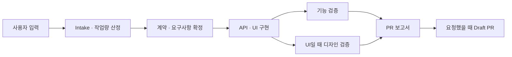

# Bilingual Four-Case Guide Implementation Plan

> **For agentic workers:** REQUIRED SUB-SKILL: Use superpowers:subagent-driven-development (recommended) or superpowers:executing-plans to implement this plan task-by-task. Steps use checkbox (`- [ ]`) syntax for tracking.

**Goal:** Publish a deeply detailed Korean and English guide whose four native tabs explain inputs, execution, evidence, blockers, and expected PR results for every supported SpecToPR case.

**Architecture:** Keep Korean as the default Docusaurus locale and add English under the standard `i18n/en` tree. Preserve the `/usage/recipes` route by changing only its extension to MDX, render the four cases with native `Tabs`/`TabItem`, and verify both localized routes with static contract tests plus a small Playwright browser script.

**Tech Stack:** Docusaurus 3.10, MDX 3, React 19, Mermaid, Vitest, Playwright 1.61, TypeScript 6.

## Global Constraints

- Keep exactly four cases: brief, legacy, feature, and Figma.
- Delivery mode controls delivery/evidence; brief, Figma, OpenAPI, supporting docs, project guidance, and optional skill hints remain composable sources.
- Keep Korean at `/usage/recipes` and publish English at `/en/usage/recipes`.
- Keep existing Korean links valid and add a native Docusaurus locale dropdown.
- Feature alone automatically requires one targeted Playwright command and exactly one valid WebM or MP4; never imply full-project E2E.
- Any supplied Figma URL requires a real connected-host Figma bundle.
- Figma mode defaults to no publication; a draft PR requires explicit draft intent.
- Explain that workload/token range/confidence are intake estimates and required validation is never removed for token pressure.
- Use native tabs, tables, admonitions, and Mermaid; do not add generated marketing imagery or tutorial video.
- Add no workflow tool, stage, skill, reviewer, delivery mode, or runtime behavior.
- Do not deploy, tag, push, or release as part of this implementation.

---

### Task 1: Docusaurus bilingual shell

**Files:**

- Modify: `website/docusaurus.config.ts`
- Create: `website/i18n/en/docusaurus-theme-classic/navbar.json`
- Test: `tests/plugin/documentation-v2.test.ts`

**Interfaces:**

- Consumes: the existing Korean-default Docusaurus site and `/usage/recipes` route.
- Produces: `ko` and `en` locale builds, `/en/...` routes, a locale dropdown, and English navbar labels used by Tasks 2–3.

- [ ] **Step 1: Add the failing locale contract test**

Extend `tests/plugin/documentation-v2.test.ts` with this test:

```ts
it("publishes Korean and English guide locales with a locale dropdown", () => {
  const config = readFileSync(path.join(root, "website/docusaurus.config.ts"), "utf8");
  const navbar = JSON.parse(
    readFileSync(path.join(root, "website/i18n/en/docusaurus-theme-classic/navbar.json"), "utf8"),
  ) as Record<string, { message: string }>;

  expect(config).toContain('defaultLocale: "ko"');
  expect(config).toContain('locales: ["ko", "en"]');
  expect(config).toContain('type: "localeDropdown"');
  expect(config).toContain('ko: { label: "한국어"');
  expect(config).toContain('en: { label: "English"');
  expect(navbar["item.label.4개 케이스"]?.message).toBe("4 Cases");
});
```

- [ ] **Step 2: Run the locale test and confirm RED**

Run:

```bash
pnpm vitest run tests/plugin/documentation-v2.test.ts -t "publishes Korean and English guide locales"
```

Expected: FAIL because `en`, `localeDropdown`, and the English navbar file do not exist.

- [ ] **Step 3: Configure both locales and the locale dropdown**

Change the `i18n` block in `website/docusaurus.config.ts` to:

```ts
i18n: {
  defaultLocale: "ko",
  locales: ["ko", "en"],
  localeConfigs: {
    ko: { label: "한국어", htmlLang: "ko-KR" },
    en: { label: "English", htmlLang: "en-US" },
  },
},
```

Rename the current navbar recipe label to `4개 케이스` and add the locale dropdown immediately before GitHub:

```ts
{ to: "/usage/recipes", position: "left", label: "4개 케이스" },
{ to: "/concepts/pipeline", position: "left", label: "v2 구조" },
{ type: "localeDropdown", position: "right" },
{ href: "https://github.com/dhyun2/spec-to-pr", label: "GitHub", position: "right" },
```

- [ ] **Step 4: Add the English navbar translation**

Create `website/i18n/en/docusaurus-theme-classic/navbar.json`:

```json
{
  "title": {
    "message": "SpecToPR",
    "description": "The title in the navbar"
  },
  "item.label.가이드": {
    "message": "Guide",
    "description": "Navbar item with label 가이드"
  },
  "item.label.4개 케이스": {
    "message": "4 Cases",
    "description": "Navbar item with label 4개 케이스"
  },
  "item.label.v2 구조": {
    "message": "v2 Architecture",
    "description": "Navbar item with label v2 구조"
  },
  "item.label.GitHub": {
    "message": "GitHub",
    "description": "Navbar item with label GitHub"
  }
}
```

- [ ] **Step 5: Re-run the focused test and typecheck**

Run:

```bash
pnpm vitest run tests/plugin/documentation-v2.test.ts -t "publishes Korean and English guide locales"
pnpm --dir website typecheck
```

Expected: PASS.

- [ ] **Step 6: Commit the bilingual shell**

```bash
git add website/docusaurus.config.ts website/i18n/en/docusaurus-theme-classic/navbar.json tests/plugin/documentation-v2.test.ts
git commit -m "docs: add bilingual guide shell"
```

---

### Task 2: Korean and English four-case tabs

**Files:**

- Delete: `website/docs/usage/recipes.md`
- Create: `website/docs/usage/recipes.mdx`
- Create: `website/i18n/en/docusaurus-plugin-content-docs/current/usage/recipes.mdx`
- Modify: `README.md`
- Modify: `README.ko.md`
- Modify: `website/docs/getting-started/quickstart.md`
- Test: `tests/plugin/documentation-v2.test.ts`

**Interfaces:**

- Consumes: the `ko`/`en` locale shell from Task 1 and the case contract in `docs/superpowers/specs/2026-07-14-bilingual-four-case-guide-design.md`.
- Produces: two locale-specific `/usage/recipes` documents with the same four tab values and copy-paste-compatible workflow fields.

- [ ] **Step 1: Replace the old recipe assertions with a failing bilingual tab contract**

Update the compact website inventory from `usage/recipes.md` to `usage/recipes.mdx`, then add:

```ts
it("documents exactly four detailed cases in Korean and English", () => {
  const guides = {
    ko: readFileSync(path.join(root, "website/docs/usage/recipes.mdx"), "utf8"),
    en: readFileSync(
      path.join(root, "website/i18n/en/docusaurus-plugin-content-docs/current/usage/recipes.mdx"),
      "utf8",
    ),
  };

  for (const [locale, guide] of Object.entries(guides)) {
    expect(guide, locale).toContain('import Tabs from "@theme/Tabs"');
    expect(guide, locale).toContain('import TabItem from "@theme/TabItem"');
    expect(guide.match(/<TabItem value="(?:brief|legacy|feature|figma)"/g)).toHaveLength(4);
    for (const value of ["brief", "legacy", "feature", "figma"]) {
      expect(guide, `${locale}:${value}`).toContain(`data-case-panel="${value}"`);
      for (const headingId of [
        "use-this-case",
        "required-inputs",
        "optional-inputs",
        "minimal-prompt",
        "full-prompt",
        "process",
        "evidence",
        "branch-and-commits",
        "expected-pr",
        "blockers",
        "exclusions",
      ]) {
        expect(guide, `${locale}:${headingId}:${value}`).toContain(`{#${headingId}-${value}}`);
      }
    }
    for (const field of [
      "mode:",
      "scope:",
      "changeKind:",
      "publication:",
      "briefPath",
      "figmaUrl",
      "docsPaths",
      "openApiPaths",
      "guidancePaths",
      "skillHints",
    ]) {
      expect(guide, `${locale}:${field}`).toContain(field);
    }
    expect(guide).toContain("requiredValidations");
    expect(guide).toContain("implementationContextId");
    expect(guide).toContain("figma-bundle");
  }

  expect(guides.ko).toContain("예상 예시");
  expect(guides.en).toContain("Illustrative expectation");
  for (const guide of Object.values(guides)) {
    const feature = tabSection(guide, "feature");
    expect(feature).toContain("targeted-feature");
    expect(feature).toContain("featureVideo");
    expect(feature).toContain("full-project E2E");
    for (const value of ["brief", "legacy", "figma"]) {
      expect(tabSection(guide, value)).not.toContain("featureVideo: required");
    }
  }
});

function tabSection(contents: string, value: string): string {
  const start = contents.indexOf(`<TabItem value="${value}"`);
  if (start < 0) throw new Error(`Missing tab ${value}`);
  const end = contents.indexOf("</TabItem>", start);
  if (end < 0) throw new Error(`Unclosed tab ${value}`);
  return contents.slice(start, end);
}
```

- [ ] **Step 2: Run the bilingual contract and confirm RED**

Run:

```bash
pnpm vitest run tests/plugin/documentation-v2.test.ts -t "documents exactly four detailed cases"
```

Expected: FAIL because the canonical guide is still Markdown and the English guide is absent.

- [ ] **Step 3: Create the Korean MDX guide**

Move the route content to `website/docs/usage/recipes.mdx` and start with this exact shell:

````mdx
---
sidebar_position: 1
title: 4가지 케이스
description: SpecToPR의 기획서, 레거시, 기능 개발, Figma 흐름별 입력과 예상 PR
---

import Tabs from "@theme/Tabs";
import TabItem from "@theme/TabItem";

# 네 가지 케이스 중 하나를 고르세요

모드는 납품·증거 정책을 정하고 source는 독립적으로 조합됩니다. 아래 예상 PR은 구조를 이해하기 위한 **예상 예시**이며 실제 제목·파일명·검사 명령은 대상 저장소와 승인된 계약에 따라 달라집니다.

| 케이스    | 최소 입력                              | 기본 결과                          | 자동 feature E2E/영상 | Figma 증거           |
| --------- | -------------------------------------- | ---------------------------------- | --------------------- | -------------------- |
| 기획서    | `mode: brief`, `briefPath`             | 검증된 구현 + draft PR             | 아니요                | URL을 주었을 때만    |
| 레거시    | `mode: legacy`, 구체적인 delta         | focused baseline + draft PR        | 아니요                | URL을 주었을 때만    |
| 기능 개발 | `mode: feature`, `scope: ui`           | targeted E2E + 영상 1개 + draft PR | 예                    | URL을 주었을 때 필수 |
| Figma     | `mode: figma`, `scope: ui`, `figmaUrl` | 디자인 구현, 기본 발행 없음        | 아니요                | 필수                 |


````

<Tabs groupId="delivery-case" queryString="case">
  <TabItem value="brief" label="1. 기획서" default>
    <div data-case-panel="brief">
      ## 이 케이스를 쓰는 경우 {#use-this-case-brief}

      수용 조건이 적힌 기획서를 구현하고 관련 검증과 draft PR까지 받고 싶을 때 사용합니다.
    </div>

  </TabItem>
  <TabItem value="legacy" label="2. 레거시">
    <div data-case-panel="legacy">
      ## 이 케이스를 쓰는 경우 {#use-this-case-legacy}

      기존 동작을 보존하면서 구체적으로 지정한 delta만 변경할 때 사용합니다.
    </div>

  </TabItem>
  <TabItem value="feature" label="3. 기능 개발">
    <div data-case-panel="feature">
      ## 이 케이스를 쓰는 경우 {#use-this-case-feature}

      사용자 기능을 API와 UI까지 구현하고 해당 기능의 targeted E2E와 영상 하나를 포함한 draft PR로 받을 때 사용합니다.
    </div>

  </TabItem>
  <TabItem value="figma" label="4. Figma">
    <div data-case-panel="figma">
      ## 이 케이스를 쓰는 경우 {#use-this-case-figma}

      Figma를 primary source로 디자인을 구현하고 시각·반응형·접근성 증거를 검증할 때 사용합니다.
    </div>

  </TabItem>
</Tabs>
```

Expand every tab from its concrete opening paragraph to all eleven sections using explicit localized heading IDs:

```mdx
## 이 케이스를 쓰는 경우 {#use-this-case-brief}

## 반드시 제공할 것 {#required-inputs-brief}

## 선택 입력 {#optional-inputs-brief}

## 최소 프롬프트 {#minimal-prompt-brief}

## 전체 프롬프트 예시 {#full-prompt-brief}

## SpecToPR이 진행하는 과정 {#process-brief}

## 증거와 검증 {#evidence-brief}

## 예상 브랜치와 커밋 {#branch-and-commits-brief}

## 예상 Draft PR {#expected-pr-brief}

## Run이 멈추는 경우 {#blockers-brief}

## 이 케이스가 하지 않는 것 {#exclusions-brief}
```

Use the same suffix for each tab. Every tab must include:

- a `:::tip 입력 / 결과` summary;
- a minimal prompt and a full prompt using only valid runtime field names;
- an ordered intake → contracts → implementation → independent review → report → publication timeline;
- concrete evidence filenames marked as illustrative;
- an illustrative PR title and a PR body outline;
- blocker paired with the exact user action needed to resume;
- workload/token range/confidence language and unchanged `requiredValidations`;
- explicit exclusions.

Use this content contract so the Korean and English pages stay semantically identical:

| Case    | Required inputs                                                                                                                                                                                                                | Process and evidence                                                                                                                                                                                                                                                                                                                                              | Illustrative publication result                                                                                                                                                                                                                                                                                        | Blockers and explicit exclusions                                                                                                                                                                                                                    |
| ------- | ------------------------------------------------------------------------------------------------------------------------------------------------------------------------------------------------------------------------------ | ----------------------------------------------------------------------------------------------------------------------------------------------------------------------------------------------------------------------------------------------------------------------------------------------------------------------------------------------------------------- | ---------------------------------------------------------------------------------------------------------------------------------------------------------------------------------------------------------------------------------------------------------------------------------------------------------------------- | --------------------------------------------------------------------------------------------------------------------------------------------------------------------------------------------------------------------------------------------------- |
| Brief   | Repository root, concrete request, `mode: brief`, existing project-local `briefPath`, actual `changeKind`, `publication: draft`; `scope` is set from the accepted work rather than inferred from the word “brief.”             | Read the brief and optional sources, freeze acceptance criteria, implement only accepted scope, run focused applicable checks, require independent functional review, and add design review only when `scope: ui`. Report `workload`, estimated token range, confidence, unchanged `requiredValidations`, `implementationContextId`, and any `figma-bundle` used. | Branch `codex/checkout-brief`; title `feat: implement checkout from approved brief`; body sections for accepted requirements, implementation, guidance/skills actually applied, checks, functional/design verdicts, risks, and evidence paths. No automatic feature video.                                             | Stop for a missing/invalid brief, contradictory sources, dirty publication preflight, or reviewer changes; tell the user which path/source/decision/commit is needed. Do not expand beyond acceptance criteria or infer targeted feature E2E/video. |
| Legacy  | Repository root, `mode: legacy`, actual `changeKind`, narrowly described current → desired behavior, affected entry point; use `scope: non-ui` unless the delta changes UI, and `publication: draft`.                          | Capture one focused current-behavior baseline with command and result before editing, preserve unrelated behavior, implement the smallest delta, run affected regression checks, perform independent functional review and UI design review only when applicable.                                                                                                 | Branch `codex/payment-retry-notification`; title `fix: prevent duplicate payment retry notification`; body shows baseline, requested delta, changed files, affected checks, review verdicts, risk, and rollback notes.                                                                                                 | Stop when the delta or baseline cannot be reproduced, sources conflict, publication preflight is dirty, or review requests changes. Do not inventory, migrate, modernize, or E2E-test the whole repository; do not require a feature video.         |
| Feature | Repository root, concrete user feature, `mode: feature`, `scope: ui`, `changeKind: feature`, `publication: draft`; optionally compose `briefPath`, `figmaUrl`, `openApiPaths`, `docsPaths`, `guidancePaths`, and `skillHints`. | Resolve contracts, capture a real `figma-bundle` whenever `figmaUrl` exists, implement API and UI in one `implementationContextId`, reach API-ready before final UI evidence, run focused checks and both independent reviews, then run exactly one targeted Playwright selector/command and attach exactly one valid WebM or MP4.                                | Branch `codex/checkout-flow`; title `feat: add API-backed checkout flow`; body includes traceability, API-ready evidence, changed files, validation commands, functional/design verdicts, exact `targeted-feature` selector, strict result JSON, and one `featureVideo` path.                                          | Stop for incomplete contracts/Figma/API-ready evidence, broad/chained/skipped/list-only E2E, zero or multiple videos, dirty publication preflight, or reviewer changes. Explicitly reject full-project E2E and unrelated feature inventory.         |
| Figma   | Repository root, `mode: figma`, `scope: ui`, valid `figmaUrl`; `publication: none` by default and `publication: draft` only when the user explicitly requests a PR.                                                            | Capture connected-host nodes, variables, component context, screenshots, and a strict project-local `figma-bundle`; map designs to the existing design system; implement and verify visual fidelity, responsiveness, interactions, accessibility, focused functional behavior, and independent design review.                                                     | Default result is a verified working-tree implementation and report with no PR. When draft intent is explicit, use branch `codex/figma-checkout` and illustrative title `feat: implement checkout from Figma`, with Figma evidence, visual/responsive/accessibility checks, review verdicts, changed files, and risks. | Stop when the URL/node is invalid, connected-host evidence is unavailable, design states conflict or are incomplete, publication preflight is dirty, or review requests changes. Do not imply feature E2E/video or automatic publication.           |

Use these minimum prompts verbatim except for localized natural-language request lines:

```text
# Brief
/spec-to-pr /absolute/path/to/app
mode: brief
briefPath: docs/checkout.md
changeKind: feature
publication: draft
기획서의 수용 조건만 구현하고 관련 검사로 검증한 뒤 draft PR로 발행해줘.

# Legacy
/spec-to-pr /absolute/path/to/app
mode: legacy
scope: non-ui
changeKind: fix
publication: draft
결제 재시도 시 알림이 두 번 생성되는 현재 동작을 재현하고 한 번만 생성되도록 최소 범위로 수정한 뒤 draft PR로 발행해줘.

# Feature
/spec-to-pr /absolute/path/to/app
mode: feature
scope: ui
changeKind: feature
publication: draft
checkout을 API와 UI까지 구현하고 해당 checkout 경로만 E2E로 검증해 영상 하나와 함께 draft PR로 발행해줘.

# Figma
/spec-to-pr /absolute/path/to/app
mode: figma
scope: ui
figmaUrl: https://www.figma.com/design/FILE/checkout?node-id=12-345
publication: none
Figma를 기존 디자인 시스템에 맞춰 구현하고 시각·반응형·접근성을 검증해줘.
```

For each case, the full prompt extends its minimum prompt with only relevant composable fields. Brief may add `scope`, `figmaUrl`, `openApiPaths`, `docsPaths`, `guidancePaths`, and `skillHints`; legacy may add reproduction commands and supporting paths; feature uses the complete prompt below; Figma may add `briefPath`, `openApiPaths`, `docsPaths`, `guidancePaths`, `skillHints`, and explicit `publication: draft` only in a separately labeled PR variant. English prompts keep field names and paths unchanged and translate only the natural-language request.

The feature full prompt must be exactly compatible with this shape:

```text
/spec-to-pr /absolute/path/to/app
mode: feature
scope: ui
briefPath: docs/checkout.md
figmaUrl: https://www.figma.com/design/FILE/checkout?node-id=12-345
openApiPaths: [docs/openapi.yaml]
docsPaths: [docs/business-rules.md, docs/error-cases.md]
guidancePaths: [docs/architecture/ARCHITECTURE.md, docs/etc/folder-structure.md]
skillHints: [react-best-practices, next-best-practices, design-system, api-generator]
changeKind: feature
publication: draft
checkout을 end-to-end로 구현해줘. checkout test path/tag/project만 실행하고 영상은 정확히 하나만 첨부해.
```

- [ ] **Step 4: Create the English MDX guide with semantic parity**

Create `website/i18n/en/docusaurus-plugin-content-docs/current/usage/recipes.mdx` with the same frontmatter route, imports, table, Mermaid flow, tab values, `data-case-panel` values, and eleven heading-ID prefixes. Use natural English labels:

```mdx
<Tabs groupId="delivery-case" queryString="case">
  <TabItem value="brief" label="1. Brief" default>
  <TabItem value="legacy" label="2. Legacy">
  <TabItem value="feature" label="3. Feature">
  <TabItem value="figma" label="4. Figma">
</Tabs>
```

Translate the section headings as:

```text
Use this case
Required inputs
Optional inputs
Minimal prompt
Full prompt example
What SpecToPR does
Evidence and validation
Expected branch and commits
Expected draft PR
When the Run stops
What this case does not do
```

Keep all workflow field names and example paths identical to Korean. Label every PR preview **Illustrative expectation**, not a guaranteed title or filename. The feature prompt must say “Run only the checkout test path, tag, or project and attach exactly one video.”

- [ ] **Step 5: Update maintained entry links**

Add these direct links near the existing guide references:

```md
<!-- README.md -->

[Read the detailed four-case guide](https://dhyun2.github.io/spec-to-pr/en/usage/recipes)

<!-- README.ko.md -->

[4가지 케이스 상세 가이드](https://dhyun2.github.io/spec-to-pr/usage/recipes)
```

Change the quickstart link label from `사용 레시피` to `4가지 케이스 상세 가이드` while preserving `/usage/recipes`.

- [ ] **Step 6: Re-run documentation tests and both locale builds**

Run:

```bash
pnpm vitest run tests/plugin/documentation-v2.test.ts
pnpm --dir website typecheck
pnpm --dir website build --locale ko
pnpm --dir website build --locale en
```

Expected: all commands exit 0. Broken links are fatal through `onBrokenLinks: "throw"`.

- [ ] **Step 7: Commit the bilingual case guide**

```bash
git add README.md README.ko.md website/docs/usage/recipes.md website/docs/usage/recipes.mdx website/i18n/en/docusaurus-plugin-content-docs/current/usage/recipes.mdx website/docs/getting-started/quickstart.md tests/plugin/documentation-v2.test.ts
git commit -m "docs: add detailed four-case guide"
```

---

### Task 3: Browser interaction and responsive regression

**Files:**

- Create: `tests/browser/four-case-guide.mjs`
- Modify: `package.json`

**Interfaces:**

- Consumes: the production site containing Korean `/spec-to-pr/usage/recipes` and English `/spec-to-pr/en/usage/recipes`.
- Produces: a deterministic `pnpm guide:check` interaction check for four tabs, localized routes, console errors, locale links, and page overflow.

- [ ] **Step 1: Add the browser check script before the implementation exists**

Add to root `package.json`:

```json
"guide:check": "node tests/browser/four-case-guide.mjs"
```

Run:

```bash
pnpm guide:check
```

Expected: FAIL with `ERR_MODULE_NOT_FOUND` because the browser script is absent.

- [ ] **Step 2: Implement the Playwright browser check**

Create `tests/browser/four-case-guide.mjs`:

```js
import assert from "node:assert/strict";

import { chromium } from "playwright";

const origin = process.env.GUIDE_BASE_URL ?? "http://127.0.0.1:3000/spec-to-pr";
const locales = [
  {
    name: "ko",
    url: `${origin}/usage/recipes`,
    alternative: "/spec-to-pr/en/usage/recipes",
    tabs: ["1. 기획서", "2. 레거시", "3. 기능 개발", "4. Figma"],
  },
  {
    name: "en",
    url: `${origin}/en/usage/recipes`,
    alternative: "/spec-to-pr/usage/recipes",
    tabs: ["1. Brief", "2. Legacy", "3. Feature", "4. Figma"],
  },
];
const values = ["brief", "legacy", "feature", "figma"];
const viewports = [
  { name: "desktop", width: 1440, height: 1000 },
  { name: "mobile", width: 390, height: 844 },
];

const browser = await chromium.launch({ headless: true });
try {
  for (const locale of locales) {
    for (const viewport of viewports) {
      const page = await browser.newPage({ viewport });
      const errors = [];
      page.on("console", (message) => {
        if (message.type() === "error") errors.push(message.text());
      });
      page.on("pageerror", (error) => errors.push(error.message));

      await page.goto(locale.url, { waitUntil: "networkidle" });
      const tabs = page.getByRole("tab");
      assert.equal(await tabs.count(), 4, `${locale.name}:${viewport.name}:tab count`);

      for (let index = 0; index < values.length; index += 1) {
        const tab = tabs.filter({ hasText: locale.tabs[index] });
        await tab.click();
        assert.equal(await tab.getAttribute("aria-selected"), "true");
        await page.locator(`[data-case-panel="${values[index]}"]`).waitFor({ state: "visible" });
      }

      assert.ok(
        (await page.locator(`a[href*="${locale.alternative}"]`).count()) > 0,
        `${locale.name}:${viewport.name}:locale link`,
      );
      const overflow = await page.evaluate(
        () => document.documentElement.scrollWidth - document.documentElement.clientWidth,
      );
      assert.ok(overflow <= 1, `${locale.name}:${viewport.name}:horizontal overflow ${overflow}px`);
      assert.deepEqual(errors, [], `${locale.name}:${viewport.name}:console errors`);
      await page.close();
    }
  }
} finally {
  await browser.close();
}
```

- [ ] **Step 3: Build and run the browser check against the production server**

Run:

```bash
pnpm --dir website build
python /Users/dhp94d/.codex/skills/webapp-testing/scripts/with_server.py \
  --server "pnpm --dir website serve --host 127.0.0.1 --port 3000" \
  --port 3000 \
  -- pnpm guide:check
```

Expected: PASS for two locales × two viewport sizes × four tab selections, with zero console/page errors and no horizontal page overflow.

- [ ] **Step 4: Run the complete documentation verification**

Run:

```bash
pnpm vitest run tests/plugin/documentation-v2.test.ts tests/plugin/layout.test.ts
pnpm --dir website typecheck
pnpm --dir website build
pnpm plugin:validate
pnpm format:check
git diff --check
```

Expected: every command exits 0.

- [ ] **Step 5: Commit browser regression coverage**

```bash
git add package.json tests/browser/four-case-guide.mjs
git commit -m "test: verify four-case guide tabs"
```

## Final acceptance checklist

- [ ] Korean and English production routes both render.
- [ ] Each route has exactly four keyboard-selectable case tabs.
- [ ] Each tab has all eleven contract sections, two prompts, a process timeline, evidence, blockers, exclusions, and an illustrative PR preview.
- [ ] Feature alone promises targeted E2E and exactly one video.
- [ ] Figma defaults to implementation-only and requires explicit draft publication.
- [ ] README links target the correct locale routes.
- [ ] Locale dropdown stays on the equivalent recipe route.
- [ ] Desktop and mobile views have no page-level overflow or console errors.
- [ ] Full documentation tests, plugin validation, formatting, and both-locale builds pass.
