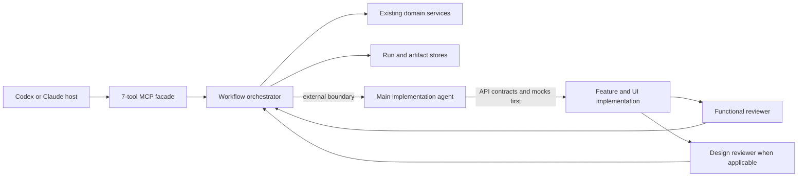

# SpecToPR Fast Workflow v2 Design

## Outcome

SpecToPR v2 replaces model-driven micro-orchestration with a small workflow facade. The default path must be fast, evidence-backed, and conditional: API contracts and mocks are completed before UI work, then functional and design reviews run independently.

The facade has four supported delivery modes. They share the same stages, tools, implementation context, and reviewers; a mode changes intake requirements and evidence policy, not the workflow topology.

| Mode | Required input | Default evidence | Draft review request |
| --- | --- | --- | --- |
| `brief` | brief/spec plus target repository | changed-scope quality checks and functional review | supported |
| `legacy` | existing repository plus a concrete change request | focused baseline plus changed-scope checks | supported |
| `feature` | user-facing feature request plus target repository | targeted feature E2E and one bounded video, never full-project E2E by default | supported |
| `figma` | Figma URL plus target repository | Figma bundle, design review, and visual evidence | supported |

`auto` remains available for backward-compatible classification, but explicit mode selection is preferred at CLI and SDK boundaries. Publication is always an explicit draft-only intent.

## Evidence and success criteria

The v1 surface advertises 111 MCP tools (about 411 KB of tool schemas), exposes 27 Run stages, ships 27 skills, and maintains 16 registered agent roles across 31 role-definition files. A typical run needs roughly 45–70 MCP calls even though the repository's 354 tests finish in about eight seconds.

v2 is successful when it has:

- at most 7 public MCP tools and 40 KB of advertised tool schemas;
- no more than 12 MCP calls on a normal publish-ready path;
- 8 durable workflow stages instead of 27;
- 9 skills instead of 27;
- 2 reviewer roles instead of implementation lanes plus a reviewer cascade;
- one canonical readiness decision shared by reviews, the scorecard, and PR reporting;
- no required gate without real executed evidence;
- no separate API and Design/UI subagents or integration worktree lane.

Compatibility with v1 tool names, skills, agent roles, and incomplete Runs is intentionally not preserved.

## Considered approaches

### A. Keep the current micro-tools and shorten prompts

This is the lowest code risk, but it preserves the 411 KB discovery payload, dozens of round trips, disconnected stage ledger, and duplicate reviewer passes. Rejected because prose reduction cannot fix orchestration latency or policy drift.

### B. Remove MCP and use only a CLI

This minimizes protocol surface but weakens Codex and Claude plugin integration and discards the valid local-stdio boundary documented in ADR 002. Rejected because stdio is not the bottleneck.

### C. Keep local stdio as a seven-tool facade

Selected. Deterministic work runs in-process through an application orchestrator. MCP only starts, advances, resumes, submits external evidence, publishes, and archives workflows. This preserves host compatibility while removing model-managed choreography.

## Architecture

The orchestrator owns sequencing, stage transitions, retries, conditional skips, and compact status responses. Existing parsers, generators, validators, artifact storage, publisher safety rules, and archive safety rules remain internal implementation details.

## Public MCP contract

The public surface contains exactly these tools:

1. `workflow_info`: contract version, runtime capabilities, and size-safe diagnostics.
2. `workflow_start`: create a Run, parse intake, classify scope, and advance to the first external boundary.
3. `workflow_advance`: execute deterministic stages until completion, a blocker, or an external action.
4. `workflow_submit`: submit a tagged external result such as implementation, functional review, design review, or Figma evidence.
5. `workflow_status`: return only stage, applicability, blockers, next actions, and artifact handles.
6. `workflow_publish`: preview or execute safe draft PR/MR publication and verify synchronization.
7. `workflow_archive`: preview or execute post-merge OpenSpec archival with merge evidence.

Full Run aggregates, security micro-tools, stage leases, worktree CRUD, plan/get/record triplets, release tools, and individual Figma recording calls are not public MCP tools.

## Workflow and stages

The durable stage list is:

1. `intake`
2. `contracts`
3. `implementation`
4. `functional-review`
5. `design-review`
6. `report`
7. `publish`
8. `archive`

`implementation` has an internal checkpoint named `api-ready`. It requires generated types, schemas, wrappers, mocks, and contract-test evidence before feature or UI work can proceed. This is a sequencing rule inside one implementation context, not a separate agent lane.

After implementation, functional review and applicable design review are independent and may run in parallel. A non-UI change records design review as not applicable without invoking a design reviewer.

## Gate policy

Intake produces one typed applicability plan. Each gate is `required`, `conditional`, `opt-in`, `release-only`, or `not-applicable`, with a reason.

- Always for code changes: available lint/format, typecheck, build, and one relevant functional test.
- Conditional: OpenSpec validation, architecture boundaries, and targeted security checks.
- UI conditional: visual comparison when a baseline exists and accessibility for changed interactive states.
- Performance conditional: budget-sensitive routes or explicit performance intent.
- Observability: opt-in only.
- Release-only: full matrices, hardening suites, package verification, and cross-host manifest validation.

Mode-specific rules stay conditional:

- `brief` adds no blanket gates. The brief is evidence for contracts and traceability.
- `legacy` requires a focused baseline relevant to the requested change. It does not imply a full regression suite.
- A user-facing `feature` requires a changed-feature E2E selection and exactly one `.webm` or `.mp4` recording. The selected test must be identified by path, tag, or Playwright project so a whole-application suite cannot satisfy this requirement accidentally.
- `figma` requires real Figma intake before contracts complete. The active host uses its connected Figma capability and submits one `figma-bundle`; the runtime does not expose Figma micro-tools or RUM-style polling.

Missing optional scripts are not applicable. Missing required scripts are blockers. Placeholder or empty reports never count as passing evidence. The latest completed run of a gate supersedes stale failures.

## Review model

There are two canonical reviewer roles:

- `functional-reviewer`: requirement fidelity, API contracts, tests, architecture, security, and unresolved functional gaps.
- `design-reviewer`: Figma or legacy visual fidelity, design-system usage, supported UI states, interaction accessibility, and visual evidence.

Each review returns an explicit overall verdict: `approved`, `changes-requested`, or `blocked`. Major or blocker findings and blocked/rejected requirements cannot produce `approved`.

The old Review Council, Integrator, narrow gate reviewers, PR-report reviewer, publisher reviewer, release reviewer, and observability reviewer are removed. The scorecard becomes a presentation of the canonical gate decision rather than a second policy engine.

## Skills and agent definitions

The runtime skill set is reduced to:

- `spec-to-pr`
- `intake-contracts`
- `implement`
- `review-functional`
- `review-design`
- `publish`
- `doctor`
- `archive-openspec`
- `prepare-release`

Only the two reviewer roles are registered as reusable agents. Implementation stays with the active agent; a host may delegate the complete implementation stage as one unit, but it must not split API and UI into independent lanes. Host-specific registrations are generated from canonical role definitions to prevent drift.

The existing `intake-contracts` skill owns conditional Figma intake, so no tenth workflow skill is added. The `implement` skill owns targeted feature E2E capture. `review-functional` validates feature behavior and recording provenance; `review-design` validates Figma or legacy visual fidelity. This keeps API and UI sequencing local while still allowing the two independent reviews to run in parallel.

## Correctness rules

- A workflow never publishes without approved functional review.
- UI scope never publishes without an approved applicable design review.
- Non-UI scope never waits for design, accessibility, visual, performance, or observability work unless explicitly required.
- Failed or not-run evidence cannot satisfy a required gate.
- Publication remains draft-only and never merges, approves, closes, or marks ready.
- Archival remains an explicit post-merge action.
- A feature video is published only for a user-facing `feature` run, is size-bounded, and is linked as evidence rather than treated as a visual baseline.
- A `figma` run cannot complete contracts from a URL string alone; it requires submitted Figma artifacts.
- A mode never expands changed-scope verification into a full-project E2E or release matrix unless explicitly requested.

## Testing

Tests are organized around behavior rather than the legacy public surface:

- orchestrator end-to-end tests for non-UI, OpenAPI+UI, resume, blocked review, publish, and archive;
- one MCP startup/list-tools smoke test asserting exactly seven tools and a schema-size budget;
- stage-order tests proving `api-ready` precedes UI work;
- applicability tests proving optional gates do not run or block;
- review tests proving explicit verdict invariants;
- evidence freshness tests proving the latest rerun wins;
- existing domain service tests retained unless the service is deleted.

## Migration and deletion

v2 is a clean contract break. Legacy MCP tools are deleted rather than hidden behind a compatibility flag. Legacy skills and role definitions are deleted after their responsibilities move into the nine skills and two reviewers. Incomplete v1 Runs return a concise unsupported-version error; finished artifacts remain ordinary files and are not rewritten.

The implementation is delivered in vertical slices: canonical workflow policy, orchestrator, seven-tool facade, compact skills/agents, then dead-code deletion and documentation. Each slice must keep `pnpm check` green.
