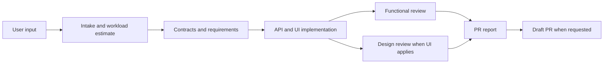

# Bilingual Four-Case Guide Design

## Goal

Make the four supported SpecToPR delivery cases unmistakable in both Korean and English. A reader must be able to choose a case, copy a valid prompt, understand every required input and runtime phase, and predict the shape of the resulting implementation evidence and draft PR before starting a Run.

## Supported cases

The guide defines exactly these four cases:

1. Brief to draft PR
2. Legacy change to draft PR
3. Feature to targeted E2E, one video, and draft PR
4. Figma to design implementation, with draft publication only when explicitly requested

The case labels describe delivery behavior. Brief, Figma, OpenAPI, supporting documents, project guidance, and optional skill hints remain composable sources. In particular, the feature case may consume every source type without changing away from `mode: feature`.

## Approaches considered

### Selected: Docusaurus locales with case tabs

- Korean remains the default locale at `/usage/recipes`.
- English is published at `/en/usage/recipes`.
- Each locale renders the same four case tabs with native Docusaurus `Tabs` and `TabItem` components.
- A locale dropdown exposes Korean and English directly from the navbar.
- Existing Korean links remain valid.

This provides stable shareable URLs, clean search indexing, and a single interaction model for comparing cases.

### Rejected: language tabs nested inside case tabs

This avoids locale setup but creates two levels of tabs, obscures the selected language in shared URLs, and makes search results ambiguous.

### Rejected: one page per case

Four independent pages allow more expansion but make side-by-side comparison slower and duplicate the shared workflow explanation.

## Information architecture

The existing `usage/recipes` route becomes the canonical four-case guide. The page has four layers:

1. A short promise explaining what SpecToPR accepts and returns.
2. A comparison table covering mode, minimum input, optional sources, default publication, feature E2E, video, and design evidence.
3. One common Mermaid workflow from user input through draft PR.
4. Four native case tabs containing the detailed case contract.

The sidebar and navbar continue to link to this route. The label changes from the ambiguous “4 modes” wording to “4 cases” in each locale because sources and delivery modes are no longer mutually exclusive.

## Shared tab content contract

Every case tab follows the same headings so users can compare cases without learning a new layout:

1. **Use this when** — the exact decision rule and common examples.
2. **What you must provide** — blocking inputs, accepted formats, and minimum specificity.
3. **Optional inputs** — composable sources and what each source changes.
4. **Copy this prompt** — a minimal valid prompt.
5. **Full prompt example** — a realistic complete prompt with every useful field.
6. **What SpecToPR does** — an ordered phase-by-phase timeline.
7. **Evidence and validation** — gates, commands, artifacts, screenshots, and videos.
8. **Expected branch and commits** — source branch, clean-tree rule, and publication preflight.
9. **Expected draft PR** — example title, body sections, checks, files, and attachments.
10. **When the Run stops** — missing evidence, contradictions, invalid repository state, and user decisions.
11. **What this case does not do** — explicit limits that prevent surprising heavy work.

Each case also includes a compact “You provide / SpecToPR returns” summary near the top.

## Case-specific requirements

### Case 1: Brief to draft PR

- Required: repository root, concrete request, `mode: brief`, and an existing project-local `briefPath`.
- Optional: Figma, supporting docs, OpenAPI, explicit project guidance, and installed-skill hints.
- The brief supplies acceptance criteria but does not imply UI scope by itself.
- The Run implements only accepted brief scope, runs applicable focused checks, performs independent functional review and design review only for UI scope, then publishes a draft PR.
- Targeted feature E2E and a video are not automatically required.

### Case 2: Legacy change to draft PR

- Required: repository root, `mode: legacy`, actual change kind, and a narrowly described behavior delta.
- The Run captures a focused current-behavior baseline before implementation.
- Verification stays within the affected regression surface; it does not inventory or modernize the whole repository.
- The PR includes baseline evidence, changed behavior, affected checks, independent review, and known risk.
- Figma, feature video, and broad migration work are not implied.

### Case 3: Feature to targeted E2E, one video, and draft PR

- Required: repository root, `mode: feature`, `scope: ui`, a concrete feature request, and draft publication intent.
- Optional and composable: `briefPath`, `figmaUrl`, repeated `docsPaths`, repeated `openApiPaths`, `guidancePaths`, and `skillHints`.
- Any supplied Figma URL requires a real connected-host Figma bundle before contracts pass.
- API and UI remain in one implementation context; API-ready evidence precedes final UI evidence.
- Only this case automatically requires one targeted Playwright invocation and exactly one valid WebM or MP4.
- Full-project E2E, chained test commands, list-only tests, and zero or multiple videos are rejected.
- The draft PR lists the exact selector, command, strict result JSON, and video path.

### Case 4: Figma to design implementation

- Required: repository root, `mode: figma`, `scope: ui`, and a valid `figmaUrl`.
- The connected host captures real nodes, variables, component context, screenshots, and a strict project-local Figma manifest.
- The implementation maps the design to the project design system and verifies visual, responsive, interaction, and accessibility evidence.
- Publication defaults to none. A draft PR is produced only when the user explicitly supplies draft publication intent.
- Feature E2E and video are not implied unless the delivery case is explicitly changed to feature.

## Prompt examples

Every prompt example uses actual workflow field names rather than prose aliases. The complete feature example includes:

```text
/spec-to-pr /absolute/path/to/app
mode: feature
scope: ui
briefPath: docs/checkout.md
figmaUrl: https://www.figma.com/design/FILE/checkout?node-id=12-345
openApiPaths: [docs/openapi.yaml]
docsPaths: [docs/business-rules.md, docs/error-cases.md]
guidancePaths: [docs/architecture/ARCHITECTURE.md, docs/etc/folder-structure.md]
skillHints: [react-best-practices, next-best-practices, design-system, api-generator]
changeKind: feature
publication: draft
Implement checkout end to end. Run only the checkout-targeted E2E and attach exactly one video.
```

English examples use the same field names and paths so a prompt copied from either locale is runtime-compatible.

## Expected process presentation

The guide includes one shared Mermaid flow:



Inside each tab, a numbered timeline explains where that case differs. The guide states that the workload size, token range, and confidence appear immediately after intake and are estimates rather than fixed promises. Required validation is never removed because of token pressure.

## Expected PR examples

Each tab contains a plausible, explicitly illustrative PR preview rather than claiming an exact generated title. The preview includes:

- example source branch and PR title;
- requirement traceability;
- explicit and discovered project guidance;
- applied optional skills only;
- changed files and evidence paths;
- functional and design review results;
- validation commands and result artifacts;
- feature selector, strict E2E result, and one video only for the feature case;
- Figma bundle details when a Figma URL was supplied;
- known risks and blockers.

The guide distinguishes “expected example” from runtime-guaranteed fields so users do not mistake illustrative filenames or titles for a fixed contract.

## Language architecture

- `ko` remains the Docusaurus default locale.
- `en` is added as a supported locale.
- Korean source content remains under `website/docs`.
- English translations live under Docusaurus' `website/i18n/en/docusaurus-plugin-content-docs/current` tree.
- The English case guide matches the Korean section order and semantic requirements, while copy is natural rather than mechanically translated.
- Navbar locale selection is visible on desktop and mobile.
- Local search continues indexing Korean and English.

Only the four-case guide is required to be fully bilingual in this change. Existing untranslated English-locale pages may fall back to the Korean source until they receive dedicated translations; navigation must not break.

## Visual design

Use native tabs, tables, admonitions, and Mermaid rather than generated screenshots or video. These elements stay synchronized with contract changes, remain accessible, support dark mode, and render in both locales. Custom CSS is limited to compact case-summary and expected-PR blocks if native Markdown is insufficient.

Generated imagery is intentionally excluded because it would duplicate text, age quickly when contracts change, and add accessibility and localization work without improving the central comparison.

## Error and blocker communication

Every case lists concrete stop conditions:

- a required path is missing, outside the repository, not a regular file, oversized, or conflicts with another source role;
- explicit project guidance is missing;
- required Figma evidence is unavailable;
- brief, OpenAPI, Figma, and user request contradict each other without a safe resolution;
- API-ready evidence is incomplete for API-backed UI;
- targeted feature E2E is broad, chained, skipped, or lacks exactly one valid video;
- repository publication preflight is dirty or lacks a committed source branch;
- a reviewer requests changes.

The guide explains the next user action for each blocker rather than presenting only an error name.

## Testing and acceptance

### Static documentation tests

- The canonical guide is MDX and imports native `Tabs` and `TabItem`.
- Exactly four case tab values are present in Korean and English.
- Every tab contains its required inputs, minimal prompt, full prompt, process, evidence, expected PR, blockers, and exclusions.
- The feature tab contains targeted E2E, exactly one video, and no full-project E2E language.
- The Figma tab states publication defaults to none and draft is explicit.
- The brief and legacy tabs do not promise feature video evidence.
- Field examples use valid runtime names and allowed enum values.

### Build tests

- Website type checking passes.
- Korean and English Docusaurus production builds pass with broken-link checking enabled.
- Search configuration accepts both locales.

### Browser tests

- Open the Korean and English recipe URLs.
- Assert all four tabs are visible and keyboard-selectable.
- Select every tab and assert the corresponding heading, prompt block, and expected-PR section become visible.
- Confirm locale switching preserves a valid recipe route.
- Capture console errors and require none.
- Verify desktop and mobile widths without clipped tab labels or horizontal page overflow.

## Maintained documentation links

- Korean README links directly to the Korean guide.
- English README links directly to the English guide.
- Quickstart, navbar, footer, and sidebar keep a canonical recipe link.
- Labels use “four cases,” not “four modes.”

## Non-goals

- No new workflow tool, durable stage, skill, reviewer, delivery mode, or runtime behavior.
- No generated marketing illustration or tutorial video.
- No redesign of the rest of the documentation site.
- No full translation of unrelated documentation pages.
- No deployment, tag, or release as part of the documentation implementation unless separately requested.
