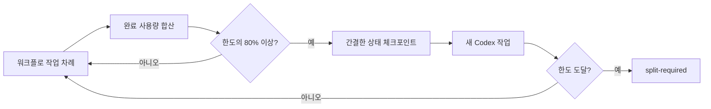
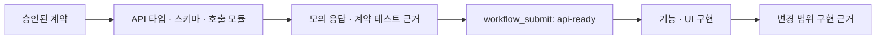

import GuideHero from "@site/src/components/guide/GuideHero";
import RunPipeline from "@site/src/components/guide/RunPipeline";
import NextStep from "@site/src/components/guide/NextStep";

<GuideHero
eyebrow="하나의 실행 · 상태를 보존하는 8단계"
title="실행은 어떻게 진행되나요?"
summary="요청 접수부터 초안 PR 발행, 병합 후 보관까지 한 변경의 상태와 검증 자료가 어떻게 이어지는지 살펴봅니다."
primary={{ label: "검토자 역할 보기", href: "/concepts/reviews" }}
secondary={{ label: "사용 방식 고르기", href: "/usage/" }}
/>

네 가지 제공 방식은 서로 다른 실행 흐름을 만들지 않습니다. 모두 하나의 실행 기록과 하나의 제공 프로필을 공유합니다. 제공 방식은 최종 결과와 필요한 검증 자료를 정하고, 입력 자료는 필요한 만큼 조합합니다.

예를 들어 `feature` 프로필에는 기획서, Figma URL, OpenAPI, 보조 문서, 프로젝트 지침, 선택 스킬 힌트를 함께 넣을 수 있습니다. 기획서·문서·OpenAPI는 작업 범위와 작업량을 판단하는 데 사용합니다. 프로젝트 지침은 범위를 넓히는 근거로 사용하지 않으며, 명시하거나 자동으로 찾은 파일 경로와 실제 적용한 스킬만 추적 정보로 남깁니다.

## 실행 흐름

<RunPipeline locale="ko" />

## 공개 도구 7개

| 도구               | 역할                                                                       |
| ------------------ | -------------------------------------------------------------------------- |
| `workflow_info`    | 계약 버전과 도구·단계·검토자 목록 확인                                     |
| `workflow_start`   | 실행을 만들고 작업 범위, 제공 프로필, 초기 작업량 예상 기록                |
| `workflow_advance` | 다음 외부 작업이나 종료 상태까지 정해진 순서로 진행                        |
| `workflow_submit`  | 계약, API 준비, 구현, Figma·화면 비교, 검토 자료 제출                      |
| `workflow_status`  | 현재 단계, 작업량·토큰 예상, 차단 사유, 다음 작업, 재개에 필요한 맥락 조회 |
| `workflow_publish` | 표준 보고서를 바탕으로 초안 PR/MR을 미리 확인하거나 발행·갱신              |
| `workflow_archive` | 병합을 확인한 뒤 명시적으로 보관 작업을 미리 확인하거나 실행               |

이 목록에 없는 v1 세부 도구는 공개 계약에 포함되지 않습니다.

## 상태를 보존하는 8단계

| 단계                | 완료 조건                                                                                      |
| ------------------- | ---------------------------------------------------------------------------------------------- |
| `intake`            | 작업 범위와 제공 프로필 기록                                                                   |
| `contracts`         | 필요한 요구사항·API·모의 응답·디자인 계약, 프로젝트 지침 추적 정보, 입력 자료별 검증 근거 제출 |
| `implementation`    | API를 사용하는 UI는 먼저 `api-ready` 근거 제출. `feature` 방식은 해당 기능 E2E와 영상 1개 필요 |
| `functional-review` | 코드 범위에 필요한 기능 검증과 요구사항을 독립 검토자가 승인                                   |
| `design-review`     | UI 범위의 화면·상호작용·접근성 근거를 독립 검토자가 승인. 비-UI 작업에는 적용하지 않음         |
| `report`            | 변경할 수 없는 검토 묶음에 연결된 15개 섹션의 `pr-report-v2.1` JSON/Markdown 생성              |
| `publish`           | `publication: draft`일 때 초안 PR/MR과 필수 첨부 자료 동기화                                   |
| `archive`           | 신뢰할 수 있는 병합 근거가 있을 때 사용자가 명시적으로 실행                                    |

각 단계의 `pending`, `running`, `passed`, `failed`, `blocked`, `skipped`, `waived` 상태와 실행 권한, 체크포인트는 영구 기록에 보관됩니다. 사용자는 내부 상태 전이용 세부 도구 대신 `workflow_advance`와 `workflow_status`를 사용합니다.

### 증거 파일 경로 규칙

모든 `artifactPaths`와 증거 파일 경로는 프로젝트 루트를 기준으로 한 상대 경로여야 하며, 운영체제와 관계없이 `/`로 구분해야 합니다. 실행 엔진은 파일을 받기 전에 절대 경로, 상위 폴더로 이동하는 경로, 제어 문자나 역슬래시가 들어간 경로, 비밀값처럼 보이는 경로를 거부합니다. 경로에 토큰·비밀번호·비밀값·인증 정보의 **실제 값**을 넣지 마세요. `token-validation.json`처럼 검증 목적만 설명하고 비밀값을 포함하지 않는 이름은 사용할 수 있습니다.

## 작업량 예측과 자동 분할

요청 접수가 끝나면 같은 체크포인트에 작업량(`XS`~`XL`), 예상 토큰 최소·최대, 신뢰도(`low`/`medium`/`high`), 산정 근거, 한도와 80% 기준을 기록합니다. 처음에는 정보가 적어 예상 범위가 넓고 신뢰도가 낮을 수 있습니다. 계약 단계에서 실제 요구사항 수, 관련 파일, API 작업, UI 화면, Figma 노드, 테스트 대상, 워크스페이스 패키지, 불확실성을 `workloadSignals`로 제출하면 기존 예상치만 갱신합니다. 이 과정에서 별도 도구나 아홉 번째 단계가 생기지는 않습니다.

`workflow_status.resumeContext`는 목표, 프로젝트 상대 증거 경로, 종류별 최신 제출 내용을 간결하게 반환합니다. 목표는 4,000자, 경로는 200개(초기 50개와 최신 150개)·각 1,000자, 제출 내용은 16종류·요약별 500자로 제한합니다. 내부 결과물 ID 목록은 상태와 체크포인트에서 제외합니다.

SDK 실행기는 Codex가 외부 작업 묶음 하나를 마칠 때마다 작업 차례를 끝내고 새로운 구조화 상태를 받습니다. 토큰 사용량은 작업 차례가 끝난 뒤에만 알 수 있으므로 완료 시점마다 `input_tokens + output_tokens`를 누적하고, 캐시된 입력이나 추론 출력은 중복 계산하지 않습니다. 사용량을 확인할 수 없으면 0으로 간주하지 않고 `usage-unavailable`로 다음 작업을 막습니다.

기본 시간 예산은 작업 차례 10분, 전체 실행 45분입니다. 차례 또는 전체 시간이 끝나면 SDK는 실제 실행을 취소하고 기존 스레드와 마지막 영구 상태를 돌려주므로, 검증을 통과로 바꾸거나 새 실행을 만들지 않습니다. `--turn-timeout-seconds`, `--run-timeout-seconds`로 근거가 있을 때만 늘릴 수 있고, `budget.elapsedMs`, `budget.actionTurns`, `budget.formatTurn`에서 오래 걸린 경계를 확인한 뒤 같은 실행을 재개합니다.

한 작업 차례가 실행되는 동안 정확히 80%가 되는 순간은 알 수 없습니다. 따라서 완료된 작업 경계에서 사용량이 처음 80% 이상으로 확인되면 맥락을 압축합니다. 새 작업은 먼저 영구 실행 기록의 `workflow_status`를 읽고, `resumeContext`에 담긴 목표·증거 경로·제출 요약으로 다음 작업을 복원합니다. 에이전트가 경계 지시를 따르지 않고 한 차례에 여러 작업을 수행했다면 이미 발생한 외부 변경을 되돌릴 수는 없습니다. 다만 다음 작업은 새로운 상태와 사용량 경계를 확인하기 전에는 시작하지 않습니다.

한도에 도달하면 다음 작업을 시작하지 않고 독립적으로 검증할 수 있는 범위로 나눕니다. 실행 엔진이 정한 필수 검증 목록은 줄이거나 면제하지 않습니다.

사용량이 온전히 기록된 새 완료 실행의 숫자와 상태 값만 저장해 표시 범위를 보정하며, 자동 한도는 작업량별 기본 최대값을 유지합니다. 다른 한도로 기록된 과거 표본은 제외합니다. 보정 기록에는 프롬프트, 코드, 변경 내용, 경로, 도구 입력·출력, 최종 응답을 저장하지 않습니다. 기록은 순서대로 안전하게 처리하고 크기와 보존 기간을 제한합니다. 선택 사항인 기록 입출력에 실패해도 워크플로 결과를 실패로 바꾸지 않습니다.

## 하나의 구현 맥락

API와 UI를 별도 에이전트나 작업 트리로 나누지 않으므로 맥락을 넘기거나 나중에 합치는 단계가 없습니다. API가 없는 변경에는 이 준비 과정을 적용하지 않습니다. API를 사용하는 UI는 서로 다른 실제 타입·스키마·래퍼·모의 응답 파일과 `status: passed`인 JSON 계약 테스트 결과를 하나의 안정적인 `implementationContextId`와 함께 `apiArtifacts`로 제출해야 합니다. 경로 별칭, 심볼릭 링크, 하드 링크는 별도 증거로 인정하지 않습니다. 최종 구현에서도 같은 ID를 사용해야 하며 `apiReady: true`라는 주장만으로 완료할 수 없습니다.

요청을 접수할 때 로컬·원격 자료의 원본 해시, 조회 시각, 확인된 위치를 `sourceProvenance`에 고정하고 OpenAPI의 전체 API 작업 목록을 만듭니다. Figma와 실행 중인 레거시의 기준 화면은 공통 `visualTargets`를 사용합니다. 실제 캡처에는 기준과 같은 경로·상태·화면 크기·기기 배율·테스트 데이터, 자료 제공자, ISO 형식의 촬영 시각, PNG 경로와 `sha256:` 해시를 제출합니다. `compare-visuals`는 비교 조건이 달라지거나 해시가 맞지 않으면 시도 횟수를 소비하지 않고 거부하며, 정확 일치율·검토 일치율·차이 이미지·겹침 이미지를 직접 계산합니다. 호출자가 미리 계산한 점수는 받지 않습니다. 고정 기준은 일치율 92% 이상, 근거가 있는 마스킹 영역 20% 이하입니다. 최초 비교와 보정 후 최대 2회를 사용자 확인 없이 자동으로 수행하고, 세 번째 유효 실패는 실행을 `blocked`로 둔 채 같은 15개 섹션의 진단 초안에 동일 크기 기준/결과와 별도 차이·겹침 이미지를 남깁니다. 집중 UI assertion은 전체 점수와 별도로 통과해야 합니다.

레거시 계약은 안정적인 기능 키를 `planned`로 고정하고, 최종 구현에서 현재 검토 묶음의 상태를 `migrated` 또는 범위 제외로 바꿉니다. `brief`와 `feature`의 API 범위는 접수 단계에서 확인한 OpenAPI의 전체 API 작업과 정확히 일치해야 합니다. `legacy`는 지원하는 소스 코드 탐지 방식만 사용해 API 후보를 찾습니다. 후보가 있으면 다른 방식과 같은 수준의 완전한 API 근거가 필요합니다. 후보가 없으면 사용한 탐지 방식과 인벤토리 해시를 근거로 API 섹션을 `complete`로 남깁니다. 메서드나 경로가 모호한 후보는 해당 범위의 실행 기록 또는 OpenAPI가 하나의 결과로 확정할 때만 해소합니다. 확정할 수 없으면 실행 ID를 유지한 채 접수 단계의 차단 사유로 반환합니다.

프로젝트 지침의 우선순위는 현재 사용자 요청 → 명시한 `guidancePaths` → 자동으로 찾은 지침 → 설치되어 있고 적용 가능한 스킬 → SpecToPR 기본값 순서입니다. 선택 스킬이 없어도 실행을 막지 않으며, 프로젝트 지침은 일반적인 스킬 조언보다 우선합니다.

모호한 레거시 API는 대상 프로젝트 안에 저장한 범위 제한 HAR 또는 요청 JSON(최대 1MB·요청 1,000개), 혹은 해당 범위에서 하나의 결과로 확정되는 OpenAPI로만 해소합니다. 실행 자료의 해시와 탐지 방식은 인벤토리에 고정됩니다. `collect-legacy-network-evidence` 요청에 `legacy-network-evidence`를 제출하면 새 실행을 만들지 않고 같은 실행의 접수 단계부터 이어갑니다.

## 두 가지 독립 검토

- `functional-reviewer`: 코드가 바뀐 작업에 적용합니다. 계약 충족 여부, 코드 차이, 관련 테스트, 프로젝트 지침에 따른 파일 배치·API·프레임워크 규칙, 아키텍처와 보안 검증을 확인합니다.
- `design-reviewer`: UI가 바뀐 작업에만 적용합니다. 프로젝트 지침과 적용 스킬에 따른 기준 디자인, 디자인 시스템과 UI 규칙, 반응형·상호작용 상태, 접근성을 확인합니다.

구현이 끝나면 워크플로 조정자가 `workflow_status` 상태 기록, 승인된 계약, 코드 차이, 증거 경로를 변경할 수 없는 검토 묶음으로 만들어 두 검토자에게 전달합니다. 검토자는 워크플로 도구를 직접 호출하거나 구현을 수정하지 않고 정해진 형식의 판정만 반환합니다. UI 작업이라면 두 검토를 동시에 진행할 수 있습니다. 한 검토자가 다른 검토자의 판정을 대신하거나 두 결과를 하나의 통합 점수로 합치지는 않습니다.

## 작업 위임 정책

`delegationPolicy`는 예상 작업량에서 바로 계산합니다.

| 작업량 | 읽기 전용 조사 담당 상한 | 조건                                     |
| ------ | -----------------------: | ---------------------------------------- |
| XS/S   |                        0 | 구현 담당자가 직접 확인                  |
| M      |                        1 | 독립적으로 분리할 수 있는 조사가 있을 때 |
| L/XL   |                        2 | 조사 범위가 서로 겹치지 않을 때          |

조사 담당자는 파일 편집, 브라우저 사용, 워크플로 도구 호출, 하위 위임을 하지 않습니다. 중첩 위임은 허용하지 않으며 API와 UI를 포함한 구현 담당자는 항상 한 명입니다. 여러 구현 담당자가 동시에 편집하거나 고정된 에이전트 팀을 운영하지 않습니다. 구현이 끝난 뒤 `functional-reviewer`와 UI 작업의 `design-reviewer`만 변경할 수 없는 검토 묶음을 읽고 동시에 작업할 수 있습니다. 두 검토자 모두 완전한 읽기 전용이며 워크플로 도구를 사용하지 않습니다.

실행 시간을 줄이기 위해 일반적인 보조 작업, 반복 상태 조회, 같은 검증의 재실행을 병렬화하지 않습니다. 독립적이고 범위가 겹치지 않는 읽기 전용 조사만 예상 작업량에 따라 위 표의 한도에서 병렬화하며, 구현 후의 두 독립 검토도 같은 고정 검토 묶음에서만 병렬로 실행합니다. 검토자 시간 초과는 대체 검토자를 자동으로 만들지 않는 진단 상태입니다.

## 제공 방식별 추가 검증

| 방식      | 추가로 필요한 결과와 검증                       | 조합할 수 있는 입력 예시                           |
| --------- | ----------------------------------------------- | -------------------------------------------------- |
| `brief`   | 전체 API/UI, Figma 일치율, API 차이, Web Vitals | 기획서 + Figma + 로컬/URL OpenAPI                  |
| `legacy`  | 마이그레이션, 실행한 레거시 일치율, API 차이    | 대상 + `legacyProjectRoot` + 선택 문서/OpenAPI/HAR |
| `feature` | `brief` 전체 결과, 해당 기능 E2E, 영상 1개      | 기획서 + Figma + OpenAPI + 문서/프로젝트 지침/스킬 |
| `figma`   | 정해진 모의 데이터 기반 UI, Figma 일치율        | `figmaUrl` + 문서/프로젝트 지침                    |

제공 방식에 따라 도구나 단계, 별도 작업 흐름이 늘어나지는 않습니다. `feature`만 영상이 필요하며, 전체 프로젝트 E2E는 기본 요구사항이 아닙니다. 어떤 방식이든 `figmaUrl`을 제공하면 호스트의 Figma 기능으로 만든 타입이 지정된 `figma-bundle` 한 개가 필요합니다. Figma 자료 제공 기능은 실행 엔진 밖에 있으며 상태를 반복 조회하지 않습니다.

## 검증과 발행

일반 변경은 프로젝트에서 사용할 수 있는 포맷 검사, 린트, 타입 검사, 빌드와 관련 기능 테스트를 기본으로 실행합니다. OpenSpec, 아키텍처, 변경 범위 보안 검사, 화면 비교, 접근성, 성능 검증은 작업 범위에 따라 적용합니다. 관측 가능성 검증은 사용자가 선택한 경우에만 적용합니다. 전체 테스트 조합과 배포 파일·패키지 무결성 검사는 명시적인 릴리스 절차에서만 실행합니다.

### 브라우저 검증 도구 선택

브라우저에서 요구사항을 충족했는지는 Playwright Test/CLI의 화면 상태 기반 검증과 구조화 결과로 판정합니다. Browser MCP나 호스트 브라우저는 상호작용을 재현하고 살펴볼 때 선택적으로 사용합니다. Chrome DevTools MCP는 콘솔, 네트워크, 성능, 메모리, 실시간 DOM을 진단할 근거가 필요할 때만 사용합니다. 스크린샷, 영상, DevTools 추적 기록, 에이전트의 관찰만으로는 검증을 대신할 수 없습니다. 필수 브라우저 검증을 실행하지 못하면 `BROWSER_NOT_RUN`과 정확한 해결 방법을 남기고 차단합니다. 변경 기능 선택자를 사용한 E2E와 정확히 1개의 영상은 `feature` 방식에만 필요합니다.

### 정상 발행과 차단 진단

`workflow_publish intent: ready`는 검증을 통과한 표준 보고서로 초안 PR/MR만 생성하거나 갱신합니다. 차단 사유는 원본 프롬프트, 비밀값, 대화 전문, 제한 없는 개인 절대 경로를 제외하고 구조화된 `blockerDetails`에 보존합니다. 여기에는 `stage`, `code`, `kind`, `retryable`, `resumable`, 완료한 작업, 민감 정보를 제거한 근거, 시도한 복구, 실행하지 못한 검증, 정확한 해결 방법이 들어갑니다.

정상 발행과 차단 진단은 모두 `pr-report-v2.1`의 같은 15개 섹션을 사용합니다. 각 섹션의 상태는 `complete`, `not-run`, `blocked`, `not-applicable` 중 하나이며, 현재 검토 묶음에 없는 이전 증거 경로는 제외합니다. 정상 보고서는 입력 자료, 요구사항, 파일, API, 레거시, 화면, 검토, 성능, 기능 검증, 위험, 롤백, 근거를 보여 줍니다. 차단 보고서는 같은 위치에 실행하지 못한 상태, 멈춘 단계, 정확한 해결 방법을 표시합니다.

GitHub 검증 자료는 실행마다 새 브랜치를 만들지 않고 관리 브랜치 `spec-to-pr/evidence`의 변경되지 않는 실행·검토 묶음·비교 대상·파일별 경로에 저장합니다. PR 링크는 업로드 커밋 SHA에 고정하므로 같은 경로를 나중에 다시 사용해도 이전 검증 자료는 바뀌지 않습니다.

레거시 이관의 검토 자료는 `.spec-to-pr/<feature>/`와 같은 변경의 `openspec/changes/<change-name>/`에 고정합니다. 기능 폴더에는 `manifest.json`, `contracts/`, `evidence/`, `visual/`, `report/`만 보존합니다. `manifest.json`은 현재 실행 ID와 리비전, 레거시 루트 해시, 요구사항 ID, OpenSpec 파일별 경로와 해시를 묶는 계약 무결성의 기준입니다. PR의 접힌 실행 정보에는 재현에 필요한 실행 ID·커밋·입력 해시만 표시하고, 본문에는 요구사항 상태와 레거시/현재 화면 비교를 먼저 보여 줍니다. 원본 HAR·쿠키·토큰·전체 로그, 불투명한 기능 키, 반복되는 전체 구현 파일 목록은 검토 화면에서 제외합니다.

GitLab 프로젝트 업로드가 401/403/408/429, 5xx 또는 일시적인 네트워크 오류로 실패하면 레거시/현재 PNG만 원본(raw) URL로 대신 연결할 수 있습니다. 이 경우 파일은 검토 대상 커밋에서 Git이 추적하는 일반 파일이어야 합니다. 해당 커밋의 정확한 파일 내용과 깨끗한 작업 트리 파일 모두의 SHA-256이 캡처 때 기록한 값과 같아야 합니다. 생성된 차이·겹침 이미지, 영상, 누락되거나 변경된 파일, 해시가 다른 파일에는 이 방식을 사용하지 않으며 원래 발행 실패를 그대로 남깁니다.

`workflow_publish intent: blocked-diagnostic`은 작업 트리가 깨끗하고, 소스 브랜치가 대상 브랜치와 다르며, 인증된 원격 저장소를 지원하고, 변경이 커밋되어 있고, 소스가 대상보다 한 커밋 이상 앞서 있을 때만 진단용 초안을 만들 수 있습니다. 진단용 발행은 계속 `status: blocked`이며 보고서나 발행을 통과했다는 뜻이 아닙니다. 조건을 충족하지 못하거나 `PUBLISH_NO_DELTA`가 발생하면 빈 커밋이나 대체 이슈를 만들지 않고 **로컬 차단 보고서**를 반환합니다. 같은 작업이 스스로 해결할 수 없는 사전 조건 때문에 반복 발행되는 일도 막습니다.

동시 실행을 막는 영구 점유 정보가 만료되거나 상태 확인 신호가 끊겨 외부 변경의 성공 여부를 확인할 수 없으면 `reason: diagnostic-publication-uncertain`을 반환하고 자동으로 다시 발행하지 않습니다. 기본값은 `recoverUncertain: false`입니다. 사용자가 GitHub/GitLab에서 소스와 대상이 같은 기존 초안을 직접 확인하고 명시적으로 승인한 경우에만 기존 `workflow_publish`를 `recoverUncertain: true`로 다시 호출합니다. 이 복구 절차는 새 도구나 단계를 만들지 않고, 차단된 단계를 통과 상태로 바꾸지도 않습니다. SDK가 자동으로 승인하지도 않습니다.

문제를 해결한 뒤에는 `workflow_status.resumeContext`에서 **같은 실행**을 이어가며 이미 통과한 단계를 반복하지 않습니다. 진단용 초안이 있으면 소스와 대상이 같은 **기존 초안 PR**에서 `[Blocked]` 제목과 차단 라벨을 정상 제목·본문으로 바꾸고 라벨을 제거합니다. 병합 후 보관은 사용자가 별도로 요청해야 하며 상태를 자동으로 반복 조회하지 않습니다.

<NextStep
eyebrow="다음 개념"
title="같은 검토 자료도 검토자마다 확인하는 항목이 다릅니다"
description="기능 판정과 디자인 판정을 나눈 이유, 각 검토자가 확인할 수 있는 자료와 금지된 작업을 살펴보세요."
href="/concepts/reviews"
label="검토자 역할 보기"
secondary={{ label: "시각 검증 보기", href: "/concepts/visual-verification" }}
/>
