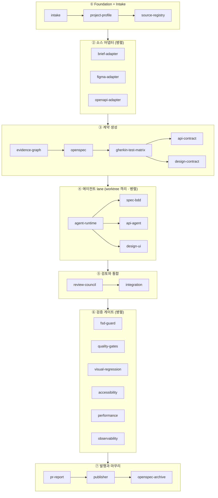
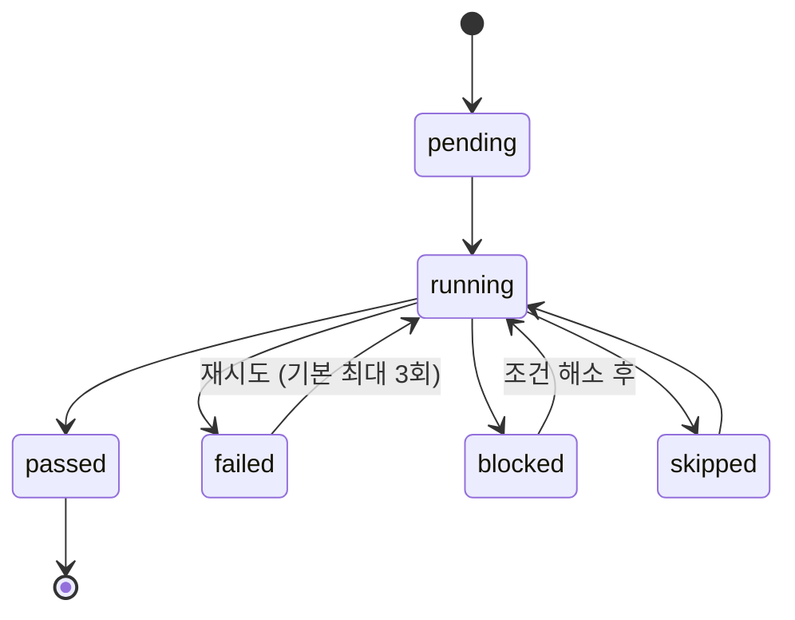

# 파이프라인 구조

하나의 요청은 하나의 **Run**이 되고, Run은 **26개 스테이지**를 위에서 아래로 통과합니다. 각 스테이지는 이전 스테이지의 산출물만 입력으로 받는 결정론적 단위입니다.



## 단계별 요약

| 단계        | 스테이지                                                   | 하는 일                                                                                  | 태스크 문서                                                                                                              |
| ----------- | ---------------------------------------------------------- | ---------------------------------------------------------------------------------------- | ------------------------------------------------------------------------------------------------------------------------ |
| ① 수집      | intake → project-profile → source-registry                 | 요청 파싱, 프로젝트 관례 감지(프레임워크·FSD·디자인시스템), 입력 스냅샷을 SHA-256로 고정 | [T06](/tasks/06-intake-manifest-and-project-profiler)~[T07](/tasks/07-source-registry-and-content-addressing)            |
| ② 어댑터    | brief / figma / openapi-adapter                            | 기획서·Figma·OpenAPI에서 각각 증거 추출 (셋은 병렬)                                      | [T08](/tasks/08-brief-adapter)~[T12](/tasks/12-openapi-intake-adapter)                                                   |
| ③ 계약      | evidence-graph → openspec → gherkin → api/design-contract  | 증거를 연결해 추적 매트릭스를 만들고 OpenSpec·Gherkin·API·디자인 계약 확정               | [T13](/tasks/13-evidence-graph-requirement-traceability)~[T17](/tasks/17-figma-design-contract-and-design-system-mapper) |
| ④ 구현      | agent-runtime → 3개 lane                                   | worktree 격리된 3개 에이전트가 병렬 구현                                                 | [T18](/tasks/18-worktree-isolated-agent-runtime)~[T21](/tasks/21-design-ui-agent-lane)                                   |
| ⑤ 검토·통합 | review-council → integration                               | 교차 검토 verdict → 승인된 변경만 통합 worktree로                                        | [T22](/tasks/22-review-council-and-gap-ledger)~[T23](/tasks/23-integration-bounded-repair-loop)                          |
| ⑥ 게이트    | fsd-guard · quality · visual · a11y · perf · observability | 결정론적 검증 게이트 6종 (병렬)                                                          | [T24](/tasks/24-fsd-architecture-source-guards)~[T29](/tasks/29-opentelemetry-and-log-correlation)                       |
| ⑦ 발행      | pr-report → publisher → openspec-archive                   | 증거 기반 PR 본문 생성 → draft 발행 → (머지 후) 아카이브                                 | [T30](/tasks/30-evidence-driven-pr-report)~[T32](/tasks/32-manual-post-merge-openspec-archive-lifecycle)                 |

## 스테이지의 생명주기

모든 스테이지는 같은 상태 기계를 따릅니다.



- **lease** — 스테이지 시작 시 5분 TTL의 lease를 획득하고 heartbeat로 갱신합니다. 에이전트가 죽어도 lease가 만료되면 다른 워커가 이어받을 수 있습니다.
- **checkpoint** — 스테이지마다 체크포인트가 저장되어, Run이 어디서 끊겨도 그 지점부터 재개됩니다.
- **waived** — 사람이 명시적으로 면제한 스테이지 상태. 면제 사유가 기록됩니다.

실제로 SQLite에 기록되는 스테이지 하나의 상태는 이런 모양입니다:

```json title="실행 중인 visual-regression 스테이지의 기록 (요약)"
{
  "stage": "visual-regression",
  "status": "running",
  "attempt": 2,
  "maxAttempts": 3,
  "lease": {
    "workerId": "worker-a1b2",
    "acquiredAt": "2026-07-10T02:10:00Z",
    "heartbeatAt": "2026-07-10T02:14:30Z",
    "expiresAt": "2026-07-10T02:19:30Z"
  },
  "checkpoint": { "name": "captured-screenshots", "data": { "captured": 4, "compared": 2 } }
}
```

이 기록 덕분에 다음 질문들에 항상 결정적으로 답할 수 있습니다:

- **"지금 누가 이 스테이지를 잡고 있나?"** → `lease.workerId`. `expiresAt`이 지났으면 죽은 워커 — 다른 워커가 인수 가능
- **"이거 다시 시도해도 되나?"** → `attempt 2 / maxAttempts 3` — 한 번 남음
- **"어디서부터 이어 하나?"** → checkpoint `captured-screenshots`: 스크린샷 4장 중 2장 비교 완료 지점부터

스테이지 전이는 전부 kernel의 MCP tool로만 일어납니다: `start_stage`(lease 발급) → `heartbeat_stage`(갱신) → `complete_stage` / `fail_stage` / `block_stage` / `skip_stage` (**현재 lease 보유자만 호출 가능**) → 재개 시 `get_resume_plan`이 다음 대상과 만료된 lease를 식별합니다.

## 왜 스테이지를 이렇게 잘게 나눴나

- **재개 가능성** — 26개 중 20번째에서 실패해도 앞의 19개를 다시 하지 않습니다.
- **증거의 경계** — 각 스테이지의 산출물이 명확해야 "어느 근거로 이 코드가 나왔나"를 역추적할 수 있습니다.
- **병렬성** — 의존이 없는 스테이지(어댑터 3종, 게이트 6종, lane 3개)는 병렬로 돕니다.

33개 태스크(T01~~T33)와 26개 런타임 스테이지의 관계: 태스크는 **구현 단위**(빌드 순서), 스테이지는 **실행 단위**(런타임 순서)입니다. T01~~T05(Foundation)는 런타임 스테이지가 아니라 모든 스테이지가 딛고 서는 기반 계층입니다. 전체 의존 관계는 [태스크 의존 그래프](/reference/task-graph)를 보세요.
