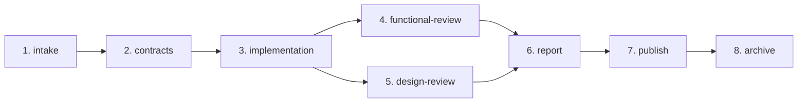
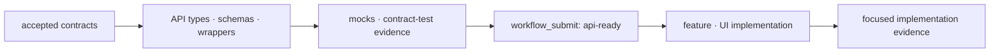

# v2 파이프라인

네 delivery mode는 별도 pipeline이 아니라 하나의 Run과 하나의 delivery profile을 공유합니다.

## 7개 public tool

| Tool               | 역할                                                                     |
| ------------------ | ------------------------------------------------------------------------ |
| `workflow_info`    | contract version, tool/stage/reviewer inventory 확인                     |
| `workflow_start`   | Run 생성, scope와 delivery profile 기록                                  |
| `workflow_advance` | 다음 외부 action 또는 terminal 상태까지 deterministic 진행               |
| `workflow_submit`  | contracts, API-ready, implementation, Figma bundle, review evidence 제출 |
| `workflow_status`  | stage, blocker, next action, artifact handle 조회                        |
| `workflow_publish` | canonical report로 draft PR/MR preview 또는 실행                         |
| `workflow_archive` | merge 확인 후 explicit archive preview 또는 실행                         |

이 목록 밖의 v1 microtool은 public contract가 아닙니다.

## 8개 durable stage

| Stage               | 완료 조건                                                                                        |
| ------------------- | ------------------------------------------------------------------------------------------------ |
| `intake`            | scope와 delivery profile이 기록됨                                                                |
| `contracts`         | 필요한 요구사항/API/mock/design contract와 mode-specific intake evidence가 실제 파일로 제출됨    |
| `implementation`    | API-backed UI는 선행 `api-ready` evidence 필수; feature는 targeted E2E + 영상 1개                |
| `functional-review` | 코드 scope의 필수 기능 gate와 requirement가 독립적으로 승인됨                                    |
| `design-review`     | UI scope의 visual/interaction/accessibility evidence가 독립적으로 승인됨; 비-UI면 not applicable |
| `report`            | 두 review와 required gate에서 canonical publish decision 생성                                    |
| `publish`           | publication이 `draft`일 때 draft review request와 필수 asset sync                                |
| `archive`           | authoritative merge evidence가 있을 때 명시적으로 실행                                           |

Stage는 pending/running/passed/failed/blocked/skipped/waived 상태와 lease/checkpoint를 durable ledger에 보관합니다. 사용자는 세부 stage machine microtool 대신 `workflow_advance`와 `workflow_status`를 사용합니다.

## 하나의 implementation context

API와 UI를 별도 agent/worktree로 나누지 않으므로 context handoff와 integration lane이 없습니다. API 없는 변경은 해당 준비를 not applicable로 처리합니다. API-backed UI는 물리적으로 서로 다른 비어 있지 않은 type/schema/wrapper/mock 파일과 `status: passed`인 JSON contract-test 결과를 안정적인 `implementationContextId`와 함께 `apiArtifacts`로 제출합니다. Path, symlink, hard link alias는 별도 증거가 아닙니다. 최종 구현은 같은 ID를 반복해야 하며 `apiReady: true` 주장만으로 완료될 수 없습니다.

## 두 개의 독립 review

- `functional-reviewer`: code scope에 적용. 계약 일치, diff, 관련 테스트, architecture/security 등 필요한 gate를 확인합니다.
- `design-reviewer`: UI scope에만 적용. design baseline, design-system 사용, responsive/interaction state, accessibility를 확인합니다.

구현 뒤 orchestrator가 `workflow_status` snapshot, accepted contracts, diff, evidence path로 immutable packet을 만들고 두 reviewer에게 전달합니다. Reviewer는 workflow tool을 직접 호출하거나 implementation을 수정하지 않고 schema-shaped verdict를 반환합니다. UI scope라면 병렬로 검토할 수 있습니다. 한 reviewer가 다른 verdict를 대신하거나 합산 Review Council을 두지 않습니다.

## Mode별 조건부 evidence

| Mode      | Contracts 이전/중                                | Implementation                                 |
| --------- | ------------------------------------------------ | ---------------------------------------------- |
| `brief`   | `briefPath`의 acceptance criteria                | 관련 검사                                      |
| `legacy`  | 요청 delta의 focused baseline                    | 영향받은 회귀 검사                             |
| `feature` | 일반 contracts                                   | 단일 Playwright + passing JSON + 유효 영상 1개 |
| `figma`   | host Figma capability → typed `figma-bundle` 1개 | UI/visual evidence                             |

Mode는 tool, stage, lane을 추가하지 않습니다. Feature mode만 영상 비용을 지며 full-project E2E는 기본이 아닙니다. Figma provider는 runtime 밖에 있고 polling하지 않습니다.

## Gate와 publication

일반 change는 사용 가능한 format/lint, typecheck, build, 관련 functional test를 기본으로 합니다. OpenSpec, architecture, targeted security, visual, accessibility, performance는 scope에 따라 적용되고 observability는 opt-in입니다. Full matrix와 release hardening은 explicit release workflow 전용입니다.

`workflow_publish`는 draft만 생성/갱신합니다. Merge 뒤의 archive는 별도 사용자 action이며 자동 polling하지 않습니다.
