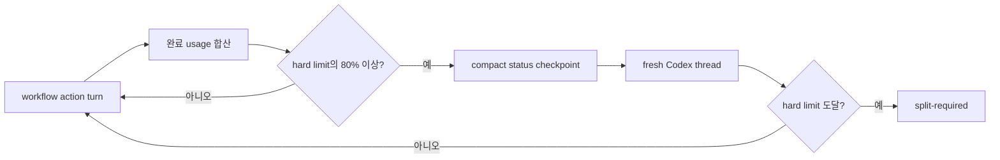
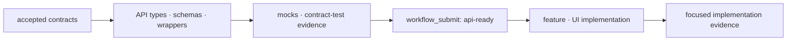

import GuideHero from "@site/src/components/guide/GuideHero";
import RunPipeline from "@site/src/components/guide/RunPipeline";
import NextStep from "@site/src/components/guide/NextStep";

<GuideHero
eyebrow="One Run · eight durable stages"
title="Run은 어떻게 움직이나요?"
summary="요청이 들어온 순간부터 draft PR과 merge 후 archive까지, 한 변경이 남기는 상태·증거·권한 경계를 따라갑니다."
primary={{ label: "리뷰 역할 보기", href: "/concepts/reviews" }}
secondary={{ label: "내 케이스 고르기", href: "/usage/" }}
/>

네 delivery mode는 별도 pipeline이 아니라 하나의 Run과 하나의 delivery profile을 공유합니다. Delivery mode controls delivery and evidence; input sources compose independently.

`feature` profile 하나가 brief, Figma URL, OpenAPI, 보조 문서, project guidance, optional skill hint를 모두 받을 수 있습니다. Brief/문서/OpenAPI는 scope와 workload 분류에 참여합니다. Project guidance is excluded from scope classification; explicit/discovered path와 실제 적용 skill만 trace로 유지합니다.

## Run map

<RunPipeline locale="ko" />

## 7개 public tool

| Tool               | 역할                                                                                |
| ------------------ | ----------------------------------------------------------------------------------- |
| `workflow_info`    | contract version, tool/stage/reviewer inventory 확인                                |
| `workflow_start`   | Run 생성, scope/delivery profile과 초기 workload 추정 기록                          |
| `workflow_advance` | 다음 외부 action 또는 terminal 상태까지 deterministic 진행                          |
| `workflow_submit`  | contracts, API-ready, implementation, Figma/visual comparison, review evidence 제출 |
| `workflow_status`  | stage, workload/token range, blocker, next action, bounded resume context 조회      |
| `workflow_publish` | canonical report로 draft PR/MR preview 또는 실행                                    |
| `workflow_archive` | merge 확인 후 explicit archive preview 또는 실행                                    |

이 목록 밖의 v1 microtool은 public contract가 아닙니다.

## 8개 durable stage

| Stage               | 완료 조건                                                                                        |
| ------------------- | ------------------------------------------------------------------------------------------------ |
| `intake`            | scope와 delivery profile이 기록됨                                                                |
| `contracts`         | 필요한 요구사항/API/mock/design contract, guidance trace와 source-dependent intake evidence 제출 |
| `implementation`    | API-backed UI는 선행 `api-ready` evidence 필수; feature는 targeted E2E + 영상 1개                |
| `functional-review` | 코드 scope의 필수 기능 gate와 requirement가 독립적으로 승인됨                                    |
| `design-review`     | UI scope의 visual/interaction/accessibility evidence가 독립적으로 승인됨; 비-UI면 not applicable |
| `report`            | immutable packet에 묶인 15-section `pr-report-v2.1` JSON/Markdown 생성                           |
| `publish`           | publication이 `draft`일 때 draft review request와 필수 asset sync                                |
| `archive`           | authoritative merge evidence가 있을 때 명시적으로 실행                                           |

Stage는 pending/running/passed/failed/blocked/skipped/waived 상태와 lease/checkpoint를 durable ledger에 보관합니다. 사용자는 세부 stage machine microtool 대신 `workflow_advance`와 `workflow_status`를 사용합니다.

### Artifact evidence path 계약

모든 `artifactPaths`와 artifact evidence path는 project root 기준의 portable project-relative, `/`-separated safe name이어야 합니다. Runtime은 ingestion 전에 absolute, traversal, control-character, backslash를 포함한 non-portable path와 secret-shaped path를 거부합니다. Path에 token/password/secret/credential **값**을 넣지 않습니다. `token-validation.json`처럼 증거 의미를 설명할 뿐 실제 비밀값을 포함하지 않는 이름은 허용됩니다.

## Workload와 자동 경계 제어

Intake가 끝나면 같은 checkpoint에 `XS`~`XL`, 예상 token 최소/최대, `low`/`medium`/`high` 신뢰도, 근거, hard limit과 80% 기준을 기록합니다. `workflow_status.resumeContext`는 기록된 목표, 프로젝트 상대 evidence 경로, 종류별 최신 제출 요약을 compact하게 반환합니다. Goal은 4,000자, path는 200개(초기 50+최신 150)와 각 1,000자, submission은 16종류와 요약별 500자로 제한하고 opaque artifact ID 목록은 status/checkpoint에서 제외합니다. 정보가 적은 intake는 넓은 범위와 낮은 신뢰도로 시작합니다. Contracts가 실제 요구사항 수, 관련 파일, API operation, UI surface, Figma node, test target, workspace package, uncertainty를 `workloadSignals`로 제출하면 같은 estimate만 갱신합니다. 별도 tool이나 아홉 번째 stage는 없습니다.

SDK runner는 Codex에게 external action group 하나 뒤에 turn을 끝내도록 지시하고 각 action turn에서 새 structured status를 요구합니다. SDK usage는 turn 완료 뒤에만 오므로 `input_tokens + output_tokens`를 완료 경계에서 누적하고, cached input/reasoning output은 중복 합산하지 않습니다. Usage가 없으면 0으로 간주하지 않고 `usage-unavailable`로 다음 action을 막습니다.

한 turn 실행 중 정확한 80% 지점은 관찰할 수 없으므로 최초로 80% 이상이 확인된 완료 경계에서 압축합니다. Fresh thread는 먼저 durable Run의 `workflow_status`를 읽고 `resumeContext`의 목표·evidence 경로·제출 요약으로 다음 action을 재구성합니다. Agent가 경계 지시를 무시해 한 turn에서 여러 action을 수행한 경우 이미 생긴 side effect는 되돌릴 수 없지만, 다음 turn은 새 status와 자동 경계 확인 전 시작하지 않습니다. Hard limit에 도달하면 다음 action을 시작하지 않고 독립적으로 검증 가능한 범위로 나눕니다. Runtime이 제공한 전체 required-validation 목록은 줄이거나 waive하지 않습니다. Complete usage가 있는 신규 비재개 완료 Run의 숫자/enum만 저장해 표시 범위만 보정하며 자동 limit은 workload 기본 최대값으로 고정합니다. 과거에 다른 hard limit으로 기록된 표본은 제외합니다. Calibration history에는 prompt, code, diff, path, tool payload, final response를 저장하지 않으며 기록을 직렬·원자적으로 처리하고 크기와 보존 기간을 제한합니다. 선택적 history I/O 실패는 workflow 결과를 실패로 바꾸지 않습니다.

## 하나의 implementation context

API와 UI를 별도 agent/worktree로 나누지 않으므로 context handoff와 integration lane이 없습니다. API 없는 변경은 해당 준비를 not applicable로 처리합니다. API-backed UI는 물리적으로 서로 다른 비어 있지 않은 type/schema/wrapper/mock 파일과 `status: passed`인 JSON contract-test 결과를 안정적인 `implementationContextId`와 함께 `apiArtifacts`로 제출합니다. Path, symlink, hard link alias는 별도 증거가 아닙니다. 최종 구현은 같은 ID를 반복해야 하며 `apiReady: true` 주장만으로 완료될 수 없습니다.

Intake는 local/remote raw digest, 조회 시각, resolved locator를 `sourceProvenance`로 고정하고 OpenAPI 전체 operation inventory를 생성합니다. Figma/running legacy baseline은 공통 `visualTargets`를 씁니다. 각 actual capture는 target의 route/state/viewport/device scale/fixture와 provider, ISO capture time, PNG path, `sha256:` digest를 제출하고, `compare-visuals`는 target drift·digest mismatch와 caller score를 거부한 채 exact/review ratio, diff, overlay를 최소 98%, 정당한 mask 최대 20%, 비교 총 3회(최초 1회 + repair 최대 2회)로 계산합니다. Legacy contracts는 stable key를 `planned`로 고정하고 final implementation이 current-packet `migrated`/제외 coverage로 교체합니다. Brief/feature API coverage는 intake OpenAPI operation 집합과 정확히 일치해야 합니다. Legacy는 명시된 bounded source adapter 목록으로 API 후보를 파생합니다. 후보가 있으면 같은 완전한 API 증거를 요구하고, 후보가 0개면 API 섹션을 adapter 목록과 inventory digest에 묶어 `complete`로 남깁니다. Method/path가 모호한 후보는 유일한 scoped runtime/OpenAPI match로만 해소하며 그렇지 않으면 Run ID가 보존된 intake blocker로 반환합니다.

Project instruction precedence는 current user request → explicit `guidancePaths` → automatically discovered guidance → available/applicable installed skill → SpecToPR defaults입니다. Missing optional skill은 blocker가 아니며 project guidance가 generic skill 조언보다 우선합니다.

모호한 legacy API는 대상 프로젝트 내부 `legacyNetworkEvidencePath`의 bounded HAR/request JSON(최대 1 MB·1,000 request) 또는 유일한 scoped OpenAPI로만 해소합니다. Runtime evidence의 digest와 adapter는 inventory에 고정되며, 미해소 intake는 `nextActions: []`이고 모든 downstream submission을 거부합니다.

## 두 개의 독립 review

- `functional-reviewer`: code scope에 적용. 계약 일치, diff, 관련 테스트, guidance 기반 파일 배치/API/framework convention, architecture/security gate를 확인합니다.
- `design-reviewer`: UI scope에만 적용. guidance와 적용 skill에 따른 design baseline, design-system/UI convention, responsive/interaction state, accessibility를 확인합니다.

구현 뒤 orchestrator가 `workflow_status` snapshot, accepted contracts, diff, evidence path로 immutable packet을 만들고 두 reviewer에게 전달합니다. Reviewer는 workflow tool을 직접 호출하거나 implementation을 수정하지 않고 schema-shaped verdict를 반환합니다. UI scope라면 병렬로 검토할 수 있습니다. 한 reviewer가 다른 verdict를 대신하거나 합산 Review Council을 두지 않습니다.

## Delegation policy

`delegationPolicy`는 workload에서 직접 계산됩니다.

| Workload | read-only scout 상한 | 조건                                            |
| -------- | -------------------: | ----------------------------------------------- |
| XS/S     |                    0 | implementation writer가 직접 읽음               |
| M        |                    1 | 독립적인 read-heavy discovery가 있을 때만       |
| L/XL     |                    2 | 서로 겹치지 않는 read-heavy discovery로 bounded |

Scout는 편집, browser, workflow MCP, nested delegation을 하지 않습니다. **No nesting**이며 API/UI를 포함한 implementation writer는 항상 한 명입니다. Parallel writer와 persistent agent team은 없습니다. `functional-reviewer`와 UI scope의 `design-reviewer`만 implementation 완료 뒤 immutable packet을 읽으며 병렬일 수 있고, 두 profile 모두 fully read-only, workflow-MCP-free입니다.

## Mode별 조건부 evidence

| Mode      | Delivery/evidence 조건                           | 조합 가능한 source 예시                                  |
| --------- | ------------------------------------------------ | -------------------------------------------------------- |
| `brief`   | full API/UI + Figma ratio + API gap + Web Vitals | brief + Figma + local/URL OpenAPI                        |
| `legacy`  | migration + running legacy ratio + 파생 API gap  | target + `legacyProjectRoot` + optional docs/OpenAPI/HAR |
| `feature` | brief full delivery + targeted E2E + 영상 1개    | brief + Figma + OpenAPI + docs/guidance/skills           |
| `figma`   | deterministic mock UI + Figma ratio              | `figmaUrl` + docs/guidance                               |

Mode는 tool, stage, lane을 추가하지 않습니다. Feature mode만 영상 비용을 지며 full-project E2E는 기본이 아닙니다. 어떤 mode든 `figmaUrl`이 있으면 host Figma capability의 typed `figma-bundle` 한 개가 필요합니다. Figma provider는 runtime 밖에 있고 polling하지 않습니다.

## Gate와 publication

일반 change는 사용 가능한 format/lint, typecheck, build, 관련 functional test를 기본으로 합니다. OpenSpec, architecture, targeted security, visual, accessibility, performance는 scope에 따라 적용되고 observability는 opt-in입니다. Full matrix와 tracked archive/package integrity 검증은 explicit release workflow 전용입니다.

### Browser evidence routing

Playwright Test/CLI web-first assertion과 structured result가 browser acceptance oracle입니다. Browser MCP 또는 host browser는 interactive reproduction/inspection에만 optional이고, Chrome DevTools MCP는 console, network, performance, memory, live-DOM evidence가 필요할 때만 diagnostic입니다. Screenshot, video, DevTools trace, agent observation은 assertion을 대체하지 않습니다. Required browser proof를 실행하지 못하면 `BROWSER_NOT_RUN`과 exact unblock action으로 blocked합니다. `feature`만 변경 기능 selector의 E2E와 video 정확히 1개를 요구합니다.

### Ready와 blocked publication

`workflow_publish intent: ready`는 canonical passed report에서 draft PR/MR만 생성·갱신합니다. Blocker는 raw prompt/secret/transcript/private absolute path 없이 다음 typed `blockerDetails`를 보존합니다: `stage`, `code`, `kind`, `retryable`, `resumable`, completed work, redacted evidence, attempted recovery, unrun validations, exact unblock action.

정상과 blocked publication 모두 같은 `pr-report-v2.1` 15개 섹션을 사용합니다. 각 섹션은 `complete`, `not-run`, `blocked`, `not-applicable` 중 하나이며, 현재 review packet에 없는 stale evidence path는 생략됩니다. 정상은 source/requirements/files/API/legacy/visual/reviews/performance/feature/risk/rollback/evidence를, blocked는 같은 위치에서 not-run 상태와 stopped stage/exact unblock action을 표시합니다.

GitHub 증거는 실행마다 branch를 만들지 않고 단일 관리 branch `spec-to-pr/evidence`의 immutable run/packet/target/artifact 경로에 저장합니다. PR 링크는 upload commit SHA에 고정되어 동일 경로를 재사용해도 과거 증거가 바뀌지 않습니다.

`workflow_publish intent: blocked-diagnostic`은 clean tree, non-target source, supported authenticated remote, committed delta, target보다 한 commit ahead 조건이 이미 맞을 때만 diagnostic draft를 만들 수 있습니다. Diagnostic publication은 계속 `status: blocked`이며 report/publish passed verdict가 아닙니다. 조건이 없거나 `PUBLISH_NO_DELTA`이면 empty commit 또는 issue fallback 없이 **local blocked report**를 반환합니다. 같은 action이 자기 precondition blocker를 다시 publish하며 loop하지 않습니다.

동시 실행을 막는 durable claim이 만료되거나 heartbeat를 잃어 외부 mutation 성공 여부를 확정할 수 없으면 `reason: diagnostic-publication-uncertain`을 반환하고 자동 재발행하지 않습니다. `recoverUncertain: false`가 기본값입니다. 사용자가 GitHub/GitLab에서 같은 source/target의 matching draft를 직접 확인한 뒤 명시적으로 승인한 경우에만 기존 `workflow_publish`를 `recoverUncertain: true`로 다시 호출합니다. 이 선택적 복구는 새 tool/stage가 아니며 blocked stages를 passed로 바꾸지 않고, SDK도 자동 승인하지 않습니다.

해결 뒤 `workflow_status.resumeContext`로 **same Run**을 이어가 통과한 stage를 반복하지 않습니다. Diagnostic draft가 있으면 같은 source/target의 **same draft PR**에서 `[Blocked]` 제목과 blocked label을 정상 ready 제목/본문으로 바꾸고 label을 제거합니다. Merge 뒤 archive는 별도 사용자 action이며 자동 polling하지 않습니다.

<NextStep
eyebrow="다음 개념"
title="같은 packet을 읽어도 reviewer마다 보는 것이 다릅니다"
description="Functional과 design verdict를 분리한 이유와 각 agent의 입력·출력·금지 권한을 확인하세요."
href="/concepts/reviews"
label="에이전트 리뷰 보기"
secondary={{ label: "시각 검증 보기", href: "/concepts/visual-verification" }}
/>
