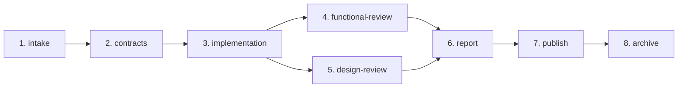
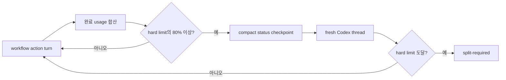
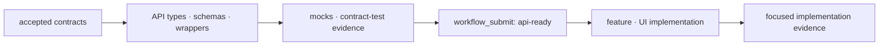

# v2 파이프라인

네 delivery mode는 별도 pipeline이 아니라 하나의 Run과 하나의 delivery profile을 공유합니다. Delivery mode controls delivery and evidence; input sources compose independently.

`feature` profile 하나가 brief, Figma URL, OpenAPI, 보조 문서, project guidance, optional skill hint를 모두 받을 수 있습니다. Brief/문서/OpenAPI는 scope와 workload 분류에 참여합니다. Project guidance is excluded from scope classification; explicit/discovered path와 실제 적용 skill만 trace로 유지합니다.

## 7개 public tool

| Tool               | 역할                                                                           |
| ------------------ | ------------------------------------------------------------------------------ |
| `workflow_info`    | contract version, tool/stage/reviewer inventory 확인                           |
| `workflow_start`   | Run 생성, scope/delivery profile과 초기 workload 추정 기록                     |
| `workflow_advance` | 다음 외부 action 또는 terminal 상태까지 deterministic 진행                     |
| `workflow_submit`  | contracts, API-ready, implementation, Figma bundle, review evidence 제출       |
| `workflow_status`  | stage, workload/token range, blocker, next action, bounded resume context 조회 |
| `workflow_publish` | canonical report로 draft PR/MR preview 또는 실행                               |
| `workflow_archive` | merge 확인 후 explicit archive preview 또는 실행                               |

이 목록 밖의 v1 microtool은 public contract가 아닙니다.

## 8개 durable stage

| Stage               | 완료 조건                                                                                        |
| ------------------- | ------------------------------------------------------------------------------------------------ |
| `intake`            | scope와 delivery profile이 기록됨                                                                |
| `contracts`         | 필요한 요구사항/API/mock/design contract, guidance trace와 source-dependent intake evidence 제출 |
| `implementation`    | API-backed UI는 선행 `api-ready` evidence 필수; feature는 targeted E2E + 영상 1개                |
| `functional-review` | 코드 scope의 필수 기능 gate와 requirement가 독립적으로 승인됨                                    |
| `design-review`     | UI scope의 visual/interaction/accessibility evidence가 독립적으로 승인됨; 비-UI면 not applicable |
| `report`            | 두 review와 required gate에서 canonical publish decision 생성                                    |
| `publish`           | publication이 `draft`일 때 draft review request와 필수 asset sync                                |
| `archive`           | authoritative merge evidence가 있을 때 명시적으로 실행                                           |

Stage는 pending/running/passed/failed/blocked/skipped/waived 상태와 lease/checkpoint를 durable ledger에 보관합니다. 사용자는 세부 stage machine microtool 대신 `workflow_advance`와 `workflow_status`를 사용합니다.

## Workload와 자동 경계 제어

Intake가 끝나면 같은 checkpoint에 `XS`~`XL`, 예상 token 최소/최대, `low`/`medium`/`high` 신뢰도, 근거, hard limit과 80% 기준을 기록합니다. `workflow_status.resumeContext`는 기록된 목표, 프로젝트 상대 evidence 경로, 종류별 최신 제출 요약을 compact하게 반환합니다. Goal은 4,000자, path는 200개(초기 50+최신 150)와 각 1,000자, submission은 16종류와 요약별 500자로 제한하고 opaque artifact ID 목록은 status/checkpoint에서 제외합니다. 정보가 적은 intake는 넓은 범위와 낮은 신뢰도로 시작합니다. Contracts가 실제 요구사항 수, 관련 파일, API operation, UI surface, Figma node, test target, workspace package, uncertainty를 `workloadSignals`로 제출하면 같은 estimate만 갱신합니다. 별도 tool이나 아홉 번째 stage는 없습니다.

SDK runner는 Codex에게 external action group 하나 뒤에 turn을 끝내도록 지시하고 각 action turn에서 새 structured status를 요구합니다. SDK usage는 turn 완료 뒤에만 오므로 `input_tokens + output_tokens`를 완료 경계에서 누적하고, cached input/reasoning output은 중복 합산하지 않습니다. Usage가 없으면 0으로 간주하지 않고 `usage-unavailable`로 다음 action을 막습니다.

한 turn 실행 중 정확한 80% 지점은 관찰할 수 없으므로 최초로 80% 이상이 확인된 완료 경계에서 압축합니다. Fresh thread는 먼저 durable Run의 `workflow_status`를 읽고 `resumeContext`의 목표·evidence 경로·제출 요약으로 다음 action을 재구성합니다. Agent가 경계 지시를 무시해 한 turn에서 여러 action을 수행한 경우 이미 생긴 side effect는 되돌릴 수 없지만, 다음 turn은 새 status와 자동 경계 확인 전 시작하지 않습니다. Hard limit에 도달하면 다음 action을 시작하지 않고 독립적으로 검증 가능한 범위로 나눕니다. Runtime이 제공한 전체 required-validation 목록은 줄이거나 waive하지 않습니다. Complete usage가 있는 신규 비재개 완료 Run의 숫자/enum만 저장해 표시 범위만 보정하며 자동 limit은 workload 기본 최대값으로 고정합니다. 과거에 다른 hard limit으로 기록된 표본은 제외합니다. Calibration history에는 prompt, code, diff, path, tool payload, final response를 저장하지 않으며 기록을 직렬·원자적으로 처리하고 크기와 보존 기간을 제한합니다. 선택적 history I/O 실패는 workflow 결과를 실패로 바꾸지 않습니다.

## 하나의 implementation context

API와 UI를 별도 agent/worktree로 나누지 않으므로 context handoff와 integration lane이 없습니다. API 없는 변경은 해당 준비를 not applicable로 처리합니다. API-backed UI는 물리적으로 서로 다른 비어 있지 않은 type/schema/wrapper/mock 파일과 `status: passed`인 JSON contract-test 결과를 안정적인 `implementationContextId`와 함께 `apiArtifacts`로 제출합니다. Path, symlink, hard link alias는 별도 증거가 아닙니다. 최종 구현은 같은 ID를 반복해야 하며 `apiReady: true` 주장만으로 완료될 수 없습니다.

Project instruction precedence는 current user request → explicit `guidancePaths` → automatically discovered guidance → available/applicable installed skill → SpecToPR defaults입니다. Missing optional skill은 blocker가 아니며 project guidance가 generic skill 조언보다 우선합니다.

## 두 개의 독립 review

- `functional-reviewer`: code scope에 적용. 계약 일치, diff, 관련 테스트, guidance 기반 파일 배치/API/framework convention, architecture/security gate를 확인합니다.
- `design-reviewer`: UI scope에만 적용. guidance와 적용 skill에 따른 design baseline, design-system/UI convention, responsive/interaction state, accessibility를 확인합니다.

구현 뒤 orchestrator가 `workflow_status` snapshot, accepted contracts, diff, evidence path로 immutable packet을 만들고 두 reviewer에게 전달합니다. Reviewer는 workflow tool을 직접 호출하거나 implementation을 수정하지 않고 schema-shaped verdict를 반환합니다. UI scope라면 병렬로 검토할 수 있습니다. 한 reviewer가 다른 verdict를 대신하거나 합산 Review Council을 두지 않습니다.

## Mode별 조건부 evidence

| Mode      | Delivery/evidence 조건                             | 조합 가능한 source 예시                          |
| --------- | -------------------------------------------------- | ------------------------------------------------ |
| `brief`   | acceptance criteria와 관련 검사                    | `briefPath` + docs/OpenAPI/guidance              |
| `legacy`  | 요청 delta의 focused baseline과 영향받은 회귀 검사 | docs/OpenAPI/guidance                            |
| `feature` | 단일 Playwright + passing JSON + 유효 영상 1개     | brief + Figma + OpenAPI + docs + guidance/skills |
| `figma`   | Figma-primary UI/visual evidence                   | `figmaUrl` + docs/guidance                       |

Mode는 tool, stage, lane을 추가하지 않습니다. Feature mode만 영상 비용을 지며 full-project E2E는 기본이 아닙니다. 어떤 mode든 `figmaUrl`이 있으면 host Figma capability의 typed `figma-bundle` 한 개가 필요합니다. Figma provider는 runtime 밖에 있고 polling하지 않습니다.

## Gate와 publication

일반 change는 사용 가능한 format/lint, typecheck, build, 관련 functional test를 기본으로 합니다. OpenSpec, architecture, targeted security, visual, accessibility, performance는 scope에 따라 적용되고 observability는 opt-in입니다. Full matrix와 tracked archive/package integrity 검증은 explicit release workflow 전용입니다.

`workflow_publish`는 draft만 생성/갱신합니다. Merge 뒤의 archive는 별도 사용자 action이며 자동 polling하지 않습니다.
