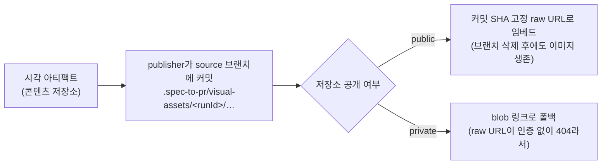
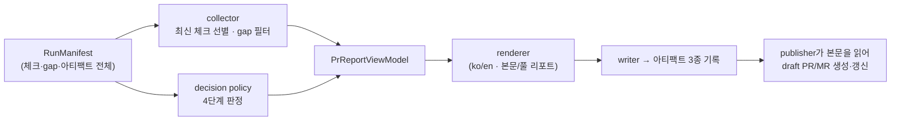

# PR 리포트 구조 — 최종 산출물

파이프라인의 마지막 산출물인 **PR/MR 본문**이 실제로 어떻게 생겼고, 어떤 데이터로 채워지며, 언제 blocked로 표시되는지를 다룹니다. 모든 내용은 `src/pr-report/`의 실제 렌더러 기준입니다.

## 하나의 Run에서 3개의 리포트 아티팩트가 나온다

| 아티팩트                                     | 용도                                      | 분량                                                                          |
| -------------------------------------------- | ----------------------------------------- | ----------------------------------------------------------------------------- |
| **PR 본문 Markdown** (`pr-body-markdown`)    | 리뷰어가 PR에서 바로 읽는 요약본          | **11개 섹션**                                                                 |
| **내부 감사 Markdown** (`pr-audit-markdown`) | 아카이브·감사용 전체 리포트               | **23개 섹션** (메타데이터·추적 매트릭스·Figma 인벤토리·아카이브 계획 등 포함) |
| **뷰모델 JSON** (`pr-report-view-model`)     | 렌더링 전 구조화 데이터 — 재렌더링·검증용 | —                                                                             |

셋 다 콘텐츠 저장소에 불변으로 기록되고 Run manifest에 등록됩니다. PR에 올라가는 것은 첫 번째뿐이고, 나머지 둘은 "본문의 모든 문장을 데이터로 역추적"하기 위해 존재합니다.

이 내부 리포트 아티팩트는 `${SPEC_TO_PR_DATA_DIR}`의 플러그인 데이터 저장소에 기록되며 대상 프로젝트의 Git 변경으로 추가되지 않습니다. GitHub PR에 표시할 시각 이미지만 별도로 source 브랜치의 `.spec-to-pr/visual-assets/<runId>/`에 업로드됩니다.

언어는 intake 때 결정된 `locale`(ko/en)에 따라 **한국어/영어 렌더러가 분리**되어 있습니다.

## PR 본문 11개 섹션 (순서대로)

리뷰어가 위에서부터 읽으며 30초 안에 "머지해도 되나"를 판단할 수 있게 **결정 → 실패 이유 → 근거** 순서로 배치되어 있습니다.

| #   | 섹션 (한국어 렌더링)              | 채워지는 내용                                                                            |
| --- | --------------------------------- | ---------------------------------------------------------------------------------------- |
| 1   | `# 요약`                          | 구현 요약 불릿                                                                           |
| 2   | `## 결정`                         | 리뷰어가 판단할 **머지 준비 상태**                                                       |
| 3   | `## 우선 확인할 실패 / 차단 사유` | 실패/미실행 게이트와 blocker gap만 추려서 — 리뷰어가 제일 먼저 볼 것                     |
| 4   | `## 게이트 요약`                  | 게이트별 필수 여부·상태·증거 개수·메모 표 (본문에서는 증거를 "3개 증거"처럼 압축)        |
| 5   | `## 리뷰 점수표`                  | 9차원 스코어카드: 점수·기준·상태·**다음 수정 대상**·증거·메모                            |
| 6   | `## 시각 회귀`                    | 상태별 Figma/브라우저/diff 비교 결과와 일치율                                            |
| 7   | `## 기능 검증`                    | 테스트 체크 결과 표 (이름·종류·결과·커맨드·exit code)                                    |
| 8   | `## API Generator / API Contract` | API 계약·드리프트 검증 결과                                                              |
| 9   | `## 접근성`                       | 접근성 게이트 결과                                                                       |
| 10  | `## 성능 / Web Vitals`            | 성능 게이트 결과                                                                         |
| 11  | `## 갭 및 리뷰 메모`              | gap을 **카테고리·심각도·상태·제목으로 그룹핑**한 표 — 같은 gap이 2건이면 행 하나에 "2개" |

:::info 본문에는 아티팩트 ID가 노출되지 않습니다
`gap_1111…` 같은 내부 ID는 본문에서 의도적으로 제거되고, 상세는 내부 감사 리포트에만 남습니다. 리뷰어용 본문과 감사용 전체 기록을 분리하는 설계입니다.
:::

## Blocked 케이스 축약 예시

렌더러 테스트의 실제 산출물을 압축한 것입니다:

:::warning blocked 리포트가 새 PR을 만들지는 않습니다
이 예시는 blocked 본문의 **형태**를 설명합니다. `blocked`이면 새 PR/MR 발행은 건너뜁니다. 이미 열린 draft가 있고 사용자가 실패 증거를 그 PR에 남기라고 요청한 경우에만 기존 본문을 blocked 내용으로 갱신할 수 있습니다.
:::

```markdown
# 요약

- 증거 기반 구현 리포트를 생성했습니다.

## 결정

| 항목           | 결과    |
| -------------- | ------- |
| 머지 준비 상태 | blocked |

## 우선 확인할 실패 / 차단 사유

- OpenSpec / 명세: 미실행 - OpenSpec CheckResult가 기록되지 않았습니다.
- 요구사항 추적성: traceability matrix row가 0개입니다.
- Missing linked evidence: 2개 blocker gap

## 리뷰 점수표

| 항목            | 점수 | 기준 | 상태 | 다음           | 증거 | 메모                                       |
| --------------- | ---- | ---- | ---- | -------------- | ---- | ------------------------------------------ |
| Legacy coverage | 6.00 | 8.00 | 실패 | 다음 수정 대상 | -    | Two legacy features have no test evidence. |
| Visual parity   | 8.50 | 8.00 | 통과 | -              | -    | Visual comparison meets the threshold.     |

## 갭 및 리뷰 메모

| 카테고리     | 심각도  | 상태 | 제목                    | 건수 | 영향                               |
| ------------ | ------- | ---- | ----------------------- | ---- | ---------------------------------- |
| traceability | blocker | open | Missing linked evidence | 2개  | Cannot prove requirement coverage. |

## 시각 증거 미리보기

Figma baseline, 브라우저 캡처, visual diff 이미지를 리뷰용으로 업로드했습니다.

| 대상         | Figma                                   | Browser                                   | Diff                                   | 점수                           |
| ------------ | --------------------------------------- | ----------------------------------------- | -------------------------------------- | ------------------------------ |
| home-desktop | `` | `` | `` | 98.00% · exact 95.00% · passed |
```

Run ID, 생성 시각, 아티팩트 개수·ID, 전체 리포트 위치는 PR 본문에 노출하지 않습니다. 이 값들은 `pr-audit-markdown`과 `pr-report-view-model`에만 보관됩니다.

## Ready 성공 케이스 전체 예시

아래는 필수 게이트와 9차원 점수표를 모두 통과한 최종 PR 본문 예시입니다. 기본 renderer가 만드는 11개 섹션 뒤에 publisher가 `시각 증거 미리보기`를 추가하므로, 이미지 증거가 있는 실제 PR에서는 총 12개 섹션이 보입니다.

```markdown
# 요약

- 결제 화면 개편 요구사항 8건을 구현했습니다.
- OpenSpec·Gherkin·API·Figma evidence가 구현 및 테스트 결과와 연결되었습니다.
- 필수 게이트와 리뷰 점수표가 모두 기준을 통과했습니다.

## 결정

| 항목           | 결과  |
| -------------- | ----- |
| 머지 준비 상태 | ready |

## 우선 확인할 실패 / 차단 사유

리포트 모델에서 차단 또는 실패 리뷰 항목이 확인되지 않았습니다.

## 게이트 요약

| 게이트            | 필수 | 상태 | 증거     | 메모                                        |
| ----------------- | ---- | ---- | -------- | ------------------------------------------- |
| Architecture      | 예   | 통과 | 2개 증거 | FSD 경계와 source guard가 통과했습니다.     |
| 런타임 검증       | 예   | 통과 | 3개 증거 | lint·typecheck·build가 통과했습니다.        |
| 기능 검증         | 예   | 통과 | 4개 증거 | unit·component·contract·e2e가 통과했습니다. |
| OpenSpec / 명세   | 예   | 통과 | 2개 증거 | OpenSpec 검증이 통과했습니다.               |
| 시각 회귀         | 예   | 통과 | 1개 증거 | Figma/브라우저 비교가 기준을 충족했습니다.  |
| 접근성            | 예   | 통과 | 1개 증거 | 자동 접근성 검사가 통과했습니다.            |
| 성능 / Web Vitals | 예   | 통과 | 1개 증거 | Lighthouse 예산을 충족했습니다.             |
| 보안 하드닝       | 예   | 통과 | 1개 증거 | 보안 체크가 통과했습니다.                   |
| 관측성            | 예   | 통과 | 1개 증거 | trace/log 상관관계가 확인됐습니다.          |

## 리뷰 점수표

| 항목                 | 점수 | 기준 | 상태 | 다음 | 증거     | 메모                                    |
| -------------------- | ---- | ---- | ---- | ---- | -------- | --------------------------------------- |
| Brief fidelity       | 9.5  | 8.0  | 통과 | -    | 3개 증거 | 요구사항이 구현 범위와 일치합니다.      |
| Legacy coverage      | 9.0  | 8.0  | 통과 | -    | 2개 증거 | 기존 동작이 테스트와 연결됐습니다.      |
| Gherkin completeness | 9.2  | 8.0  | 통과 | -    | 2개 증거 | 수용 시나리오가 모두 연결됐습니다.      |
| TDD evidence         | 9.0  | 8.0  | 통과 | -    | 4개 증거 | 실행된 테스트와 결과 리포트가 있습니다. |
| Design-system usage  | 9.4  | 8.0  | 통과 | -    | 2개 증거 | 기존 디자인 시스템을 사용했습니다.      |
| Visual parity        | 9.8  | 8.0  | 통과 | -    | 3개 증거 | review match 98.7%입니다.               |
| Resource contract    | 9.1  | 8.0  | 통과 | -    | 2개 증거 | 이미지·URL·이벤트 계약이 일치합니다.    |
| API contract         | 9.3  | 8.0  | 통과 | -    | 3개 증거 | OpenAPI와 wrapper가 일치합니다.         |
| Publish sync         | 10.0 | 8.0  | 통과 | -    | 1개 증거 | PR 본문과 시각 증거가 동기화됐습니다.   |

## 시각 회귀

| 상태             | Figma     | 브라우저  | Diff      | Exact  | Review Match | 결과 | 메모                    |
| ---------------- | --------- | --------- | --------- | ------ | ------------ | ---- | ----------------------- |
| checkout-desktop | 기준 캡처 | 구현 캡처 | diff 생성 | 96.20% | 98.70%       | 통과 | viewport·font 조건 일치 |

## 기능 검증

| 체크      | 종류      | 결과 | 명령                | Exit Code | 요약               |
| --------- | --------- | ---- | ------------------- | --------- | ------------------ |
| unit      | unit      | 통과 | pnpm test:unit      | 0         | 42개 테스트 통과   |
| component | component | 통과 | pnpm test:component | 0         | 8개 상태 검증 통과 |
| e2e       | e2e       | 통과 | pnpm test:e2e       | 0         | 결제 흐름 통과     |

## API Generator / API Contract

| 항목                 | 결과 | 증거                       | 메모                         |
| -------------------- | ---- | -------------------------- | ---------------------------- |
| POST /checkout       | 통과 | OpenAPI + contract test    | request/response schema 일치 |
| GET /payment-methods | 통과 | generated client + wrapper | drift 없음                   |

## 접근성

| 체크         | 종류          | 결과 | 명령           | Exit Code | 요약                       |
| ------------ | ------------- | ---- | -------------- | --------- | -------------------------- |
| axe checkout | accessibility | 통과 | pnpm test:a11y | 0         | critical/serious 위반 없음 |

자동 접근성 검사는 수동 스크린리더 리뷰를 대신하지 않습니다.

## 성능 / Web Vitals

| 지표                   | 값   | 예산   | 결과 | 출처        |
| ---------------------- | ---- | ------ | ---- | ----------- |
| Lighthouse performance | 94   | ≥ 90   | 통과 | CI lab data |
| LCP                    | 1.8s | ≤ 2.5s | 통과 | CI lab data |
| CLS                    | 0.03 | ≤ 0.1  | 통과 | CI lab data |

## 갭 및 리뷰 메모

open 또는 assumed 상태의 gap이 없습니다.

## 시각 증거 미리보기

Figma baseline, 브라우저 캡처, visual diff 이미지를 리뷰용으로 업로드했습니다.

| 대상             | Figma                                   | Browser                                   | Diff                                   | 점수                           |
| ---------------- | --------------------------------------- | ----------------------------------------- | -------------------------------------- | ------------------------------ |
| checkout-desktop | `` | `` | `` | 98.70% · exact 96.20% · passed |
```

## 머지 준비 상태 — 4단계 판정

`결정` 표의 "머지 준비 상태"는 스코어카드의 passed/retry/blocked와 별개인 **리포트 판정**으로, 4단계입니다.

| 판정                 | 의미                    | 조건 (우선순위순)                                                                                                                                                                                                            |
| -------------------- | ----------------------- | ---------------------------------------------------------------------------------------------------------------------------------------------------------------------------------------------------------------------------- |
| `blocked`            | 발행 차단               | 필수 체크(lint·typecheck·build·openspec·security) 실패 / blocker gap 열림 / 필수 게이트 미실행 / 레거시 커버리지 미완 / 스코어카드 blocking / Figma를 쓰는데 시각 비교 없음 / component contract가 있는데 컴포넌트 증거 없음 |
| `draft`              | draft로만 발행          | major 심각도 gap이 열려 있음                                                                                                                                                                                                 |
| `ready-after-review` | 사람 확인 후 ready 가능 | 시각 비교가 warning/fail이거나 시각·접근성 체크가 skip/fail                                                                                                                                                                  |
| `ready`              | 리뷰만 통과하면 됨      | 위 조건 전부 해당 없음                                                                                                                                                                                                       |

`blocked`이면 **새 PR/MR은 만들어지지 않습니다.** 이미 열린 draft가 있으면 본문만 blocked 사유로 갱신됩니다. 별도의 경고 배너 대신, `결정` 표 + `우선 확인할 실패` 섹션이 차단 이유를 그대로 보여줍니다.

## 스크린샷이 PR에 들어가는 방식

시각 증거(Figma baseline · 브라우저 캡처 · diff 이미지)는 발행 시점에 처리됩니다:



- 이미지 URL을 **커밋 SHA에 고정**하기 때문에, 머지 후 브랜치를 지워도 PR의 스크린샷이 깨지지 않습니다.
- GitHub에서는 이 이미지 파일이 source 브랜치의 PR 변경에 포함되며, PR을 머지하면 대상 브랜치에도 남습니다.
- PR 본문에는 이미지와 비교 점수만 표시하고 내부 Artifact ID는 표시하지 않습니다.
- private 저장소는 GitHub 이미지 프록시가 인증을 못 하므로 임베드 대신 클릭 가능한 링크로 들어갑니다.

## 생성 파이프라인 (내부 구조)



핵심 규칙: **렌더러는 데이터를 만들지 않습니다.** 본문의 모든 셀은 Run에 이미 기록된 CheckResult·Gap·Artifact에서 나오고, publisher가 PR URL을 기록하기 전까지는 이 리포트도 발행 증거로 취급되지 않습니다.

## 관련 문서

- 판정에 쓰이는 점수 체계 → [평가와 루프 엔지니어링](/concepts/scoring-and-loops)
- 태스크 명세 → [T30 · 증거 기반 PR/MR 리포트](/tasks/30-evidence-driven-pr-report), [T31 · 퍼블리셔](/tasks/31-github-gitlab-publishers)
