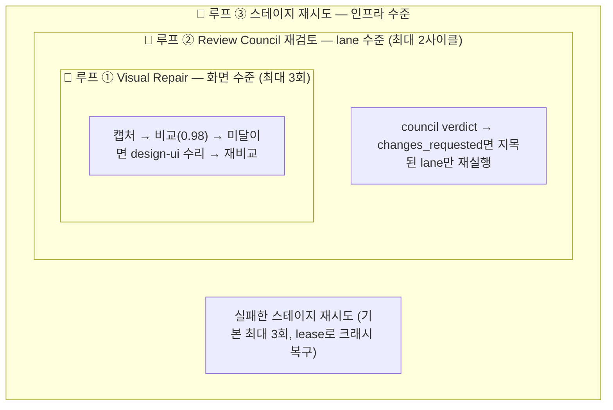

# 평가와 루프 엔지니어링

SpecToPR이 "다 됐다"고 판단하는 방식은 자연어 자기평가가 아니라 **점수 + 한정된(bounded) 반복**입니다. 이 페이지 하나로 스코어카드 9차원과 3중 루프 전체를 이해할 수 있습니다.

## Review Scorecard — 9개 차원

Run의 최종 평가는 9개 차원, 각 0~10점입니다.

| #   | 차원                   | 무엇을 측정하나                                                                         | 근거 산출물                        |
| --- | ---------------------- | --------------------------------------------------------------------------------------- | ---------------------------------- |
| 1   | `brief-fidelity`       | 구현이 기획서 요구사항과 일치하는가                                                     | Evidence Graph · 추적 매트릭스     |
| 2   | `legacy-coverage`      | (마이그레이션 시) 레거시 기능이 빠짐없이 커버됐는가                                     | Feature Coverage Matrix            |
| 3   | `gherkin-completeness` | 시나리오가 요구사항을 모두 덮는가                                                       | Gherkin · 테스트 매트릭스          |
| 4   | `tdd-evidence`         | 자동화 테스트(unit·component·contract·acceptance·e2e)가 실행·통과했고 결과가 기록됐는가 | CheckResult · test/coverage report |
| 5   | `design-system-usage`  | Figma 컴포넌트가 디자인 시스템에 매핑됐는가                                             | Design Contract                    |
| 6   | `visual-parity`        | 실제 화면이 baseline(Figma/레거시)과 일치하는가                                         | 시각 회귀 리포트                   |
| 7   | `resource-contract`    | 이미지 URL·CSS·엔드포인트가 검증됐는가                                                  | 리소스 체크                        |
| 8   | `api-contract`         | OpenAPI 계약이 구현·mock됐는가                                                          | 계약 테스트                        |
| 9   | `publish-sync`         | PR 본문과 시각 증거가 동기화됐는가                                                      | PR 리포트 검증                     |

`tdd-evidence`는 기존 산출물과의 호환성을 위해 유지하는 내부 ID입니다. 현재 점수는 red→green 실행 이력 자체가 아니라 **실행 가능한 자동화 테스트와 결과 리포트가 남았는지**를 평가합니다.

### 판정 규칙

- 기본 임계값: **8.0/10** (모든 차원이 넘어야 함)
- 비율 입력은 자동 정규화: `0.85` → `8.5/10`
- 판정 로직:

```text
어떤 차원이 임계값 미만이거나 status: fail 이면
  ├─ 시도 1~2회차 → retry  (가장 낮은 차원이 nextRepairTarget으로 지정됨)
  └─ 최대 시도 도달 → blocked
모든 차원이 임계값 이상 → passed
```

- `blocked`이면 **PR/MR이 발행되지 않습니다.** 리포트는 생성되지만 blocked로 표시되고, 기존 draft가 있으면 본문만 갱신됩니다.

실제 스코어카드 아티팩트는 이렇게 기록됩니다:

```json title="retry 판정이 난 스코어카드 (요약)"
{
  "adapter": "review-scorecard-v1",
  "minimumScore": 8,
  "lowestScore": 7.4,
  "decision": "retry",
  "nextRepairTarget": "visual-parity",
  "dimensions": [
    { "id": "brief-fidelity", "score": 9.1, "threshold": 8, "status": "pass" },
    {
      "id": "visual-parity",
      "score": 7.4,
      "threshold": 8,
      "status": "fail",
      "nextRepairTarget": true
    }
  ],
  "summary": "Review scorecard retry; repair visual-parity next."
}
```

읽는 법: 9개 차원 중 `visual-parity`가 7.4로 기준(8.0) 미달 → 전체 판정 `retry` → **가장 낮은 실패 차원이 `nextRepairTarget`으로 지목**되어 다음 수리 루프가 무엇을 고칠지가 데이터로 정해집니다. "대충 다시 해봐"가 아니라 표적이 있는 재시도입니다.

## 3중 루프 구조

수리 루프는 한 개가 아니라, 서로 다른 범위를 도는 **세 겹**입니다.



### 루프 ① — Visual Repair Loop (화면 수준) {#visual-repair-loop}

가장 안쪽, 가장 자주 도는 루프입니다.

```text
1. 브라우저에서 대상 화면 캡처
2. baseline(Figma 또는 레거시 스크린샷)과 비교 → reviewMatchRatio 산출
3. 0.98 미만이면: 차이 리포트를 들고 design-ui 에이전트가 수리
4. 재캡처·재비교
5. 3회 안에 0.98 도달 실패 → human-review blocker 기록, 발행 차단
```

- 임계값(0.98)과 최대 횟수(3)는 프롬프트로 조정 가능: "visual 최소 점수 0.95, repair 5번까지"
- Figma 노드가 컴포넌트 계약을 생성한 경우, 페이지 전체가 아니라 **컴포넌트 단위 증거**가 요구됩니다.

실제로 도는 모습을 타임라인으로 보면:

```text title="payment-form 화면의 수리 루프 예"
[시도 1] 캡처 → 비교: reviewMatchRatio 0.94 (< 0.98)
         diff 리포트: "버튼 하단 패딩 8px 차이, 보조 텍스트 색상 #666 vs #888"
         → design-ui 에이전트에 diff 리포트 전달, 수리 커밋 생성
[시도 2] 재캡처 → 비교: 0.99 ✔ 통과
         → 시도 1·2의 스크린샷과 diff 이미지가 모두 증거로 기록됨
```

3회를 다 써도 0.98에 못 미치면 이렇게 끝납니다: `human-review` blocker gap이 기록되고, 발행이 차단되며, PR 리포트의 "우선 확인할 실패" 섹션에 마지막 diff와 함께 올라옵니다. **루프가 실패를 숨기지 않고 증거로 남기는 것**이 핵심입니다.

### 루프 ② — Review Council 재검토 (lane 수준)

Council이 `changes_requested`를 내면 **지목된 lane만** 다시 돌립니다 (전체 재실행 아님). 최대 **2사이클** 후에도 분쟁이 남으면 blocked — 에이전트끼리 무한히 티키타카하지 않고 사람에게 넘깁니다.

### 루프 ③ — 스테이지 재시도 (인프라 수준)

일시적 실패(네트워크, 프로세스 크래시 등)를 위한 바깥 루프. 스테이지당 기본 **최대 3회** 재시도하고, 5분 TTL lease 덕분에 죽은 워커의 작업을 다른 워커가 이어받습니다.

:::note 통합 단계의 bounded repair
통합(T23)에서 cherry-pick 충돌이 나면 integrator가 **최대 2회**의 한정 수리를 시도합니다. 허용된 변경 패턴 안에서만 고치며, 초과 시 blocker로 전환됩니다. 상세는 [T23 문서](/tasks/23-integration-bounded-repair-loop) 참고.
:::

## 왜 "bounded"가 핵심인가

모든 루프에 상한이 있는 이유:

1. **수렴 보장** — 상한 없는 자기 수정 루프는 발산하거나 비용을 무한히 태울 수 있습니다.
2. **실패의 가시화** — 상한에 도달했다는 것 자체가 "자동으로 풀 수 없는 문제"라는 증거입니다. 이때는 gap/blocker로 기록해 **사람의 판단**으로 넘기는 것이 올바른 동작입니다.
3. **예측 가능한 비용** — 최악의 경우에도 실행 횟수의 상한이 계산됩니다.

## gap — 점수에 잡히지 않는 것들의 처리

점수가 임계값을 넘어도, 파이프라인이 **확신할 수 없었던 것**들은 gap ledger에 남습니다. gap 하나는 이렇게 생겼습니다:

```json title="기획서 모호성에서 생긴 gap"
{
  "status": "resolved",
  "category": "requirement",
  "severity": "major",
  "title": "정렬 기준 미정의",
  "expected": "종목 목록 정렬 기준이 brief에 정의되어야 한다.",
  "observed": "정렬 기준 언급 없음.",
  "resolutionArtifactIds": ["artifact_…"]
}
```

`expected`(있어야 하는 것)와 `observed`(실제로 본 것)의 차이가 곧 gap입니다. 상태 전이에는 규칙이 있습니다:

| 상태       | 의미                                | 전이 조건                                                            |
| ---------- | ----------------------------------- | -------------------------------------------------------------------- |
| `open`     | 미해결 — blocker 심각도면 발행 차단 | 생성 시 기본값                                                       |
| `assumed`  | 가정하고 진행                       | 가정 내용 기록 필수                                                  |
| `waived`   | 사람이 면제                         | waiver 근거(evidence) 필수                                           |
| `resolved` | 해결됨                              | **해결을 증명하는 아티팩트 필수** — 아티팩트 없이 resolved로 못 바꿈 |

즉 "해결했다"고 말로만 처리하는 경로가 없습니다. PR 본문의 gap 섹션은 리뷰어에게 "여기는 기계가 검증 못 했으니 사람이 봐 달라"는 명시적 신호입니다. 자세한 것은 [T22 · Review Council과 Gap Ledger](/tasks/22-review-council-and-gap-ledger)를 보세요.
