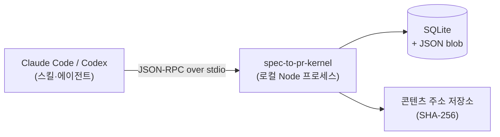

# 저장 구조와 MCP kernel

SpecToPR의 모든 상태는 대화 컨텍스트가 아니라 **로컬 MCP kernel의 SQLite**에 기록됩니다. 채팅이 끊겨도, 세션이 바뀌어도 Run은 그대로 남아 재개할 수 있습니다.

## 왜 MCP tool인가

LLM의 "기억"은 세션이 끝나면 사라지고, 자연어 보고는 검증할 수 없습니다. 그래서 상태 변경은 전부 **MCP tool 호출**로만 일어납니다.



- **stdio 통신** — kernel은 stdin/stdout으로 JSON-RPC를 주고받는 로컬 프로세스입니다. 네트워크 포트를 열지 않고, 로그는 stderr로만 내보내 stdout 프로토콜을 오염시키지 않습니다.
- **80여 개 tool** — `create_run`부터 `publish_review_request`까지, 파이프라인의 모든 상태 전이가 tool 호출 하나에 대응합니다. 에이전트가 "기록했다고 말하는 것"과 "실제 기록된 것"이 분리될 수 없는 구조입니다.

"tool 호출로만 상태가 바뀐다"를 실물로 보면 이런 왕복입니다:

```json title="요청 — 에이전트가 gap을 기록"
{
  "jsonrpc": "2.0",
  "id": 42,
  "method": "tools/call",
  "params": {
    "name": "record_gap",
    "arguments": {
      "runId": "run_01HX…",
      "category": "requirement",
      "severity": "major",
      "title": "정렬 기준 미정의",
      "expected": "종목 목록 정렬 기준이 brief에 정의되어야 한다.",
      "observed": "정렬 기준 언급 없음."
    }
  }
}
```

```json title="응답 — kernel이 검증·저장 후 확정된 사실을 반환"
{
  "jsonrpc": "2.0",
  "id": 42,
  "result": { "gapId": "gap_01HX…", "runRevision": 18 }
}
```

인자가 스키마(Zod) 검증에 어긋나면 저장 없이 에러가 돌아옵니다. LLM이 형식을 틀리면 **잘못된 데이터가 기록되는 게 아니라 호출 자체가 실패**하고, 에이전트는 고쳐서 다시 호출해야 합니다.

## Run — 단일 진실 원천

하나의 요청 = 하나의 **Run**. Run은 아래를 모두 소유합니다.

| 구성물                 | 내용                                                                 |
| ---------------------- | -------------------------------------------------------------------- |
| **Source / SourceRef** | 입력(기획서·Figma·OpenAPI·저장소)의 스냅샷과 SHA-256 digest          |
| **Evidence**           | 소스 안의 정확한 위치(파일 라인, JSON Pointer, Figma 노드, git 범위) |
| **Artifact**           | 생성물(OpenSpec, Gherkin, 스크린샷, 리포트 …)                        |
| **Gap**                | 확인 못 한 것들 — `open / assumed / waived / resolved`               |
| **AgentResult**        | 각 에이전트의 구조화된 결과                                          |
| **Stage 상태**         | 26개 스테이지 각각의 상태 · 시도 횟수 · 체크포인트 · lease           |

동시성은 **revision 기반 낙관적 잠금**으로 제어됩니다. 모든 쓰기는 "내가 마지막으로 본 revision"을 함께 보내야 하고(`expectedRevision`), 저장 성공 시 revision이 1 올라갑니다. 시나리오로 보면:

```text
워커 A: Run 읽음 (revision 17) → gap 기록 시도 (expectedRevision: 17) → 성공, revision 18
워커 B: Run 읽음 (revision 17) → 체크 기록 시도 (expectedRevision: 17) → ✘ 거부 (stale)
워커 B: Run 다시 읽음 (revision 18) → 재시도 → 성공, revision 19
```

늦게 쓴 쪽이 조용히 덮어쓰는 대신 **명시적으로 실패하고 최신 상태를 다시 읽게** 됩니다. 병렬 lane 3개가 같은 Run에 동시에 기록해도 데이터가 유실되지 않는 이유입니다.

## 콘텐츠 주소 저장 (content addressing)

입력 파일은 복사 시점의 **SHA-256 digest**로 저장됩니다.

- 기획서가 나중에 수정돼도 "그때 그 Run이 본 기획서"가 무엇인지 바이트 단위로 확정됩니다.
- 같은 파일은 한 번만 저장됩니다(중복 제거).
- 모든 Evidence는 이 불변 스냅샷을 가리키므로, PR 리뷰 시점에 근거를 그대로 재현할 수 있습니다.

## 재개(resume)의 원리

1. 요청이 오면 kernel이 기존 Run을 조회
2. 스테이지 상태를 보고 `passed`는 건너뛰고, 실패/중단 지점의 **checkpoint**에서 재개
3. 죽은 워커가 잡고 있던 스테이지는 **lease 만료**(5분) 후 다른 워커가 인수

```text title="재개 시 동작 예"
[resume] run_01HX... 발견 — 26개 중 17개 passed
[resume] visual-regression(failed, 시도 2/3)부터 재개합니다
```

## 데이터는 어디에 쌓이나

| 위치                                                      | 내용                                                    |
| --------------------------------------------------------- | ------------------------------------------------------- |
| `${SPEC_TO_PR_DATA_DIR}` (기본: 플러그인 데이터 디렉터리) | SQLite DB, JSON blob, 콘텐츠 저장소                     |
| `<프로젝트>/.spec-to-pr/worktrees/<runId>/`               | 에이전트별 git worktree (Run 종료 후 정리 가능)         |
| `<프로젝트>/.spec-to-pr/visual-assets/<runId>/`           | GitHub PR source 브랜치에 첨부되는 스크린샷·diff 이미지 |

Run DB, 내부 audit Markdown, view-model JSON, 일반 artifact blob은 `${SPEC_TO_PR_DATA_DIR}`에만 저장되며 대상 프로젝트의 코드베이스에 추가되지 않습니다. 예외는 GitHub PR에서 인라인 비교를 보여주기 위한 시각 이미지입니다. 이 파일들은 source 브랜치에 커밋되므로 PR을 머지하면 대상 브랜치에도 포함됩니다. GitLab은 repository commit 대신 project upload API를 사용합니다.

데이터 디렉터리 변경 등 환경변수는 [설정 · 환경변수](/reference/config)를 보세요.
