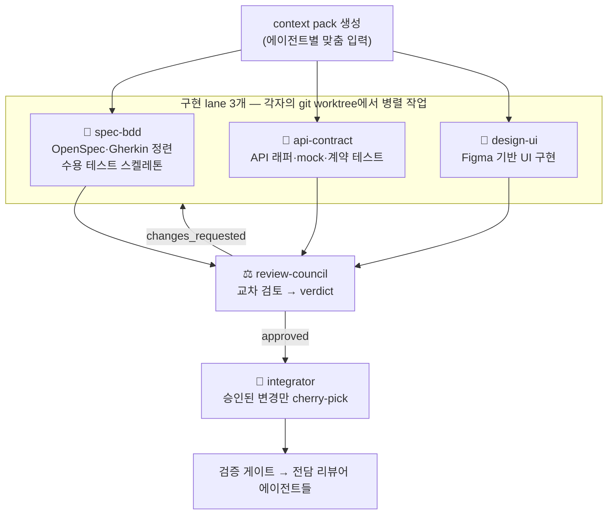

# 서브에이전트와 lane

SpecToPR의 구현은 하나의 만능 에이전트가 아니라, **역할이 좁게 정의된 서브에이전트들의 분업**으로 이뤄집니다. 핵심 설계는 세 가지입니다: **worktree 격리 · context pack · 교차 검토**.

## 전체 그림



## 1. worktree 격리

각 구현 에이전트는 **자기만의 git worktree**를 받습니다.

```text
<프로젝트>/.spec-to-pr/worktrees/<runId>/
├── spec-bdd/       ← 브랜치: spec-to-pr/<runId 축약>/spec-bdd
├── api-contract/   ← 브랜치: spec-to-pr/<runId 축약>/api-contract
├── design-ui/      ← 브랜치: spec-to-pr/<runId 축약>/design-ui
└── integration/    ← 브랜치: spec-to-pr/<runId 축약>/integration
```

- 에이전트는 main 브랜치와 다른 에이전트의 작업물을 **물리적으로 건드릴 수 없습니다.**
- 세 lane이 같은 파일을 고쳐도 서로 충돌 없이 병렬 진행되고, 충돌은 통합 단계에서 명시적으로 처리됩니다.
- 실패한 lane의 작업물은 그냥 버리면 됩니다 — 본 저장소는 오염되지 않습니다.

## 2. context pack — "필요한 것만, 전부"

에이전트에게 저장소 전체를 던져주지 않습니다. 각 에이전트는 자기 역할에 맞게 조립된 **context pack**(구조화된 JSON)만 받습니다.

| 포함 내용                | 설명                                                                            |
| ------------------------ | ------------------------------------------------------------------------------- |
| Run 요약 · 스테이지 결과 | 지금까지 파이프라인이 확정한 사실                                               |
| 계약 산출물              | OpenSpec · Gherkin · Design Contract · 테스트 매트릭스 중 해당 lane에 필요한 것 |
| 역할별 지시              | 이 lane이 해야 할 것과 하면 안 되는 것                                          |
| **파일 소유권 정책**     | 이 에이전트가 수정해도 되는 경로 목록                                           |
| 사용자 제약              | 프롬프트에서 파싱된 constraints                                                 |

실제 context pack은 이런 모양입니다 (`AgentContextPackSchema`):

```json title="design-ui 에이전트의 context pack (요약)"
{
  "runId": "run_01HX…",
  "projectRoot": "/path/to/project",
  "baseCommit": "abc123…",
  "agent": { "agent": "design-ui", "displayName": "Design/UI Agent" },
  "ownership": {
    "allowed": ["src/pages/**", "src/widgets/**"],
    "forbidden": ["src/shared/api/generated/**"]
  },
  "evidence": ["…요구사항·Figma 노드 참조…"],
  "artifacts": ["…design-contract, openspec, gherkin 참조…"],
  "gaps": ["…이 lane과 관련된 열린 gap…"],
  "instructions": ["디자인 시스템 컴포넌트만 사용", "커스텀 CSS 금지"]
}
```

`ownership`이 파일 소유권 정책입니다. 예컨대 design-ui 에이전트가 `src/shared/api/generated/` 아래를 고치면, 결과 제출 단계에서 **기계적으로 거부**됩니다 — "하지 말라고 지시"하는 게 아니라 검증기가 막습니다.

## 3. 구현 lane 3개

| lane             | 하는 일                                                               | 하지 않는 일              |
| ---------------- | --------------------------------------------------------------------- | ------------------------- |
| **spec-bdd**     | OpenSpec/Gherkin 검토·정련, 수용 테스트 스켈레톤 작성                 | 제품 코드 작성            |
| **api-contract** | API 래퍼 · mock · 계약 테스트 구현 (OpenAPI + 생성된 파이프라인 기반) | UI 코드                   |
| **design-ui**    | Design Contract를 따라 UI 구현 + 컴포넌트 테스트                      | 디자인 시스템 밖 하드코딩 |

각 lane은 작업을 마치면 자연어 소감이 아니라 **구조화된 AgentResult**를 반환합니다. 실물은 이렇게 생겼습니다:

```json title="api-contract lane의 AgentResult"
{
  "agent": "api-contract",
  "status": "passed",
  "commitSha": "abc123…",
  "changedFiles": ["src/shared/api/staff/staff.wrapper.ts"],
  "gapIds": [],
  "checks": [{ "name": "typecheck", "status": "passed" }]
}
```

그리고 이 결과는 기록되기 전에 **결과 검증기**를 통과해야 합니다. 예를 들어 API lane의 검증기는 다음 세 가지를 기계적으로 거부합니다:

1. **소유권 밖 파일 변경** — `changedFiles`에 허용 경로 밖 파일이 있으면 거부
2. **커밋 없는 성공 주장** — `status: "passed"`인데 `commitSha`가 없으면 거부 ("코드는 없는데 다 했다"를 차단)
3. **실패를 품은 성공 주장** — `checks` 안에 실패한 체크가 있는데 `status: "passed"`면 거부

즉 에이전트가 "다 됐어요"라고 말해도, 커밋·체크·소유권이 맞아떨어지지 않으면 그 말은 시스템에 존재하지 않는 것과 같습니다.

## 4. Review Council — 교차 검토

**review-council**은 세 lane의 결과물 + 추적 매트릭스 + gap ledger를 함께 놓고 **서로 모순되는 지점**을 찾습니다. "API는 이 필드를 옵셔널로 구현했는데 UI는 필수로 렌더링한다" 같은 lane 간 불일치가 여기서 잡힙니다.

- verdict는 셋 중 하나: **approved / changes_requested / blocked**
- `changes_requested`이면 **어느 lane을 다시 돌릴지** 지정해 해당 lane만 재실행
- 재검토는 **최대 2사이클** — 그 후에도 해소되지 않으면 blocked로 전환해 사람에게 넘깁니다

## 5. 검증 전담 리뷰어들

게이트 단계부터는 역할이 좁은 리뷰어들이 결과를 분류·판정합니다: visual-regression-reviewer, accessibility-reviewer, performance-reviewer, security-hardening-reviewer, observability-reviewer, pr-report-reviewer 등. 전체 15개 에이전트 목록과 호스트별 설정은 [에이전트 레퍼런스](/reference/agents)에 있습니다.

## 왜 이런 구조인가

- **좁은 역할 = 검증 가능한 출력.** "다 했어요"가 아니라 lane별 AgentResult를 놓고 교차 대조할 수 있습니다.
- **격리 = 안전한 병렬성.** 세 lane이 동시에 달려도 저장소가 깨지지 않습니다.
- **호스트와 모델이 달라도 계약은 같다.** 모델 배정은 호스트·세션 설정에 따라 달라질 수 있지만, evidence 제약·AgentResult·gate·발행 정책은 같은 kernel이 검증합니다. [호스트 동등성](/concepts/host-parity)을 보세요.
