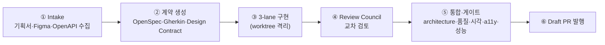

# 퀵스타트 — 첫 draft PR까지

기획서 하나와 Figma URL로 실제 draft PR이 만들어지기까지를 처음부터 끝까지 따라갑니다. 소요 시간은 프로젝트 규모에 따라 수십 분 단위입니다.

## 0. 준비 상태 점검

```bash
/spec-to-pr:doctor
```

```text title="예상 출력"
✔ plugin manifest 인식됨 (spec-to-pr v<현재 버전>)
✔ MCP kernel 기동 (node ≥ 22 확인)
✔ kernel_info / kernel_ping 응답 정상
✔ 데이터 디렉터리 쓰기 가능
```

Figma를 쓸 거라면 하나 더:

```bash
/spec-to-pr:figma-doctor
```

## 1. 입력 준비

최소한 **기획서 파일 하나**면 시작할 수 있습니다. Figma · OpenAPI는 있으면 증거의 폭이 넓어집니다.

```
my-app/
├── docs/
│   ├── brief.md          ← 기획서 (md·pdf·html 지원)
│   └── openapi.yaml      ← (선택) API 명세
└── src/ ...
```

## 2. 실행

Claude Code/Codex 채팅에 자연어로 요청합니다. 오케스트레이터가 URL·파일경로·브랜치 정책을 자동으로 파싱합니다.

```text
/spec-to-pr ./my-app docs/brief.md
https://www.figma.com/file/AbCdEf123/checkout-redesign?node-id=12-345
docs/openapi.yaml 기준으로 개발해줘. target 브랜치는 main.
```

## 3. 무엇이 일어나는가

실행하면 하나의 **Run**이 생성되고 최대 26개 런타임 스테이지가 의존성에 따라 진행됩니다. Figma가 없으면 시각 비교 계열이, 레거시 마이그레이션이 아니면 legacy coverage 계열이 조건부로 짧아집니다. 큰 흐름만 보면:



진행 중에 스테이지별 결과가 채팅에 보고됩니다. 예를 들어:

```text title="중간 보고 예시"
[evidence-graph] 요구사항 12건 ↔ API 오퍼레이션 8건 ↔ Figma 노드 15건 연결됨
[gap] REQ-007 "비회원 주문"에 대응하는 API 오퍼레이션 없음 → gap ledger 기록 (open)
[spec-bdd lane] 승인 — Gherkin 시나리오 14건, 수용 테스트 스켈레톤 생성
[visual-regression] checkout-summary 0.99 ✔ / payment-form 0.95 ✘ → repair loop 1회차 진입
[visual-regression] payment-form 0.99 ✔ (repair 1회 후)
```

## 4. 결과 확인

파이프라인이 통과하면 **draft PR**이 생성됩니다. PR 본문에는 다음이 자동으로 들어갑니다.

- 요구사항 ↔ 구현 ↔ 테스트 추적 매트릭스
- 9개 차원 스코어카드 (예: `visual-parity 9.9/10`)
- Figma vs 실제 화면 비교 스크린샷
- 남은 gap 목록 (사람이 판단해야 할 것)

PR 본문의 11개 섹션 구성과 실제 예시는 [PR 리포트 구조](/concepts/pr-report)에 있습니다.

:::info SpecToPR은 draft까지만 만듭니다
merge · approve · "ready for review" 전환은 항상 사람이 합니다. PR을 검토하고 문제가 없으면 직접 머지하세요.
:::

## 5. 머지 후 (선택)

PR을 머지했다면 OpenSpec 문서를 아카이브해 상태를 정리합니다. 자동으로 폴링하지 않으므로 **직접** 실행해야 합니다.

```bash
/spec-to-pr:archive-openspec
```

## 뭔가 잘못됐다면

- 스테이지가 실패해도 Run은 유실되지 않습니다 — 같은 요청을 다시 보내면 체크포인트에서 **재개**됩니다 ([상태 저장 구조](/concepts/storage-and-mcp) 참고)
- 자주 겪는 문제는 [트러블슈팅](/troubleshooting)에 정리되어 있습니다

## 다음 단계

- 내 상황(레거시 마이그레이션, OpenAPI 없음 등)에 맞는 프롬프트 → [사용 레시피](/usage/recipes)
- 게이트를 끄거나 임계값을 바꾸고 싶다 → [옵션과 정책](/usage/options-and-policies)
