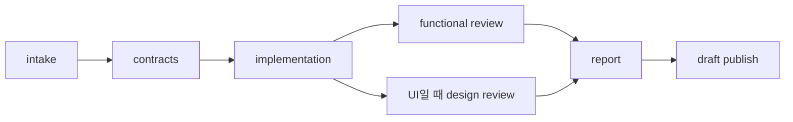

# 퀵스타트 — 첫 draft PR까지

가장 단순한 `brief` 모드로 시작합니다.

## 1. 설치 확인

```text
/spec-to-pr:doctor
```

결과에는 contract `2.0.0`, tool 7개, stage 8개, reviewer 2개가 보여야 합니다.

## 2. 요청

대상 저장소 안에 기획서를 둡니다.

```text
my-app/
├── docs/checkout.md
├── package.json
└── src/...
```

Claude Code/Codex에 다음처럼 요청합니다.

```text
/spec-to-pr /absolute/path/to/my-app
mode는 brief이고 briefPath는 docs/checkout.md야.
수용 조건대로 구현하고 관련 검사로 검증한 뒤 draft PR을 만들어줘.
```

## 3. 진행 흐름



호스트는 `workflow_advance`로 다음 외부 action까지 이동하고 실제 산출물은 `workflow_submit`으로 제출합니다. 상태 전이와 재개 정보는 runtime이 관리합니다.

API scope가 있다면 같은 구현 context에서 다음 순서를 지킵니다.

1. type/schema/client 또는 wrapper 작성
2. mock과 contract-test evidence 생성
3. Path/symlink/hard-link alias가 아닌 물리적으로 서로 다른 비어 있지 않은 파일, passing contract-test JSON, `implementationContextId`를 담은 `kind: api-ready` 제출
4. UI 구현과 UI evidence

API agent와 UI agent를 따로 만들지 않습니다.

Draft 발행을 요청했다면 구현 전에 target이 아닌 `codex/*` source branch를 사용합니다. 발행 전에는 의도한 파일만 commit하고 working tree를 clean하게 만들며 source가 target보다 한 commit 이상 앞섰는지 확인합니다.

## 4. 리뷰와 결과

코드 변경은 독립 `functional-reviewer`가 계약, diff, 관련 테스트, 필수 gate를 검토합니다. UI 변경이면 독립 `design-reviewer`가 시각 충실도, interaction, design-system 사용, accessibility를 별도로 검토합니다. Orchestrator가 먼저 `workflow_status` snapshot과 contracts/diff/evidence path를 고정해 넘기고, reviewer는 workflow tool을 직접 호출하지 않고 verdict payload만 반환합니다.

필수 evidence가 승인되면 report를 만들고 draft PR/MR을 생성하거나 갱신합니다. merge, approve, ready 전환은 사람이 합니다.

## 다른 모드로 시작하기

- 레거시 특정 변경: `mode: legacy`와 구체적인 변경 요청
- 사용자 기능: `mode: feature`, 변경 기능 E2E 하나, 영상 정확히 하나
- Figma 구현: `mode: figma`, `figmaUrl`, host-connected Figma capability

복사 가능한 예시는 [사용 레시피](/usage/recipes)에 있습니다.
