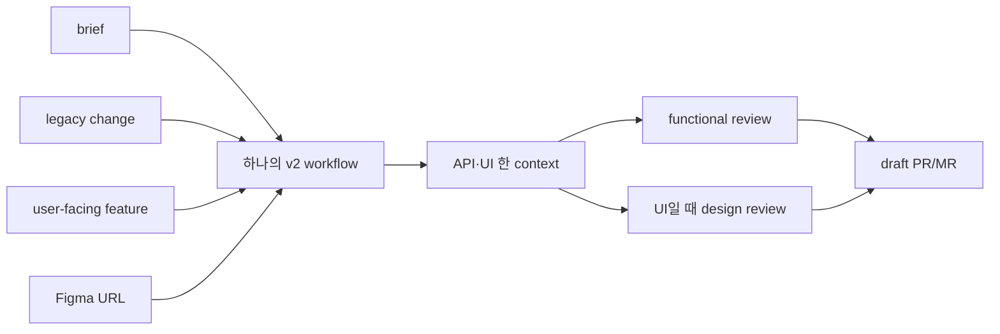

# SpecToPR

SpecToPR은 기획서, 레거시 변경 요청, 사용자 기능, Figma 디자인을 검증된 구현과 draft PR/MR로 연결하는 Claude Code · Codex 플러그인입니다.

## 네 가지 모드

| 모드      | 주는 것                     | 추가로 확인하는 것              | 결과                             |
| --------- | --------------------------- | ------------------------------- | -------------------------------- |
| `brief`   | 기획서/명세 + 저장소        | 수용 조건과 계약                | draft PR/MR                      |
| `legacy`  | 저장소 + 구체적인 변경 요청 | 요청 범위의 현재 동작 baseline  | draft PR/MR                      |
| `feature` | 사용자에게 보이는 기능 요청 | 해당 기능 E2E + 영상 정확히 1개 | 영상 링크가 있는 draft PR/MR     |
| `figma`   | Figma URL + 저장소          | 실제 Figma context와 시각 증거  | 디자인 구현, 요청 시 draft PR/MR |

`feature` 모드만 변경 기능을 고른 단일 Playwright E2E를 실행합니다. 명령 체이닝, `--list`/`--pass-with-no-tests`, 프로젝트 전체 E2E는 거부하며, `status: passed`·정확한 selector·같은 `implementationContextId`·양수 `testCount`만 담은 strict JSON과 재생 시간이 0보다 큰 구조적으로 유효한 영상 하나를 요구합니다. 다른 모드에는 feature 영상 비용을 붙이지 않습니다.

Figma는 호스트에 연결된 기능으로 읽고 `provider: host-connected-figma`, ISO `capturedAt`, 같은 `fileUrl`, 비어 있지 않은 `nodeIds`, JSON `manifestPath`, strict manifest의 PNG `visualPaths`를 실제 산출물과 함께 `figma-bundle` 한 번으로 제출합니다. SpecToPR runtime에 Figma 전용 microtool이나 polling을 두지 않습니다.

## 작게 유지한 실행 표면

- MCP tool 7개
- durable stage 8개
- skill 9개
- reviewer 2개

API와 UI는 한 구현 context에서 처리합니다. API 기반 UI는 물리적으로 서로 다른 비어 있지 않은 type, schema, wrapper, mock 파일과 passing contract-test JSON을 `implementationContextId`와 함께 `api-ready`로 먼저 기록하고 최종 구현에 같은 ID를 씁니다. Path, symlink, hard link alias는 별도 증거가 아니며 `apiReady: true`만으로는 부족합니다. Orchestrator가 immutable status/contracts/diff/evidence packet을 넘기므로 functional/design reviewer는 workflow tool 없이 독립적으로 판정합니다. Design review는 UI 범위에만 적용됩니다.

검증은 변경 범위에 비례합니다. 필요한 증거가 없거나 실패하면 막고, 선택 사항인 검사를 무조건 실행하지 않습니다. 전체 matrix와 package 검증은 release 작업에만 둡니다.

Intake가 끝나면 `XS`~`XL` 작업량과 예상 token range/confidence가 바로 보입니다. SDK는 workflow 경계별 actual usage로 estimate를 보정하고, 80%에서 compact checkpoint, hard limit에서 scope split 또는 명시적 budget 승인을 요구합니다. 이때도 필수 검증은 줄이지 않습니다.

:::info Draft까지만
SpecToPR은 target이 아닌 `codex/*` source branch에 의도한 변경을 commit한 뒤 draft PR/MR을 만들거나 갱신할 수 있습니다. Runtime은 clean tree와 target보다 한 개 이상 앞선 commit을 확인하며 merge, approve, close, ready 전환은 하지 않습니다.
:::

## 시작하기

1. [사전 준비물](/getting-started/prerequisites)
2. [설치](/getting-started/installation)
3. [퀵스타트](/getting-started/quickstart)
4. [기획서 → draft PR 사용법](/usage/brief)

내부 계약은 [파이프라인](/concepts/pipeline), 전체 skill은 [스킬 레퍼런스](/reference/skills)에서 확인할 수 있습니다.
