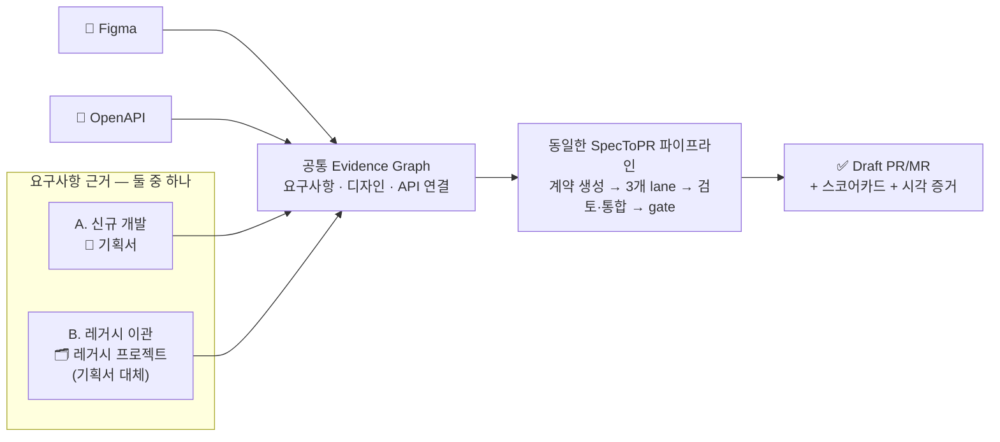

# SpecToPR

**기획서 + Figma + OpenAPI**로 새 프로젝트를 만들거나, 그중 **기획서 자리를 레거시 프로젝트로 대체**해 기존 동작을 이관할 수 있습니다. 어느 쪽이든 같은 검증 파이프라인을 거쳐 코드뿐 아니라 **"구현이 올바르다는 증거"까지 함께 담긴 draft PR/MR**을 만드는 Claude Code · Codex 플러그인입니다.

## 무엇이 다른가

일반적인 "AI가 코드 짜줌" 도구와 달리, SpecToPR은 **증거 우선(evidence-first)** 원칙으로 동작합니다.

- **증거 우선** — 자연어 "완료했습니다"가 아니라 evidence · check · diff · gap 같은 **결정론적 산출물**만 완료로 인정합니다.
- **계약 우선** — 에이전트가 코드에 손대기 전에 OpenSpec · Gherkin · API 계약 · Design Contract를 먼저 확정합니다.
- **격리 실행** — 3개 구현 lane(Spec/BDD · API · UI)을 각각 **git worktree로 격리**해 병렬 구현하고, Review Council의 교차 검토 후 병합합니다.
- **점수와 루프** — 9개 차원 스코어카드(기본 임계값 8.0/10)로 평가하고, 기준 미달이면 **한정된(bounded) 수리 루프**를 자동으로 돌립니다.
- **사람이 최종 결정** — 플러그인은 **draft** PR/MR까지만 만듭니다. merge · approve · ready 전환은 항상 사람이 합니다.

## 두 가지 사용 모드

두 모드의 차이는 **요구사항의 출처 하나**뿐입니다. A는 기획서를 요구사항 근거로 사용하고, B는 기획서 대신 레거시 프로젝트에서 기능 인벤토리를 추출합니다. Figma·OpenAPI 수집부터 Evidence Graph, OpenSpec·Gherkin·계약 생성, 구현 lane, Review Council, gate, draft PR까지의 나머지 흐름은 같습니다.

| 모드                      | 요구사항 근거                | 함께 쓰는 입력  | 공통 결과                                  |
| ------------------------- | ---------------------------- | --------------- | ------------------------------------------ |
| **A. 신규 프로젝트 개발** | 기획서(md/pdf/html)          | Figma + OpenAPI | 새 프로젝트 구현 + 검증 증거 + draft PR/MR |
| **B. 레거시 이관 개발**   | 레거시 프로젝트(기획서 대체) | Figma + OpenAPI | 기능 이관 구현 + 동등성 증거 + draft PR/MR |

Figma나 OpenAPI가 없는 경우에도 실행할 수 있지만, 없는 근거는 자동으로 추측하지 않고 gap 또는 조건부 gate로 기록합니다.

각 모드의 프롬프트 예시는 [사용 레시피](/usage/recipes)에 있습니다.

## 처음이라면 이 순서로

1. [사전 준비물](/getting-started/prerequisites) — Node 22+, 토큰, Figma MCP 연결 확인
2. [설치](/getting-started/installation) — Claude Code 또는 Codex에 플러그인 설치
3. [퀵스타트](/getting-started/quickstart) — 첫 실행부터 draft PR까지 따라하기
4. [사용 레시피](/usage/recipes) — 내 상황에 맞는 프롬프트 복사해서 쓰기

파이프라인 내부가 궁금하다면 [파이프라인 구조](/concepts/pipeline) → [서브에이전트](/concepts/subagents) → [평가와 루프 엔지니어링](/concepts/scoring-and-loops) 순서를 추천합니다.
