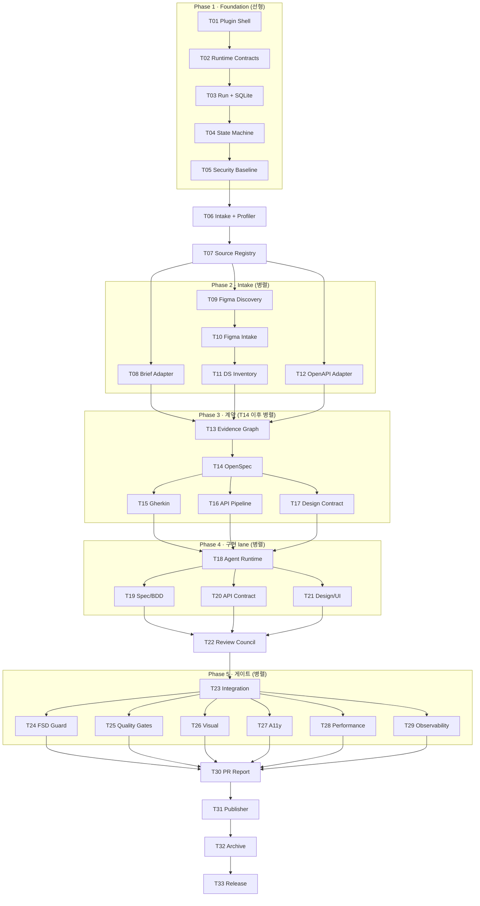

# 태스크 의존 그래프 (T01–T33)

33개 태스크의 선후 관계 전체 지도입니다. 각 노드를 클릭할 수는 없지만, 번호로 [태스크 문서](/tasks/01-executable-plugin-shell)를 찾아가면 됩니다.



## 읽는 법

- **Phase 1 (T01~T07)** — 전부 선형. 커널·계약·저장소·상태기계·보안이 차례로 쌓입니다.
- **Phase 2 (T08~T12)** — 기획서·Figma·OpenAPI 세 갈래가 **병렬**. Figma 갈래만 내부적으로 T09→T10→T11 순서가 있습니다.
- **T13이 합류점** — 세 갈래의 증거가 여기서 하나의 그래프로 합쳐집니다.
- **Phase 3 (T14~T17)** — OpenSpec이 먼저, 그 위에서 Gherkin·API 파이프라인·Design Contract가 병렬.
- **Phase 4 (T18~T23)** — lane 3개 병렬 → Council → 통합.
- **Phase 5 (T24~T29)** — 게이트 6종은 서로 **모두 병렬**입니다.
- **마무리 (T30~T33)** — 다시 선형.

## 크리티컬 패스

가장 긴 경로는 다음과 같습니다 (Figma를 쓰는 경우):

```text
T01→…→T07 → T09→T10→T11 → T13 → T14 → T17 → T18 → lane → T22 → T23 → 게이트 → T30 → T31
```

Figma를 쓰지 않으면 T09~T11·T17·T26이 빠져 경로가 짧아집니다.
