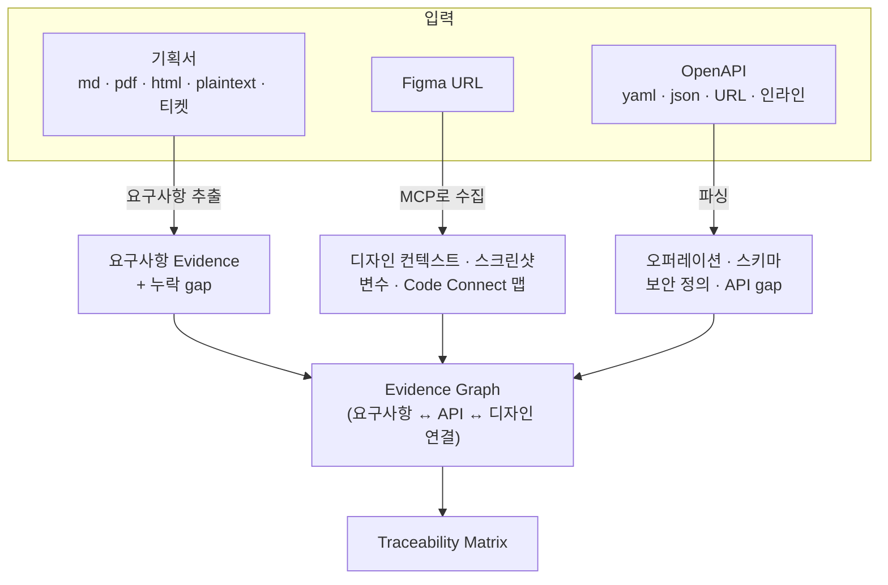

# 모드 A — 기획서 + Figma + OpenAPI

기획 문서 · 디자인 · API 명세가 준비된 **신규 기능 개발** 모드입니다. 세 입력이 각각 독립적인 증거 소스가 되고, Evidence Graph에서 하나로 합류합니다.

## 입력별로 무엇이 추출되나



### 기획서 (T08)

- 지원 형식: **markdown · plaintext · pdf · html · 티켓(Linear/GitHub Issue URL)**
- 문서를 정규화한 뒤 요구사항 단위로 쪼개 Evidence로 기록합니다. 각 요구사항은 원문의 **정확한 위치**(파일·라인)를 가리킵니다.
- 모호하거나 상충하는 문구는 gap으로 기록됩니다 — 조용히 추측하지 않습니다.

### Figma (T09~T11, T17)

- URL만 주면 Figma MCP를 통해 **design context · 스크린샷 · 변수(variable) · Code Connect 맵**을 수집해 원본 그대로 저장합니다.
- 수집물에서 **디자인 시스템 인벤토리**(컴포넌트 · variant · 토큰 · 텍스트 스타일)를 만들고, 프로젝트의 실제 디자인 시스템 코드와 교차 대조합니다.
- 최종적으로 **Design Contract**가 생성됩니다: "Figma의 이 컴포넌트 = 코드의 이 컴포넌트, 토큰은 이렇게 매핑" — UI 에이전트는 이 계약을 벗어난 하드코딩을 할 수 없습니다.

### OpenAPI (T12, T16)

- 경로 · URL · 채팅에 붙여넣은 인라인 YAML 블록 모두 인식합니다.
- 오퍼레이션/스키마 인벤토리를 만들고, 기획서 요구사항과 대조해 **없는 API를 gap으로** 올립니다.
- 타입(Zod) · API 래퍼 · mock · 계약 테스트 스켈레톤이 생성되어 API 에이전트의 재료가 됩니다.

## 세 입력이 만나면

Evidence Graph(T13)가 `요구사항 ↔ API 오퍼레이션 ↔ Figma 노드`를 연결하고, 연결이 **비어 있는 칸이 곧 gap**입니다. 예를 들어:

```text
REQ-007 "비회원 주문"
  ├─ API:    ✘ 대응 오퍼레이션 없음        → gap (open)
  └─ Figma:  ✔ guest-checkout 프레임 연결됨
```

이 매트릭스가 OpenSpec(T14) → Gherkin(T15) → 3-lane 구현(T19~T21)의 입력이 되고, 마지막 PR 본문의 추적 매트릭스로 그대로 이어집니다.

## 프롬프트 예시

```text
/spec-to-pr ./apps/web docs/checkout-brief.md
Figma: https://www.figma.com/file/AbCdEf123/checkout?node-id=12-345
OpenAPI: https://api.example.com/openapi.json
결제 수단 추가 부분만 이번 스코프로 해줘. target은 main.
```

부분 입력도 됩니다 — Figma가 없으면 시각 회귀가 생략되고, OpenAPI가 없으면 API 계약 검증 대신 gap이 남습니다. 어떤 조합이든 **없는 증거는 gap으로 가시화**되는 것이 원칙입니다.

## 이 모드에서 자주 쓰는 옵션

| 하고 싶은 것                  | 프롬프트에 추가                           |
| ----------------------------- | ----------------------------------------- |
| 특정 Figma 프레임만           | URL에 `?node-id=...`를 포함               |
| 시각 회귀 임계값 완화         | "visual 최소 점수는 0.95로 해줘"          |
| API mock 없이 실 API로 테스트 | "mock 대신 실제 API로 계약 테스트 돌려줘" |

전체 옵션은 [옵션과 정책](/usage/options-and-policies)을 보세요.
