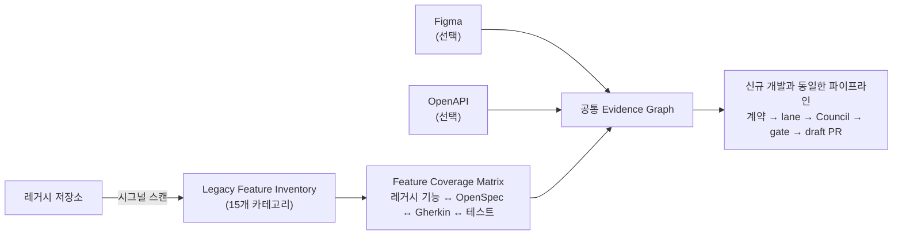

# 모드 B — 레거시 프로젝트를 기획서로

기획 문서가 없거나 낡았을 때 **기획서 입력만 레거시 프로젝트로 대체**하는 모드입니다. 레거시 저장소에서 기능을 추출해 요구사항으로 삼고, Figma·OpenAPI부터 계약 생성·3개 구현 lane·Review Council·gate·draft PR까지는 신규 개발과 같은 파이프라인을 사용합니다.

새 Figma가 있으면 레거시 동작을 새 디자인으로 구현하고, OpenAPI가 있으면 레거시 API 호출과 새 계약을 교차 검증합니다. 둘 중 하나가 없으면 해당 근거를 추측하지 않고 gap으로 남깁니다.

## 동작 개요



## 1. 기능 인벤토리 추출

레거시 코드(`.vue` · `.js` · `.ts` 등)를 스캔해 **15개 카테고리**의 기능 시그널을 추출합니다:

`netfunnel` · `native-bridge` · `query-param` · `radius-expansion` · `dialog-toast` · `analytics` · `reservation-routing` · `url-open` · `image-fallback` · `resource-binding` · `api-call` · `event-bus` · `permission` · `global-style` · `carousel-swipe`

각 기능은 파일 · 라인 · 코드 스니펫과 함께 기록됩니다:

```json title="추출된 기능 예시"
{
  "id": "legacy-feat-042",
  "category": "native-bridge",
  "label": "예약 완료 시 앱 브릿지 호출",
  "file": "src/views/ReservationDone.vue",
  "line": 87,
  "snippet": "window.NativeBridge.call('reservationComplete', ...)",
  "keywords": ["NativeBridge", "reservationComplete"]
}
```

## 2. Coverage Matrix로 누락 차단

추출된 기능마다 `레거시 기능 → OpenSpec 요구사항 → Gherkin 시나리오 → 실제 테스트/증거`가 연결되어야 합니다. **매트릭스에 빈 칸이 있으면 Review Council 도달 전에 blocker**로 잡힙니다 — "이관하다 빠뜨린 기능"이 조용히 사라지는 것을 구조적으로 막는 장치입니다.

재실행 시 이미 열려 있는 legacy-coverage gap은 기능 ID로 매칭해 재사용하므로, 같은 blocker가 중복 생성되지 않습니다.

## 3. 레거시 화면과 시각 비교

시각 회귀의 비교 기준(baseline)을 Figma 대신 **레거시 화면 스크린샷**으로 전환할 수 있습니다.

- Figma 스크린샷이 있으면 기본 baseline은 `figma`입니다.
- 레거시 프로젝트를 기획서로 사용한다는 이유만으로 baseline이 자동 전환되지는 않습니다.
- 레거시 화면과 비교하려면 캡처 가능한 레거시 화면을 준비하고 아래처럼 명시하세요.

```text
시각 비교 기준은 레거시 화면으로 해줘 (visualBaseline: legacy-screenshot)
```

새 구현의 화면을 레거시 화면과 비교해 `reviewMatchRatio` 점수를 매기고, 기본 임계값 0.98 미만이면 [수리 루프](/concepts/scoring-and-loops#visual-repair-loop)가 돕니다.

## 프롬프트 예시

### 기본 — 레거시 전체를 명세로

```text
/spec-to-pr ./new-app
레거시 프로젝트 ../legacy-app 을 기획서로 삼아 주문 플로우를 이관해줘.
시각 비교는 레거시 화면 기준으로.
```

### 스코프 한정 — 특정 화면/도메인만

```text
/spec-to-pr ./new-app
../legacy-app 중 예약(reservation) 관련 라우트만 이번 스코프로 이관해줘.
native bridge 호출이랑 analytics 이벤트는 하나도 빠지면 안 돼.
```

### 하이브리드 — 동작은 레거시, 화면은 새 Figma

```text
/spec-to-pr ./new-app
기능 명세는 ../legacy-app 기준, UI는 이 Figma 기준으로:
https://www.figma.com/file/XyZ789/renewal
```

Figma 스크린샷이 수집되면 기본 baseline이므로 별도의 “Figma baseline으로” 문장은 필요하지 않습니다.

## 스코어카드에서의 차이

이 모드에서는 9개 평가 차원 중 **`legacy-coverage`** 차원이 활성화됩니다. 기능 인벤토리 대비 커버리지가 임계값(기본 8.0/10) 미만이면 PR 발행이 차단됩니다. 자세한 평가 방식은 [평가와 루프 엔지니어링](/concepts/scoring-and-loops)을 보세요.

## 한계와 팁

- 인벤토리는 **정적 시그널 스캔**입니다. 런타임에서만 드러나는 동작(서버 주도 분기 등)은 잡히지 않을 수 있으니, 아는 것은 프롬프트 제약으로 명시하세요.
- 15개 카테고리 밖의 도메인 특화 패턴이 있다면 "XX 패턴도 기능으로 취급해줘"라고 요청에 적으면 제약으로 전달됩니다.
- 레거시 화면 캡처가 불가능한 환경(로그인 장벽 등)이면 baseline을 Figma나 수동 스크린샷으로 대체하는 편이 낫습니다.
