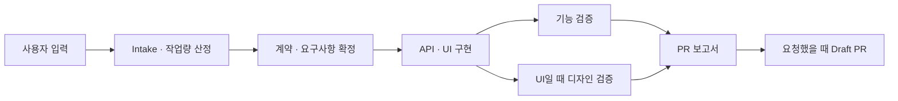

import Tabs from "@theme/Tabs";
import TabItem from "@theme/TabItem";

# 네 가지 케이스 중 하나를 고르세요

SpecToPR의 **mode는 납품 방식과 필수 증거를 정하고**, 기획서·Figma·OpenAPI·참고 문서·프로젝트 지침·설치된 skill은 서로 조합할 수 있는 source입니다. 예를 들어 기획서와 Figma URL을 함께 주더라도 사용자 기능 전체를 납품하려면 `mode: feature`를 선택합니다.

:::info 예상 결과를 읽는 법
아래 브랜치, PR 제목, 파일명은 결과의 구조를 보여 주는 **예상 예시**입니다. 실제 값은 대상 저장소, 수용 조건, 발견된 스크립트와 증거 경로에 맞춰 달라집니다.
:::

| 케이스         | 반드시 필요한 것                        | 기본 결과                          | 자동 feature E2E/영상 | Figma 증거           |
| -------------- | --------------------------------------- | ---------------------------------- | --------------------- | -------------------- |
| 기획서 → PR    | `mode: brief`, `briefPath`, 구체적 요청 | 검증된 구현 + draft PR             | 아니요                | URL을 주었을 때만    |
| 레거시 → PR    | `mode: legacy`, 좁은 동작 delta         | focused baseline + draft PR        | 아니요                | URL을 주었을 때만    |
| 기능 개발 → PR | `mode: feature`, `scope: ui`            | targeted E2E + 영상 1개 + draft PR | 예                    | URL을 주었을 때 필수 |
| Figma → 구현   | `mode: figma`, `scope: ui`, `figmaUrl`  | 디자인 구현, 기본 발행 없음        | 아니요                | 필수                 |



Intake 직후 `XS`~`XL` workload, 예상 token range, confidence와 근거가 표시됩니다. 이는 고정 약속이 아닌 추정치입니다. 80% 경계에서는 checkpoint와 compact context로 이어가며, 한계에 도달해도 `requiredValidations`를 빼지 않고 범위를 나누거나 사용자의 결정을 기다립니다.

<Tabs groupId="delivery-case" queryString="case">
  <TabItem value="brief" label="1. 기획서" default>
    <span data-case-panel="brief"></span>

## 이 케이스를 쓰는 경우 <span id="use-this-case-brief"></span>

수용 조건이 적힌 기획서나 PRD가 있고, 그 문서가 승인한 범위만 구현·검증해서 draft PR로 받고 싶을 때 사용합니다. 기획서가 화면만 다루면 UI scope이고, 서버나 배치 변경만 다루면 non-UI scope입니다. **문서가 있다는 사실만으로 기능 전체 E2E나 디자인 작업을 추정하지 않습니다.**

:::tip 입력 / 결과
**입력:** 저장소 + 기획서 경로 + 구체적 요청 · **결과:** 수용 조건 추적표, 관련 구현과 검사, 독립 리뷰, draft PR
:::

## 반드시 제공할 것 <span id="required-inputs-brief"></span>

| 입력          | 요구사항                                                         |
| ------------- | ---------------------------------------------------------------- |
| 저장소        | 절대 경로이며 Git 저장소여야 합니다. 예: `/absolute/path/to/app` |
| `mode`        | `brief`                                                          |
| `briefPath`   | 저장소 안의 기존 regular file. 예: `docs/checkout.md`            |
| 요청          | “구현해줘”만 쓰지 말고 어떤 수용 조건을 납품할지 적습니다.       |
| `changeKind`  | 실제 변경에 맞는 `feature`, `fix`, `refactor`, `docs` 등         |
| `publication` | PR까지 원하면 `draft`; 구현·리뷰까지만이면 `none`                |

## 선택 입력 <span id="optional-inputs-brief"></span>

- `scope: ui` 또는 `scope: non-ui`: UI 여부를 명시하면 디자인 리뷰 적용 여부가 분명해집니다.
- `figmaUrl`: 기획서의 UI 근거를 추가합니다. 주는 즉시 real `figma-bundle`이 필수입니다.
- `openApiPaths`: API 타입·schema·wrapper·mock 계약의 근거입니다.
- `docsPaths`: 비즈니스 규칙, 오류 사례, 분석 문서 등 보조 source입니다.
- `guidancePaths`: `AGENTS.md`, architecture, folder-structure 같은 프로젝트 지침을 명시합니다.
- `skillHints`: 설치되어 있고 적용 가능한 skill만 사용하도록 힌트를 줍니다. 누락된 선택 skill은 blocker가 아닙니다.

## 최소 프롬프트 <span id="minimal-prompt-brief"></span>

```text
/spec-to-pr /absolute/path/to/app
mode: brief
briefPath: docs/checkout.md
changeKind: feature
publication: draft
기획서의 수용 조건만 구현하고 관련 검사로 검증한 뒤 draft PR로 발행해줘.
```

## 전체 프롬프트 예시 <span id="full-prompt-brief"></span>

```text
/spec-to-pr /absolute/path/to/app
mode: brief
scope: ui
briefPath: docs/checkout.md
figmaUrl: https://www.figma.com/design/FILE/checkout?node-id=12-345
openApiPaths: [docs/openapi.yaml]
docsPaths: [docs/business-rules.md, docs/error-cases.md]
guidancePaths: [docs/architecture/ARCHITECTURE.md, docs/etc/folder-structure.md]
skillHints: [react-best-practices, next-best-practices, design-system, api-generator]
changeKind: feature
publication: draft
기획서의 승인된 checkout 수용 조건만 구현해줘. 문서 사이에 충돌이 있으면 추측하지 말고 멈춰.
API 계약 증거를 먼저 만든 뒤 같은 implementation context에서 UI를 구현하고 관련 검사만 실행해.
```

## SpecToPR이 진행하는 과정 <span id="process-brief"></span>

1. **Intake:** 경로와 publication intent를 정규화하고 workload/token range/confidence를 표시합니다.
2. **Contracts:** 기획서 수용 조건을 추적 가능한 항목으로 고정하고 optional source와 충돌을 확인합니다.
3. **Implementation:** 승인 범위만 같은 `implementationContextId`에서 구현합니다. API-backed UI면 API-ready 증거가 UI 완료보다 먼저입니다.
4. **Functional review:** 고정된 계약, diff, 관련 검사 결과를 독립 reviewer가 판정합니다.
5. **Design review:** `scope: ui`일 때만 시각·interaction·design-system·accessibility를 별도로 판정합니다.
6. **Report / publish:** 요구사항 추적, 변경, 검사, 리뷰, 위험을 보고서로 만든 뒤 `publication: draft`일 때만 PR을 발행합니다.

## 증거와 검증 <span id="evidence-brief"></span>

다음은 **예상 예시** 경로입니다.

| 증거      | 예상 예시                                              | 통과 기준                                                                      |
| --------- | ------------------------------------------------------ | ------------------------------------------------------------------------------ |
| 수용 조건 | `evidence/contracts/brief-acceptance.json`             | 각 조건이 구현·검사와 연결됨                                                   |
| API-ready | `evidence/api/contract-test.json`                      | API scope일 때 `status: passed`, 실제 artifact, 같은 `implementationContextId` |
| 관련 검사 | `evidence/tests/focused-checks.json`                   | 적용 가능한 명령이 성공하고 skip/empty가 아님                                  |
| Figma     | `evidence/figma/figma-bundle.json`                     | URL을 줬을 때 connected-host provenance와 실제 PNG                             |
| 리뷰      | `evidence/reviews/functional.json`, UI면 `design.json` | 독립 verdict가 approved                                                        |

기획서 모드는 targeted feature 영상이 자동 요구되지 않습니다. 필요한 검사는 기획서 범위와 저장소의 실제 스크립트로 정합니다.

## 예상 브랜치와 커밋 <span id="branch-and-commits-brief"></span>

- 브랜치 예상 예시: `codex/checkout-brief`
- 커밋 예상 예시: `feat: implement checkout acceptance criteria`
- 발행 전 조건: target 브랜치가 아닌 committed source branch, 의도한 변경만 포함, clean tree, target보다 최소 한 커밋 앞섬
- SpecToPR은 merge, approve, close, ready 전환을 하지 않습니다.

## 예상 Draft PR <span id="expected-pr-brief"></span>

**예상 예시 제목:** `feat: implement checkout from approved brief`

```md
## Accepted requirements

- AC-1 결제 수단 선택 → src/features/checkout/PaymentMethod.tsx
- AC-2 실패 상태 표시 → tests/checkout/error-state.test.tsx

## Implementation

- API contract와 mock을 추가하고 같은 implementationContextId에서 UI 연결

## Validation and reviews

- pnpm test -- checkout: passed
- functional-reviewer: approved
- design-reviewer: approved (UI scope)

## Evidence and risks

- evidence/contracts/brief-acceptance.json
- 알려진 위험과 제외 범위
```

## Run이 멈추는 경우 <span id="blockers-brief"></span>

| 중단 원인                                  | 사용자가 할 일                                     |
| ------------------------------------------ | -------------------------------------------------- |
| `briefPath`가 없거나 저장소 밖/비정상 파일 | 저장소 안의 실제 regular file 경로로 수정          |
| 기획서와 Figma/OpenAPI/요청이 충돌         | 어떤 source가 우선인지 결정하고 수용 조건 수정     |
| 필수 project guidance 누락                 | `guidancePaths`의 실제 파일을 추가하거나 경로 수정 |
| reviewer가 changes requested               | 지적된 계약·구현·증거를 보완한 뒤 재검토 요청      |
| dirty tree 또는 source commit 없음         | 의도한 변경만 커밋하고 clean tree를 만든 뒤 재개   |

## 이 케이스가 하지 않는 것 <span id="exclusions-brief"></span>

- 기획서 밖의 endpoint, 화면, migration을 임의로 만들지 않습니다.
- UI scope가 아닌데 디자인 리뷰를 강제하지 않습니다.
- 기능 개발 모드 전용 targeted E2E와 영상 하나를 자동으로 추가하지 않습니다.
- 토큰 압박을 이유로 필수 검증을 삭제하지 않습니다.

</TabItem>

  <TabItem value="legacy" label="2. 레거시">
  <span data-case-panel="legacy"></span>

## 이 케이스를 쓰는 경우 <span id="use-this-case-legacy"></span>

기존 프로젝트의 특정 동작을 보존하면서 **현재 → 원하는 동작의 좁은 delta**만 바꾸고 싶을 때 사용합니다. 버그 수정, 작은 호환성 변경, 제한된 리팩터링에 적합하며 저장소 전체 분석이나 현대화 요청에는 적합하지 않습니다.

:::tip 입력 / 결과
**입력:** 저장소 + 재현 가능한 현재 동작 + 원하는 delta · **결과:** focused baseline, 최소 변경, 영향받은 회귀 검사, draft PR
:::

## 반드시 제공할 것 <span id="required-inputs-legacy"></span>

| 입력          | 요구사항                                                    |
| ------------- | ----------------------------------------------------------- |
| 저장소        | 실행·검사가 가능한 Git 저장소 절대 경로                     |
| `mode`        | `legacy`                                                    |
| delta         | 현재 동작, 원하는 동작, 영향을 받는 entry point를 좁게 기술 |
| `changeKind`  | 보통 `fix` 또는 `refactor`; 실제 목적과 일치해야 함         |
| `scope`       | UI 변경이면 `ui`, 아니면 보통 `non-ui`                      |
| `publication` | PR이면 `draft`, 발행하지 않으면 `none`                      |

## 선택 입력 <span id="optional-inputs-legacy"></span>

- 재현 명령, 실패 로그, 테스트 이름, route 또는 screenshot: focused baseline을 빠르게 고정합니다.
- `briefPath`, `docsPaths`, `openApiPaths`: delta의 계약 근거를 추가합니다.
- `figmaUrl`: UI delta의 디자인 근거입니다. 제공 시 real `figma-bundle`이 필요합니다.
- `guidancePaths`, `skillHints`: 프로젝트 규칙과 적용 가능한 보조 skill을 명시합니다.

## 최소 프롬프트 <span id="minimal-prompt-legacy"></span>

```text
/spec-to-pr /absolute/path/to/legacy-app
mode: legacy
scope: non-ui
changeKind: fix
publication: draft
결제 재시도 시 알림이 두 번 생성되는 현재 동작을 재현하고 한 번만 생성되도록 최소 범위로 수정한 뒤 draft PR로 발행해줘.
```

## 전체 프롬프트 예시 <span id="full-prompt-legacy"></span>

```text
/spec-to-pr /absolute/path/to/legacy-app
mode: legacy
scope: non-ui
docsPaths: [docs/payment-retry-rules.md]
openApiPaths: [docs/payment-api.yaml]
guidancePaths: [AGENTS.md, docs/architecture/ARCHITECTURE.md]
skillHints: [api-generator]
changeKind: fix
publication: draft
POST /payments/:id/retry가 409를 반환할 때 notification row가 두 개 생기는 동작만 수정해줘.
기존 integration test로 중복 생성을 먼저 재현해 focused baseline으로 남겨.
영향받은 payment retry 검사만 실행하고 전체 inventory, migration, full-project E2E는 하지 마.
```

## SpecToPR이 진행하는 과정 <span id="process-legacy"></span>

1. **Intake:** delta와 affected entry point를 확인하고 workload/token 추정을 표시합니다.
2. **Focused baseline:** 편집 전에 현재 동작을 테스트·로그·screenshot 같은 실제 증거로 재현합니다.
3. **Contracts:** 보존할 동작, 바꿀 동작, 회귀 범위를 구분하고 `requiredValidations`를 고정합니다.
4. **Implementation:** unrelated code를 보존하며 가장 작은 변경을 적용합니다.
5. **Independent reviews:** functional review는 항상, design review는 UI delta일 때만 실행합니다.
6. **Report / publish:** baseline과 after 결과, 위험, rollback 정보를 포함해 draft PR을 만듭니다.

## 증거와 검증 <span id="evidence-legacy"></span>

| 증거            | 예상 예시                                   | 통과 기준                                   |
| --------------- | ------------------------------------------- | ------------------------------------------- |
| before baseline | `evidence/legacy/payment-retry-before.json` | 같은 요청에서 중복 알림이 재현됨            |
| after result    | `evidence/legacy/payment-retry-after.json`  | 알림이 한 번만 생성되고 기존 응답 계약 유지 |
| affected checks | `evidence/tests/payment-retry.json`         | 영향받은 단위/통합 검사 성공                |
| review          | `evidence/reviews/functional.json`          | delta, 보존 범위, 회귀 증거 승인            |

파일명은 **예상 예시**입니다. Figma 또는 UI source가 있다면 별도 design evidence가 추가되지만 기능 개발용 영상은 자동 요구하지 않습니다.

## 예상 브랜치와 커밋 <span id="branch-and-commits-legacy"></span>

- 브랜치 예상 예시: `codex/payment-retry-notification`
- 커밋 예상 예시: `fix: prevent duplicate retry notification`
- 큰 formatting, dependency upgrade, unrelated cleanup은 같은 커밋에 섞지 않습니다.
- 발행 전에 clean tree와 target보다 앞선 source commit을 확인합니다.

## 예상 Draft PR <span id="expected-pr-legacy"></span>

**예상 예시 제목:** `fix: prevent duplicate payment retry notification`

```md
## Current behavior baseline

- 409 retry 한 번에 notification 2 rows 재현

## Requested delta

- idempotency key로 같은 retry의 notification을 1 row로 제한

## Affected validation

- pnpm test -- payment-retry: passed
- functional-reviewer: approved

## Risk / rollback

- retry 경로 외 동작은 변경하지 않음
- revert 가능한 단일 커밋
```

## Run이 멈추는 경우 <span id="blockers-legacy"></span>

| 중단 원인                                           | 사용자가 할 일                                   |
| --------------------------------------------------- | ------------------------------------------------ |
| delta가 “개선해줘”처럼 넓음                         | 현재/원하는 동작과 affected entry point를 지정   |
| 현재 동작이 재현되지 않음                           | 재현 데이터, 명령, 환경 조건 또는 실패 로그 제공 |
| baseline과 source가 충돌                            | 기대 동작의 authoritative source를 선택          |
| 검사 환경이 없어 required regression을 만들 수 없음 | 최소 실행 방법이나 승인된 대체 증거 제공         |
| publication preflight 실패                          | 변경을 정리·커밋해 clean source branch로 재개    |

## 이 케이스가 하지 않는 것 <span id="exclusions-legacy"></span>

- 저장소 전체 inventory, 프레임워크 migration, 광범위한 현대화를 자동 수행하지 않습니다.
- 영향이 없는 전체 test matrix나 full-project E2E를 요구하지 않습니다.
- 재현 증거 없이 기존 동작을 추측하지 않습니다.
- 기능 영상이나 Figma 증거를 source 없이 만들지 않습니다.

</TabItem>

  <TabItem value="feature" label="3. 기능 개발">
  <span data-case-panel="feature"></span>

## 이 케이스를 쓰는 경우 <span id="use-this-case-feature"></span>

사용자에게 보이는 기능을 API와 UI까지 완성하고, **그 기능만 고른 E2E와 정확히 영상 하나**를 증거로 넣어 draft PR로 받고 싶을 때 사용합니다. 기획서, Figma, OpenAPI, 보조 문서, 폴더 구조 지침을 모두 한 Run에 조합하는 zero-to-100 흐름입니다.

:::tip 입력 / 결과
**입력:** 구체적 사용자 기능 + `mode: feature` + UI scope · **결과:** API/UI 구현, 독립 기능·디자인 리뷰, targeted E2E, 영상 1개, draft PR
:::

## 반드시 제공할 것 <span id="required-inputs-feature"></span>

| 입력          | 요구사항                                                    |
| ------------- | ----------------------------------------------------------- |
| 저장소        | 브라우저 기능과 관련 검사를 실행할 수 있는 Git 저장소       |
| `mode`        | `feature`                                                   |
| `scope`       | `ui` 필수                                                   |
| 기능 요청     | 사용자, 진입점, 성공/오류 상태, 완료 조건을 구체적으로 기술 |
| `changeKind`  | `feature`                                                   |
| `publication` | 영상이 포함된 PR 납품 계약이므로 `draft`                    |

## 선택 입력 <span id="optional-inputs-feature"></span>

- `briefPath`: 수용 조건과 범위를 고정합니다.
- `figmaUrl`: 화면·상태·component 근거를 제공합니다. 있으면 connected-host `figma-bundle`이 필수입니다.
- `openApiPaths`: API types, schema, wrapper/client, mock 계약을 만듭니다.
- `docsPaths`: 비즈니스 규칙과 edge case를 보충합니다.
- `guidancePaths`: `AGENTS.md`, architecture, folder-structure 등 프로젝트 규칙을 명시합니다.
- `skillHints`: `react-best-practices`, `next-best-practices`, `design-system`, `api-generator`처럼 설치·적용 가능한 skill을 요청합니다.
- targeted selector: Playwright test path, tag, project 중 하나를 지정하면 범위 오해가 줄어듭니다.

## 최소 프롬프트 <span id="minimal-prompt-feature"></span>

```text
/spec-to-pr /absolute/path/to/app
mode: feature
scope: ui
changeKind: feature
publication: draft
checkout을 API와 UI까지 구현하고 해당 checkout 경로만 E2E로 검증해 영상 하나와 함께 draft PR로 발행해줘.
```

## 전체 프롬프트 예시 <span id="full-prompt-feature"></span>

```text
/spec-to-pr /absolute/path/to/app
mode: feature
scope: ui
briefPath: docs/checkout.md
figmaUrl: https://www.figma.com/design/FILE/checkout?node-id=12-345
openApiPaths: [docs/openapi.yaml]
docsPaths: [docs/business-rules.md, docs/error-cases.md]
guidancePaths: [docs/architecture/ARCHITECTURE.md, docs/etc/folder-structure.md]
skillHints: [react-best-practices, next-best-practices, design-system, api-generator]
changeKind: feature
publication: draft
checkout을 end-to-end로 구현해줘. checkout test path/tag/project만 실행하고 영상은 정확히 하나만 첨부해.
```

## SpecToPR이 진행하는 과정 <span id="process-feature"></span>

1. **Intake:** 모든 source와 기능 경계를 정규화하고 workload/token 추정과 `requiredValidations`를 표시합니다.
2. **Contracts:** brief/OpenAPI/docs를 합치고 충돌을 멈춥니다. Figma URL이 있으면 실제 node·variables·screenshot·asset context와 strict manifest를 캡처합니다.
3. **API-ready:** 물리적으로 다른 non-empty type/schema/wrapper/mock과 passing contract-test JSON을 하나의 `implementationContextId`로 먼저 제출합니다.
4. **UI implementation:** 같은 context ID에서 mock 기반 상태를 검증하고 실제 API 연결, loading/empty/error/success 상태를 완성합니다.
5. **Independent reviews:** functional reviewer와 design reviewer가 고정된 계약·diff·증거를 각각 판정합니다.
6. **Targeted feature proof:** 변경 기능을 고르는 Playwright invocation 하나만 실행하고 strict JSON과 유효한 영상 하나를 기록합니다.
7. **Report / publish:** exact selector, command, result, video path와 모든 verdict를 포함한 draft PR을 발행합니다.

## 증거와 검증 <span id="evidence-feature"></span>

| 증거             | 예상 예시                                         | 필수 조건                                                                  |
| ---------------- | ------------------------------------------------- | -------------------------------------------------------------------------- |
| API-ready        | `evidence/api/api-ready.json`                     | 실제 artifact 4종, passing contract test, 같은 `implementationContextId`   |
| Figma            | `evidence/figma/figma-bundle.json`                | URL을 줬다면 real connected-host bundle과 실제 PNG                         |
| 기능/디자인 리뷰 | `evidence/reviews/functional.json`, `design.json` | 두 독립 verdict 모두 approved                                              |
| targeted result  | `evidence/e2e/targeted-feature.json`              | `status: passed`, exact selector, 같은 context ID, 양수 `testCount`만 포함 |
| 영상             | `evidence/e2e/checkout.webm`                      | `featureVideo: required`, WebM/MP4, 0초 초과, 25 MB 이하, 정확히 1개       |

허용되는 E2E는 변경 기능을 실제로 고르는 test path/tag/project를 인자로 쓰는 **unchained Playwright command 하나**입니다. `--list`, `--pass-with-no-tests`, broad 또는 full-project E2E, 테스트 0건, 영상 0개나 2개 이상은 거부됩니다.

## 예상 브랜치와 커밋 <span id="branch-and-commits-feature"></span>

- 브랜치 예상 예시: `codex/checkout-flow`
- 커밋 예상 예시: `feat: add API-backed checkout flow`
- API와 UI를 별도 agent/branch로 나누지 않고 하나의 implementation context에서 진행합니다.
- PR 전에는 영상 포함 evidence path가 존재하고 source branch가 committed/clean인지 확인합니다.

## 예상 Draft PR <span id="expected-pr-feature"></span>

**예상 예시 제목:** `feat: add API-backed checkout flow`

```md
## Requirement traceability

- brief AC-1..AC-5, Figma node 12:345, checkout OpenAPI operation

## API and UI implementation

- api-ready: evidence/api/api-ready.json
- implementationContextId: checkout-20260714
- loading / error / success UI와 실제 client 연결

## Independent reviews

- functional-reviewer: approved
- design-reviewer: approved

## Targeted feature evidence

- selector: tests/e2e/checkout.spec.ts
- command: pnpm playwright test tests/e2e/checkout.spec.ts
- result: evidence/e2e/targeted-feature.json
- featureVideo: evidence/e2e/checkout.webm (exactly one)

## Risks and exclusions

- 전체 프로젝트 E2E는 실행하지 않음
```

## Run이 멈추는 경우 <span id="blockers-feature"></span>

| 중단 원인                                          | 사용자가 할 일                                             |
| -------------------------------------------------- | ---------------------------------------------------------- |
| source 사이 계약 충돌                              | 우선 source와 수정된 acceptance criteria를 결정            |
| Figma URL은 있지만 connected-host bundle 없음      | 호스트 Figma 연결·권한을 복구하고 같은 node로 재캡처       |
| API-ready artifact/contract test/context ID 불완전 | 실제 파일과 passing JSON을 같은 context ID로 다시 제출     |
| E2E가 broad/chained/list-only/skipped 또는 0건     | 변경 기능만 고르는 path/tag/project로 단일 명령 실행       |
| 영상이 0개·여러 개·손상·25 MB 초과                 | 해당 실행의 유효한 WebM/MP4 하나만 다시 기록               |
| reviewer changes requested 또는 dirty preflight    | 지적을 수정·재검토하고 의도한 변경을 clean commit으로 정리 |

## 이 케이스가 하지 않는 것 <span id="exclusions-feature"></span>

- 전체 프로젝트의 모든 feature를 E2E로 돌리거나 영상으로 기록하지 않습니다.
- API agent와 디자인 agent를 따로 만들고 나중에 통합하지 않습니다.
- Figma URL만 보고 디자인을 추측하거나 polling하지 않습니다.
- unrelated migration, test matrix, release 검증을 feature PR에 추가하지 않습니다.

</TabItem>

  <TabItem value="figma" label="4. Figma">
  <span data-case-panel="figma"></span>

## 이 케이스를 쓰는 경우 <span id="use-this-case-figma"></span>

Figma가 primary source이고 화면 구현과 디자인 검증이 주목적일 때 사용합니다. 연결된 호스트에서 실제 node와 시각 evidence를 읽어 기존 디자인 시스템에 매핑합니다. **기본 결과는 구현·리뷰 보고서이며 PR 발행은 없음**입니다.

:::tip 입력 / 결과
**입력:** 저장소 + 유효한 Figma URL · **결과:** real Figma evidence 기반 UI 구현, 시각·반응형·interaction·accessibility 검증; 명시한 경우에만 draft PR
:::

## 반드시 제공할 것 <span id="required-inputs-figma"></span>

| 입력          | 요구사항                                         |
| ------------- | ------------------------------------------------ |
| 저장소        | 디자인 시스템과 화면을 구현할 대상 Git 저장소    |
| `mode`        | `figma`                                          |
| `scope`       | `ui` 필수                                        |
| `figmaUrl`    | 접근 가능한 file URL과 가능하면 구체적 `node-id` |
| `publication` | 기본 `none`; PR을 원한다고 명시할 때만 `draft`   |
| 요청          | 구현할 화면·상태·반응형 범위를 지정              |

## 선택 입력 <span id="optional-inputs-figma"></span>

- `briefPath`, `docsPaths`: 화면의 수용 조건, 문구, business rule을 보충합니다.
- `openApiPaths`: 화면이 API-backed라면 API-ready 계약을 추가합니다.
- `guidancePaths`: design-system 사용법, architecture, folder-structure를 명시합니다.
- `skillHints`: 설치된 `design-system`, React/Next 성능, accessibility 관련 skill을 적용하도록 요청합니다.
- `publication: draft`: 디자인 구현을 draft PR까지 받고 싶을 때만 명시합니다.

## 최소 프롬프트 <span id="minimal-prompt-figma"></span>

```text
/spec-to-pr /absolute/path/to/app
mode: figma
scope: ui
figmaUrl: https://www.figma.com/design/FILE/checkout?node-id=12-345
publication: none
Figma를 기존 디자인 시스템에 맞춰 구현하고 시각·반응형·접근성을 검증해줘.
```

## 전체 프롬프트 예시 <span id="full-prompt-figma"></span>

```text
/spec-to-pr /absolute/path/to/app
mode: figma
scope: ui
figmaUrl: https://www.figma.com/design/FILE/checkout?node-id=12-345
briefPath: docs/checkout-copy.md
openApiPaths: [docs/openapi.yaml]
docsPaths: [docs/checkout-states.md]
guidancePaths: [docs/design-system.md, docs/etc/folder-structure.md]
skillHints: [design-system, react-best-practices, accessibility-auditor]
changeKind: feature
publication: draft
node 12:345의 desktop/mobile과 loading/error/success 상태를 기존 컴포넌트로 구현해줘.
실제 Figma bundle, 시각·interaction·accessibility 증거와 독립 리뷰를 만든 뒤 draft PR로 발행해줘.
```

## SpecToPR이 진행하는 과정 <span id="process-figma"></span>

1. **Intake:** URL, node, 화면/상태 범위, publication intent와 workload 추정을 확인합니다.
2. **Figma contracts:** 연결된 호스트에서 node IDs, variables, component context, screenshots, assets를 읽고 project-local strict manifest를 만듭니다.
3. **Design-system mapping:** 새 custom markup 전에 기존 component/token과 상태를 대응시킵니다.
4. **Implementation:** 반응형 layout, interaction, loading/error/empty/success와 필요한 API 연결을 같은 `implementationContextId`에서 구현합니다.
5. **Reviews:** 관련 기능 검증과 독립 design review로 시각 충실도, accessibility, interaction을 판정합니다.
6. **Report / optional publish:** `publication: none`이면 보고서에서 끝나고, 명시적 `draft`일 때만 발행 preflight와 PR을 수행합니다.

## 증거와 검증 <span id="evidence-figma"></span>

| 증거                   | 예상 예시                                                            | 통과 기준                                                                                   |
| ---------------------- | -------------------------------------------------------------------- | ------------------------------------------------------------------------------------------- |
| bundle                 | `evidence/figma/figma-bundle.json`                                   | `provider: host-connected-figma`, ISO `capturedAt`, matching `fileUrl`, non-empty `nodeIds` |
| manifest/visuals       | `evidence/figma/manifest.json`, `evidence/figma/checkout-mobile.png` | project-local strict manifest와 실제 PNG `visualPaths`                                      |
| responsive/interaction | `evidence/design/responsive.json`, `interaction.json`                | 지정 viewport와 상태 전이가 검증됨                                                          |
| accessibility          | `evidence/design/accessibility.json`                                 | semantic/keyboard/focus/contrast 검사가 성공                                                |
| design review          | `evidence/reviews/design.json`                                       | 고정된 diff와 evidence에 대한 독립 approved verdict                                         |

Figma mode는 기능 개발용 targeted E2E와 영상을 자동으로 요구하지 않습니다. 기능 전체와 영상 납품이 목적이면 `mode: feature`를 선택하고 `figmaUrl`을 source로 조합합니다.

## 예상 브랜치와 커밋 <span id="branch-and-commits-figma"></span>

- `publication: none`: 기존 작업 브랜치에서 검증된 working-tree 구현과 보고서로 종료할 수 있습니다.
- draft를 명시한 예상 브랜치: `codex/figma-checkout`
- 커밋 예상 예시: `feat: implement checkout from Figma`
- draft 발행 전에는 다른 케이스와 동일하게 committed source branch와 clean tree가 필수입니다.

## 예상 Draft PR <span id="expected-pr-figma"></span>

기본값에는 PR이 없습니다. 아래는 `publication: draft`를 명시했을 때의 **예상 예시**입니다.

**예상 예시 제목:** `feat: implement checkout from Figma`

```md
## Figma source

- file/node: checkout / 12:345
- bundle: evidence/figma/figma-bundle.json

## Implementation

- existing design-system components와 tokens 사용
- desktop/mobile, loading/error/success 상태 구현

## Design validation

- responsive / interaction / accessibility: passed
- design-reviewer: approved

## Known differences

- Figma에 정의되지 않은 상태와 의도적으로 제외한 범위
```

## Run이 멈추는 경우 <span id="blockers-figma"></span>

| 중단 원인                                 | 사용자가 할 일                                        |
| ----------------------------------------- | ----------------------------------------------------- |
| URL/node가 잘못되었거나 권한 없음         | 접근 가능한 URL과 정확한 node-id 제공                 |
| connected-host evidence를 읽을 수 없음    | Figma 연결·로그인·권한을 복구하고 재개                |
| required state/viewport가 Figma에 없음    | authoritative behavior 또는 승인된 보완 요구사항 제공 |
| 기존 design-system과 Figma가 충돌         | 재사용/확장/예외 중 원하는 방향을 결정                |
| draft 요청인데 branch가 dirty/uncommitted | 의도한 파일만 커밋해 clean preflight를 충족           |

## 이 케이스가 하지 않는 것 <span id="exclusions-figma"></span>

- URL만으로 node, variable, component를 봤다고 주장하지 않습니다.
- Figma를 polling하거나 별도 runtime microtool을 추가하지 않습니다.
- 명시적 draft intent 없이 PR을 만들지 않습니다.
- 기능 개발 모드의 full feature E2E와 영상 계약을 암묵적으로 추가하지 않습니다.

</TabItem>
</Tabs>
