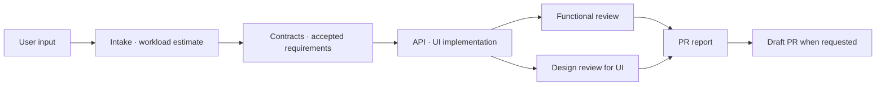

import Tabs from "@theme/Tabs";
import TabItem from "@theme/TabItem";

# Choose one of four delivery cases

A SpecToPR **mode defines delivery and required evidence**. A brief, Figma URL, OpenAPI documents, supporting documents, project guidance, and installed skills are composable sources. For example, choose `mode: feature` for complete user-facing delivery even when you also provide a brief and Figma URL.

:::info How to read expected results
Branches, PR titles, and filenames below are an **Illustrative expectation** of the result shape. Actual values follow the target repository, accepted requirements, discovered scripts, and real evidence paths.
:::

| Case                   | Minimum required input                       | Default result                                   | Automatic feature E2E/video | Figma evidence                  |
| ---------------------- | -------------------------------------------- | ------------------------------------------------ | --------------------------- | ------------------------------- |
| Brief → PR             | `mode: brief`, `briefPath`, concrete request | verified implementation + draft PR               | No                          | Only when a URL is supplied     |
| Legacy → PR            | `mode: legacy`, narrow behavior delta        | focused baseline + draft PR                      | No                          | Only when a URL is supplied     |
| Feature → PR           | `mode: feature`, `scope: ui`                 | targeted E2E + one video + draft PR              | Yes                         | Required when a URL is supplied |
| Figma → implementation | `mode: figma`, `scope: ui`, `figmaUrl`       | design implementation, no publication by default | No                          | Required                        |



Immediately after intake, status shows an `XS`–`XL` workload, estimated token range, confidence, and reasons. These values are estimates, not fixed promises. At the 80% boundary, SpecToPR checkpoints and continues from compact context. At the hard limit it splits scope or waits for a user decision without removing anything from `requiredValidations`.

<Tabs groupId="delivery-case" queryString="case">
  <TabItem value="brief" label="1. Brief" default>
    <span data-case-panel="brief"></span>

## Use this case <span id="use-this-case-brief"></span>

Use this case when an approved brief or PRD contains acceptance criteria and you want only that accepted scope implemented, verified, and delivered as a draft PR. A UI brief creates UI scope; a server-only brief does not. **The presence of a document does not imply complete feature E2E or design work.**

:::tip Input / result
**Input:** repository + brief path + concrete request · **Result:** acceptance traceability, relevant implementation and checks, independent review, and a draft PR
:::

## Required inputs <span id="required-inputs-brief"></span>

| Input         | Requirement                                                                              |
| ------------- | ---------------------------------------------------------------------------------------- |
| Repository    | Absolute path to a Git repository, for example `/absolute/path/to/app`                   |
| `mode`        | `brief`                                                                                  |
| `briefPath`   | Existing regular file inside the repository, for example `docs/checkout.md`              |
| Request       | Name the acceptance criteria or outcome to deliver; “implement it” alone is insufficient |
| `changeKind`  | The real kind, such as `feature`, `fix`, `refactor`, or `docs`                           |
| `publication` | `draft` for a PR or `none` for implementation and reviews only                           |

## Optional inputs <span id="optional-inputs-brief"></span>

- `scope: ui` or `scope: non-ui` makes design-review applicability explicit.
- `figmaUrl` adds UI evidence. Supplying it immediately requires a real `figma-bundle`.
- `openApiPaths` grounds API types, schemas, wrappers, clients, and mocks.
- `docsPaths` adds business rules, error cases, and supporting analysis.
- `guidancePaths` points to project rules such as `AGENTS.md`, architecture, or folder structure.
- `skillHints` requests only installed and applicable skills. A missing optional skill is not a blocker.

## Minimal prompt <span id="minimal-prompt-brief"></span>

```text
/spec-to-pr /absolute/path/to/app
mode: brief
briefPath: docs/checkout.md
changeKind: feature
publication: draft
Implement only the brief's acceptance criteria, run the relevant checks, and publish a draft PR.
```

## Full prompt example <span id="full-prompt-brief"></span>

```text
/spec-to-pr /absolute/path/to/app
mode: brief
scope: ui
briefPath: docs/checkout.md
figmaUrl: https://www.figma.com/design/FILE/checkout?node-id=12-345
openApiPaths: [docs/openapi.yaml]
docsPaths: [docs/business-rules.md, docs/error-cases.md]
guidancePaths: [docs/architecture/ARCHITECTURE.md, docs/etc/folder-structure.md]
skillHints: [react-best-practices, next-best-practices, design-system, api-generator]
changeKind: feature
publication: draft
Implement only the approved checkout criteria. Stop instead of guessing if sources conflict.
Create API contract evidence first, then implement the UI in the same implementation context and run only relevant checks.
```

## What SpecToPR does <span id="process-brief"></span>

1. **Intake:** Normalize paths and publication intent; report workload, token range, and confidence.
2. **Contracts:** Freeze traceable acceptance criteria and reconcile optional sources.
3. **Implementation:** Implement accepted scope in one `implementationContextId`. For API-backed UI, API-ready evidence precedes final UI evidence.
4. **Functional review:** An independent reviewer evaluates the frozen contract, diff, and focused checks.
5. **Design review:** Only for `scope: ui`, independently evaluate fidelity, interaction, design-system use, and accessibility.
6. **Report / publish:** Build traceability, change, validation, review, and risk sections; publish only for `publication: draft`.

## Evidence and validation <span id="evidence-brief"></span>

The paths below are an **Illustrative expectation**.

| Evidence            | Illustrative path                                            | Passing condition                                                                   |
| ------------------- | ------------------------------------------------------------ | ----------------------------------------------------------------------------------- |
| Acceptance criteria | `evidence/contracts/brief-acceptance.json`                   | Every criterion maps to implementation and validation                               |
| API-ready           | `evidence/api/contract-test.json`                            | When API applies: passed status, physical artifacts, same `implementationContextId` |
| Focused checks      | `evidence/tests/focused-checks.json`                         | Applicable commands pass and are not skipped or empty                               |
| Figma               | `evidence/figma/figma-bundle.json`                           | When a URL exists: connected-host provenance and actual PNGs                        |
| Reviews             | `evidence/reviews/functional.json`, and `design.json` for UI | Independent verdicts are approved                                                   |

Brief mode does not automatically require a targeted feature video. Validation follows the brief scope and scripts that actually exist in the repository.

## Expected branch and commits <span id="branch-and-commits-brief"></span>

- Illustrative branch: `codex/checkout-brief`
- Illustrative commit: `feat: implement checkout acceptance criteria`
- Publication requires a committed non-target source branch, intended changes only, a clean tree, and at least one commit ahead of target.
- SpecToPR never merges, approves, closes, or marks the PR ready.

## Expected draft PR <span id="expected-pr-brief"></span>

**Illustrative expectation title:** `feat: implement checkout from approved brief`

```md
## Accepted requirements

- AC-1 payment method selection → src/features/checkout/PaymentMethod.tsx
- AC-2 failure state → tests/checkout/error-state.test.tsx

## Implementation

- Added API contract and mock, then connected the UI in the same implementationContextId

## Validation and reviews

- pnpm test -- checkout: passed
- functional-reviewer: approved
- design-reviewer: approved (UI scope)

## Evidence and risks

- evidence/contracts/brief-acceptance.json
- known risks and excluded scope
```

## When the Run stops <span id="blockers-brief"></span>

| Blocker                                         | User action to resume                                                   |
| ----------------------------------------------- | ----------------------------------------------------------------------- |
| Missing, external, or invalid `briefPath`       | Supply an existing regular file inside the repository                   |
| Brief conflicts with Figma, OpenAPI, or request | Choose the authoritative source and update acceptance criteria          |
| Required project guidance is missing            | Add the file or correct `guidancePaths`                                 |
| Reviewer requests changes                       | Fix the named contract, implementation, or evidence issue and re-review |
| Dirty tree or no source commit                  | Commit only intended changes and restore a clean source branch          |

## What this case does not do <span id="exclusions-brief"></span>

- It does not invent endpoints, screens, or migrations outside the brief.
- It does not force design review for non-UI scope.
- It does not automatically add feature-only targeted E2E and one video.
- It never drops required validation because of token pressure.

</TabItem>

  <TabItem value="legacy" label="2. Legacy">
  <span data-case-panel="legacy"></span>

## Use this case <span id="use-this-case-legacy"></span>

Use this case to preserve an existing product while changing one **narrow current → desired behavior delta**. It fits bug fixes, small compatibility changes, and bounded refactors. It is not a request to inventory or modernize the entire repository.

:::tip Input / result
**Input:** repository + reproducible current behavior + desired delta · **Result:** focused baseline, minimal change, affected regression checks, and a draft PR
:::

## Required inputs <span id="required-inputs-legacy"></span>

| Input         | Requirement                                                         |
| ------------- | ------------------------------------------------------------------- |
| Repository    | Absolute Git repository path with a usable run or test setup        |
| `mode`        | `legacy`                                                            |
| Delta         | Narrow current behavior, desired behavior, and affected entry point |
| `changeKind`  | Usually `fix` or `refactor`, matching the actual intent             |
| `scope`       | `ui` for a UI delta; otherwise normally `non-ui`                    |
| `publication` | `draft` for a PR or `none` to stop after reviews                    |

## Optional inputs <span id="optional-inputs-legacy"></span>

- A reproduction command, failure log, test name, route, or screenshot makes the focused baseline precise.
- `briefPath`, `docsPaths`, and `openApiPaths` add contract evidence for the delta.
- `figmaUrl` adds UI design evidence and requires a real `figma-bundle`.
- `guidancePaths` and `skillHints` specify project rules and applicable supporting skills.

## Minimal prompt <span id="minimal-prompt-legacy"></span>

```text
/spec-to-pr /absolute/path/to/legacy-app
mode: legacy
scope: non-ui
changeKind: fix
publication: draft
Reproduce the duplicate notification created by a payment retry, change only that behavior to create one notification, and publish a draft PR.
```

## Full prompt example <span id="full-prompt-legacy"></span>

```text
/spec-to-pr /absolute/path/to/legacy-app
mode: legacy
scope: non-ui
docsPaths: [docs/payment-retry-rules.md]
openApiPaths: [docs/payment-api.yaml]
guidancePaths: [AGENTS.md, docs/architecture/ARCHITECTURE.md]
skillHints: [api-generator]
changeKind: fix
publication: draft
Change only the duplicate notification created when POST /payments/:id/retry returns 409.
Reproduce it with the existing integration test and keep the result as a focused baseline.
Run only affected payment retry checks. Do not perform a full inventory, migration, or full-project E2E.
```

## What SpecToPR does <span id="process-legacy"></span>

1. **Intake:** Confirm the delta and affected entry point; report the workload/token estimate.
2. **Focused baseline:** Before editing, reproduce current behavior as a real test, log, or screenshot artifact.
3. **Contracts:** Separate preserved behavior from changed behavior and freeze `requiredValidations`.
4. **Implementation:** Preserve unrelated behavior and apply the smallest sufficient change.
5. **Independent reviews:** Always run functional review; run design review only for a UI delta.
6. **Report / publish:** Include before/after evidence, risk, rollback notes, and the draft PR.

## Evidence and validation <span id="evidence-legacy"></span>

| Evidence        | Illustrative path                           | Passing condition                                               |
| --------------- | ------------------------------------------- | --------------------------------------------------------------- |
| Before baseline | `evidence/legacy/payment-retry-before.json` | Duplicate notifications reproduce under the same request        |
| After result    | `evidence/legacy/payment-retry-after.json`  | One notification and the existing response contract remain      |
| Affected checks | `evidence/tests/payment-retry.json`         | Relevant unit/integration checks pass                           |
| Review          | `evidence/reviews/functional.json`          | Delta, preserved behavior, and regression evidence are approved |

Filenames are an **Illustrative expectation**. UI or Figma sources add design evidence, but legacy mode does not automatically require a feature video.

## Expected branch and commits <span id="branch-and-commits-legacy"></span>

- Illustrative branch: `codex/payment-retry-notification`
- Illustrative commit: `fix: prevent duplicate retry notification`
- Do not mix broad formatting, dependency upgrades, or unrelated cleanup into the commit.
- Confirm a clean tree and source commit ahead of target before publication.

## Expected draft PR <span id="expected-pr-legacy"></span>

**Illustrative expectation title:** `fix: prevent duplicate payment retry notification`

```md
## Current behavior baseline

- One 409 retry creates two notification rows

## Requested delta

- An idempotency key limits the same retry to one notification row

## Affected validation

- pnpm test -- payment-retry: passed
- functional-reviewer: approved

## Risk / rollback

- no behavior outside the retry path changed
- single revertible commit
```

## When the Run stops <span id="blockers-legacy"></span>

| Blocker                                  | User action to resume                                                    |
| ---------------------------------------- | ------------------------------------------------------------------------ |
| The delta is broad, such as “improve it” | State current/desired behavior and the affected entry point              |
| Current behavior cannot be reproduced    | Supply reproduction data, command, environment condition, or failure log |
| Baseline and source contract conflict    | Choose the authoritative expected behavior                               |
| Required regression cannot run           | Provide the minimum run setup or an approved substitute artifact         |
| Publication preflight fails              | Clean and commit intended changes on the source branch                   |

## What this case does not do <span id="exclusions-legacy"></span>

- It does not inventory, migrate, or modernize the whole repository.
- It does not require an unaffected full test matrix or full-project E2E.
- It does not guess current behavior without baseline evidence.
- It does not create feature video or Figma evidence without those inputs.

</TabItem>

  <TabItem value="feature" label="3. Feature">
  <span data-case-panel="feature"></span>

## Use this case <span id="use-this-case-feature"></span>

Use this case for a user-facing capability that must be completed through API and UI, verified with **E2E targeting only that feature and exactly one video**, and delivered as a draft PR. It is the zero-to-100 flow that can combine a brief, Figma, OpenAPI, supporting docs, and folder-structure guidance in one Run.

:::tip Input / result
**Input:** concrete user feature + `mode: feature` + UI scope · **Result:** API/UI implementation, independent functional/design reviews, targeted E2E, one video, and a draft PR
:::

## Required inputs <span id="required-inputs-feature"></span>

| Input           | Requirement                                                              |
| --------------- | ------------------------------------------------------------------------ |
| Repository      | Git repository where the browser feature and relevant checks can run     |
| `mode`          | `feature`                                                                |
| `scope`         | `ui` is required                                                         |
| Feature request | State user, entry point, success/error states, and completion conditions |
| `changeKind`    | `feature`                                                                |
| `publication`   | `draft`, because the profile delivers its video through the PR           |

## Optional inputs <span id="optional-inputs-feature"></span>

- `briefPath` freezes acceptance criteria and boundaries.
- `figmaUrl` supplies screen/state/component evidence and requires a connected-host `figma-bundle`.
- `openApiPaths` grounds API types, schema, wrapper/client, and mock contracts.
- `docsPaths` adds business rules and edge cases.
- `guidancePaths` names project instructions such as `AGENTS.md`, architecture, and folder structure.
- `skillHints` requests applicable installed skills such as `react-best-practices`, `next-best-practices`, `design-system`, and `api-generator`.
- A Playwright test path, tag, or project can make the targeted selector unambiguous.

## Minimal prompt <span id="minimal-prompt-feature"></span>

```text
/spec-to-pr /absolute/path/to/app
mode: feature
scope: ui
changeKind: feature
publication: draft
Implement checkout through API and UI, verify only the checkout path with E2E, attach one video, and publish a draft PR.
```

## Full prompt example <span id="full-prompt-feature"></span>

```text
/spec-to-pr /absolute/path/to/app
mode: feature
scope: ui
briefPath: docs/checkout.md
figmaUrl: https://www.figma.com/design/FILE/checkout?node-id=12-345
openApiPaths: [docs/openapi.yaml]
docsPaths: [docs/business-rules.md, docs/error-cases.md]
guidancePaths: [docs/architecture/ARCHITECTURE.md, docs/etc/folder-structure.md]
skillHints: [react-best-practices, next-best-practices, design-system, api-generator]
changeKind: feature
publication: draft
Implement checkout end to end. Run only the checkout test path, tag, or project and attach exactly one video.
```

## What SpecToPR does <span id="process-feature"></span>

1. **Intake:** Normalize every source and feature boundary; report workload/token estimates and `requiredValidations`.
2. **Contracts:** Reconcile brief, OpenAPI, and docs. When Figma is supplied, capture real nodes, variables, screenshots, assets, and a strict manifest.
3. **API-ready:** Submit distinct non-empty type/schema/wrapper/mock files plus a passing contract-test JSON under one `implementationContextId`.
4. **UI implementation:** In the same context, validate mock-backed states, connect the real API, and finish loading, empty, error, and success states.
5. **Independent reviews:** Functional and design reviewers separately judge frozen contracts, diff, and evidence.
6. **Targeted feature proof:** Run one Playwright invocation selecting the changed feature and record strict JSON plus one valid video.
7. **Report / publish:** Publish a draft PR with the exact selector, command, result, video path, and every verdict.

## Evidence and validation <span id="evidence-feature"></span>

| Evidence        | Illustrative path                                 | Required condition                                                                  |
| --------------- | ------------------------------------------------- | ----------------------------------------------------------------------------------- |
| API-ready       | `evidence/api/api-ready.json`                     | Four physical artifact roles, passing contract test, same `implementationContextId` |
| Figma           | `evidence/figma/figma-bundle.json`                | If URL supplied: real connected-host bundle and actual PNGs                         |
| Reviews         | `evidence/reviews/functional.json`, `design.json` | Both independent verdicts approved                                                  |
| Targeted result | `evidence/e2e/targeted-feature.json`              | Only `status: passed`, exact selector, same context ID, positive `testCount`        |
| Video           | `evidence/e2e/checkout.webm`                      | `featureVideo: required`, WebM/MP4, non-zero duration, ≤25 MB, exactly one          |

The command must be one unchained Playwright invocation whose real argument selects the changed test path, tag, or project. `--list`, `--pass-with-no-tests`, broad or full-project E2E, zero tests, and zero or multiple videos are rejected.

## Expected branch and commits <span id="branch-and-commits-feature"></span>

- Illustrative branch: `codex/checkout-flow`
- Illustrative commit: `feat: add API-backed checkout flow`
- API and UI stay in one implementation agent/context rather than separate branches with an integration lane.
- Before the PR, verify the evidence video exists and the committed source branch is clean.

## Expected draft PR <span id="expected-pr-feature"></span>

**Illustrative expectation title:** `feat: add API-backed checkout flow`

```md
## Requirement traceability

- brief AC-1..AC-5, Figma node 12:345, checkout OpenAPI operation

## API and UI implementation

- api-ready: evidence/api/api-ready.json
- implementationContextId: checkout-20260714
- loading / error / success UI and real client integration

## Independent reviews

- functional-reviewer: approved
- design-reviewer: approved

## Targeted feature evidence

- selector: tests/e2e/checkout.spec.ts
- command: pnpm playwright test tests/e2e/checkout.spec.ts
- result: evidence/e2e/targeted-feature.json
- featureVideo: evidence/e2e/checkout.webm (exactly one)

## Risks and exclusions

- full-project E2E was not run
```

## When the Run stops <span id="blockers-feature"></span>

| Blocker                                                          | User action to resume                                          |
| ---------------------------------------------------------------- | -------------------------------------------------------------- |
| Source contracts conflict                                        | Choose the authoritative source and revise acceptance criteria |
| Figma URL exists but connected-host bundle is missing            | Restore host Figma access and recapture the same node          |
| API-ready artifacts, contract test, or context ID are incomplete | Resubmit physical files and passing JSON under one context ID  |
| E2E is broad, chained, list-only, skipped, or has zero tests     | Run one command selecting the changed path, tag, or project    |
| Video is absent, duplicated, invalid, or over 25 MB              | Record exactly one valid WebM/MP4 from that run                |
| Reviewer changes or dirty preflight                              | Fix, re-review, and commit only intended changes cleanly       |

## What this case does not do <span id="exclusions-feature"></span>

- It does not E2E-test or record every feature in the project.
- It does not split API and design implementation into agents and integrate later.
- It does not infer design from a Figma URL or poll Figma.
- It does not add unrelated migrations, release matrices, or full-suite evidence to a feature PR.

</TabItem>

  <TabItem value="figma" label="4. Figma">
  <span data-case-panel="figma"></span>

## Use this case <span id="use-this-case-figma"></span>

Use this case when Figma is the primary source and the goal is screen implementation plus design verification. The connected host reads real nodes and visual evidence, then maps them to the existing design system. **The default result is implementation and a review report with no PR.**

:::tip Input / result
**Input:** repository + valid Figma URL · **Result:** UI implementation from real Figma evidence, visual/responsive/interaction/accessibility validation, and a draft PR only when explicit
:::

## Required inputs <span id="required-inputs-figma"></span>

| Input         | Requirement                                                            |
| ------------- | ---------------------------------------------------------------------- |
| Repository    | Target Git repository with its design system and screen code           |
| `mode`        | `figma`                                                                |
| `scope`       | `ui` is required                                                       |
| `figmaUrl`    | Accessible file URL, preferably with a concrete `node-id`              |
| `publication` | `none` by default; `draft` only when the user explicitly requests a PR |
| Request       | Name screens, states, and responsive boundaries to implement           |

## Optional inputs <span id="optional-inputs-figma"></span>

- `briefPath` and `docsPaths` add acceptance criteria, copy, and business rules.
- `openApiPaths` adds API-ready contracts for an API-backed screen.
- `guidancePaths` supplies design-system, architecture, and folder-structure rules.
- `skillHints` requests applicable installed design-system, React/Next, and accessibility skills.
- `publication: draft` is an explicit variant for delivering the design implementation as a PR.

## Minimal prompt <span id="minimal-prompt-figma"></span>

```text
/spec-to-pr /absolute/path/to/app
mode: figma
scope: ui
figmaUrl: https://www.figma.com/design/FILE/checkout?node-id=12-345
publication: none
Implement the Figma design with the existing design system and verify visual, responsive, and accessibility behavior.
```

## Full prompt example <span id="full-prompt-figma"></span>

```text
/spec-to-pr /absolute/path/to/app
mode: figma
scope: ui
figmaUrl: https://www.figma.com/design/FILE/checkout?node-id=12-345
briefPath: docs/checkout-copy.md
openApiPaths: [docs/openapi.yaml]
docsPaths: [docs/checkout-states.md]
guidancePaths: [docs/design-system.md, docs/etc/folder-structure.md]
skillHints: [design-system, react-best-practices, accessibility-auditor]
changeKind: feature
publication: draft
Implement desktop/mobile and loading/error/success states for node 12:345 with existing components.
Create real Figma, visual, interaction, and accessibility evidence, run independent review, and publish a draft PR.
```

## What SpecToPR does <span id="process-figma"></span>

1. **Intake:** Confirm URL, node, screen/state scope, publication intent, and workload estimate.
2. **Figma contracts:** Through the connected host, read node IDs, variables, component context, screenshots, and assets into a project-local strict manifest.
3. **Design-system mapping:** Match the design to existing components and tokens before creating custom markup.
4. **Implementation:** Build responsive layout, interaction, loading/error/empty/success states, and required API connections in one `implementationContextId`.
5. **Reviews:** Run relevant functional checks and independent design review for fidelity, accessibility, and interaction.
6. **Report / optional publish:** Stop at the report for `publication: none`; perform publication preflight and PR creation only for explicit `draft`.

## Evidence and validation <span id="evidence-figma"></span>

| Evidence               | Illustrative path                                                    | Passing condition                                                                           |
| ---------------------- | -------------------------------------------------------------------- | ------------------------------------------------------------------------------------------- |
| Bundle                 | `evidence/figma/figma-bundle.json`                                   | `provider: host-connected-figma`, ISO `capturedAt`, matching `fileUrl`, non-empty `nodeIds` |
| Manifest/visuals       | `evidence/figma/manifest.json`, `evidence/figma/checkout-mobile.png` | Project-local strict manifest and actual PNG `visualPaths`                                  |
| Responsive/interaction | `evidence/design/responsive.json`, `interaction.json`                | Named viewports and state transitions are verified                                          |
| Accessibility          | `evidence/design/accessibility.json`                                 | Semantic, keyboard, focus, and contrast checks pass                                         |
| Design review          | `evidence/reviews/design.json`                                       | Independent approved verdict over frozen diff/evidence                                      |

Figma mode does not automatically require feature-targeted E2E and video. If complete feature delivery and video are the goal, choose `mode: feature` and compose `figmaUrl` as a source.

## Expected branch and commits <span id="branch-and-commits-figma"></span>

- `publication: none`: finish with a verified working-tree implementation and report on the existing work branch.
- Illustrative explicit-draft branch: `codex/figma-checkout`
- Illustrative commit: `feat: implement checkout from Figma`
- Draft publication still requires a committed source branch and clean tree.

## Expected draft PR <span id="expected-pr-figma"></span>

There is no PR by default. The following is an **Illustrative expectation** only when `publication: draft` is explicit.

**Illustrative expectation title:** `feat: implement checkout from Figma`

```md
## Figma source

- file/node: checkout / 12:345
- bundle: evidence/figma/figma-bundle.json

## Implementation

- existing design-system components and tokens
- desktop/mobile and loading/error/success states

## Design validation

- responsive / interaction / accessibility: passed
- design-reviewer: approved

## Known differences

- states not defined in Figma and intentionally excluded scope
```

## When the Run stops <span id="blockers-figma"></span>

| Blocker                                         | User action to resume                                               |
| ----------------------------------------------- | ------------------------------------------------------------------- |
| Invalid or inaccessible URL/node                | Supply an accessible URL and exact node ID                          |
| Connected-host evidence cannot be read          | Restore Figma connection, login, or permission                      |
| Required state or viewport is absent            | Supply authoritative behavior or approved supplemental requirements |
| Existing design system conflicts with Figma     | Decide whether to reuse, extend, or allow an exception              |
| Draft requested from a dirty/uncommitted branch | Commit only intended files and satisfy clean preflight              |

## What this case does not do <span id="exclusions-figma"></span>

- It does not claim nodes, variables, or components from the URL alone.
- It does not poll Figma or add a dedicated runtime microtool.
- It does not create a PR without explicit draft intent.
- It does not implicitly add the feature mode's full user-feature E2E and video contract.

</TabItem>
</Tabs>
